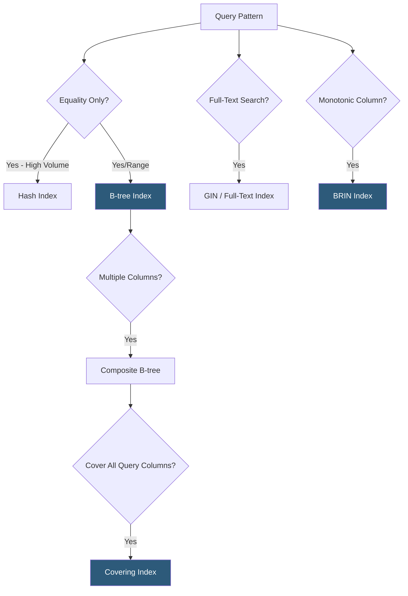

**Category:** Database Hosting
**Difficulty:** Intermediate
**Reading time:** 6 min read

---

Database indexing strategies determine which data structures the database uses to locate rows efficiently without full table scans. Choosing the right index type, covering columns, and maintenance approach is fundamental to database performance—a well-designed index set can reduce query latency by 100–1000x while poorly designed indexes create write overhead without read benefit.

- **B-tree index** — default index type for most databases; balanced tree structure optimal for equality and range queries; supports ORDER BY without sorting
- **Hash index** — O(1) exact-match lookups; faster than B-tree for equality but cannot handle range queries or ordering
- **BRIN (Block Range Index)** — PostgreSQL index type storing min/max values per block range; tiny size, ideal for monotonically increasing columns (timestamps, IDs)
- **GiST / GIN** — PostgreSQL generalized index types for complex data types: full-text search (GIN), geometric/PostGIS (GiST), JSONB containment (GIN)
- **Composite index** — index on multiple columns; column order matters—left-most prefix rule determines which queries benefit
- **Covering index** — composite index including all query columns (SELECT + WHERE); enables index-only scan without heap access
- **Partial index** — index with WHERE clause; only indexes rows matching the condition, dramatically reducing size for sparse predicates
- **Index selectivity** — fraction of distinct values; `gender` column (2 values) is low selectivity; `email` is high selectivity (1:1)

B-tree indexes are the workhorse of relational databases. Their balanced tree structure allows binary search from root to leaf in O(log n) time, finding matching rows for both equality (`=`) and range (`<`, `>`, `BETWEEN`) predicates, and returning results in sorted order without a separate sort step. B-tree indexes on foreign key columns are essential for JOIN performance—without them, joins require full table scans of the joined table.

Composite index design follows the left-most prefix rule: an index on `(customer_id, created_at, status)` can serve queries filtering on `customer_id` alone, `customer_id + created_at`, or all three columns, but not on `created_at` alone or `status` alone. The most selective column in equality predicates should generally come first; range predicates should come last as they limit the index's ability to filter subsequent columns.

Partial indexes dramatically reduce index size for queries with constant predicates. An index on `(user_id) WHERE status = 'pending'` for a query that always filters by `status = 'pending'` might index 0.1% of rows rather than 100%, making it tiny and extremely fast. Partial indexes are particularly effective for "hot" data—recent records, unprocessed jobs, active users—where queries always include a status filter.

BRIN indexes on timestamp columns are an extreme efficiency technique: a BRIN index on a table with 100M rows and an `inserted_at` timestamp might be only 128KB compared to 2GB for a B-tree index. BRIN works because monotonically increasing timestamps are naturally correlated with physical storage order—the BRIN stores just min/max timestamps per 128-page block, allowing efficient range scan skipping.

Index maintenance overhead grows with write traffic. Each INSERT adds entries to all table indexes; each UPDATE may add and delete index entries. Tables with dozens of indexes on high-write workloads should be audited—unused indexes (identified via `pg_stat_user_indexes` or MySQL's `sys.schema_unused_indexes`) should be dropped.

- Composite index on `(tenant_id, created_at DESC)` for a multi-tenant SaaS listing recent records per tenant
- Partial index on `(job_id) WHERE processed = false` for a background job queue table with millions of completed jobs
- BRIN index on an event log table's `timestamp` column instead of a 2GB B-tree index
- GIN index on a JSONB column for containment queries in a document-style PostgreSQL schema
- Covering index on `(user_id, product_id, quantity)` for a shopping cart query selecting exactly those columns

| Advantage | Disadvantage |
|-----------|--------------|
| B-tree covering indexes can satisfy queries entirely from the index without heap access | Indexes add storage overhead; a table with 10 indexes may have 3x the storage of the table itself |
| Partial indexes provide dramatic size reduction for sparse predicates | Partial index predicate must exactly match the query's WHERE clause to be used |
| BRIN indexes on monotonic columns provide tiny indexes with good range filtering | BRIN is ineffective for randomly distributed values; only works with correlated physical order |
| Composite indexes serve multiple query patterns with a single index | Left-most prefix constraint means queries must include leading columns to use the index |

- [Query Optimization Techniques](query-optimization-techniques.md)
- [Database Partitioning](database-partitioning.md)
- [Slow Query Log Analysis](slow-query-log-analysis.md)

---
*Part of the [Database Hosting](index.md) category · [Back to Master Index](../../index.md)*
