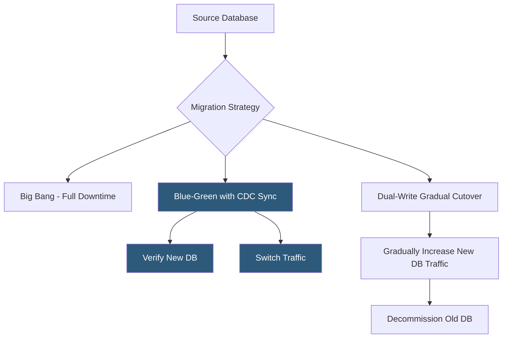

**Category:** Database Hosting
**Difficulty:** Advanced
**Reading time:** 6 min read

---

Database migration strategies define the approach for moving databases between servers, versions, or cloud providers while minimizing downtime and data loss risk. Modern migrations use change data capture and dual-write patterns to achieve near-zero-downtime cutovers even for multi-terabyte production databases serving continuous traffic.

- **Big bang migration** — single cutover window where the old database goes offline, data is copied, and traffic switches to new; simple but requires downtime
- **Blue-green migration** — maintain both old and new databases simultaneously; verify new database, then switch traffic; minimizes cutover risk
- **Dual-write** — application writes to both old and new database simultaneously during migration; ensures new database stays current without CDC
- **Schema migration** — DDL changes (ALTER TABLE, add column) applied to a live database; requires backward-compatible changes to avoid downtime
- **Expand-contract pattern** — add new column (expand), migrate data, update application, remove old column (contract); enables zero-downtime schema changes
- **Flyway / Liquibase** — schema migration tools that version-control SQL DDL changes and apply them in order across environments
- **gh-ost** — GitHub's online schema migration tool for MySQL; makes table copies with CDC instead of locking ALTER TABLE
- **pg_repack** — PostgreSQL extension for online table rebuilds and index optimization without exclusive locks

Zero-downtime database migration uses CDC to keep the new database synchronized with the old while both serve traffic. AWS DMS, Debezium, or cloud-native tools (Google Database Migration Service, Azure Database Migration Service) capture every change from the source database's transaction log and apply it to the target in near-real-time, maintaining lag of typically 1–10 seconds.

The migration phases are: initial bulk load (copying all existing data to the new database), catch-up via CDC (applying changes that occurred during the bulk load), and steady-state replication (the new database stays current with sub-second lag). The actual cutover involves directing all new writes to the new database, waiting for CDC to drain any remaining lag, and then decommissioning the old database. Total application downtime is typically under 30 seconds.

Schema migrations for live databases require backward-compatible changes. The expand-contract pattern handles column renames: first, add the new column and populate it while keeping the old one (expand). Update application code to write to both columns and read from the new one. Once all application instances are deployed, delete the old column (contract). This avoids locking ALTER TABLE statements that would block all table access for minutes on large tables.

Tools like gh-ost (for MySQL) and pg_repack (for PostgreSQL) perform online ALTER TABLE operations without the extended lock. gh-ost creates a shadow copy of the table, applies CDC from the original table's binlog, and performs an atomic table swap when the copy is complete—the entire operation requires only a sub-second lock during the final swap.

- Moving a 5TB MySQL database from on-premises to AWS RDS with less than 30 seconds of downtime
- Upgrading PostgreSQL from version 14 to 17 using logical replication to minimize cutover window
- Renaming a widely-used column in a high-traffic production table using expand-contract without locking
- Migrating from single-tenant to multi-tenant database architecture with CDC-based gradual cutover
- Changing database engines (MySQL to PostgreSQL) using dual-write during transition period

| Advantage | Disadvantage |
|-----------|--------------|
| CDC-based migration achieves near-zero-downtime regardless of database size | CDC requires transaction log access (binlog, WAL); enabling these on production may require restart |
| Expand-contract pattern enables backward-compatible schema changes without locking | Schema changes that cannot be made backward-compatible (column type changes) require more complex approaches |
| gh-ost and pg_repack perform table alterations online without extended locks | CDC tools add replication lag monitoring overhead; lag spikes can delay the cutover window |
| Blue-green approach allows full verification before any traffic cutover | Running two full databases simultaneously doubles infrastructure cost during migration window |

- [Zero-Downtime Database Updates](zero-downtime-database-updates.md)
- [Database High Availability](database-high-availability.md)
- [Database Backup Automation](database-backup-automation.md)

---
*Part of the [Database Hosting](index.md) category · [Back to Master Index](../../index.md)*
