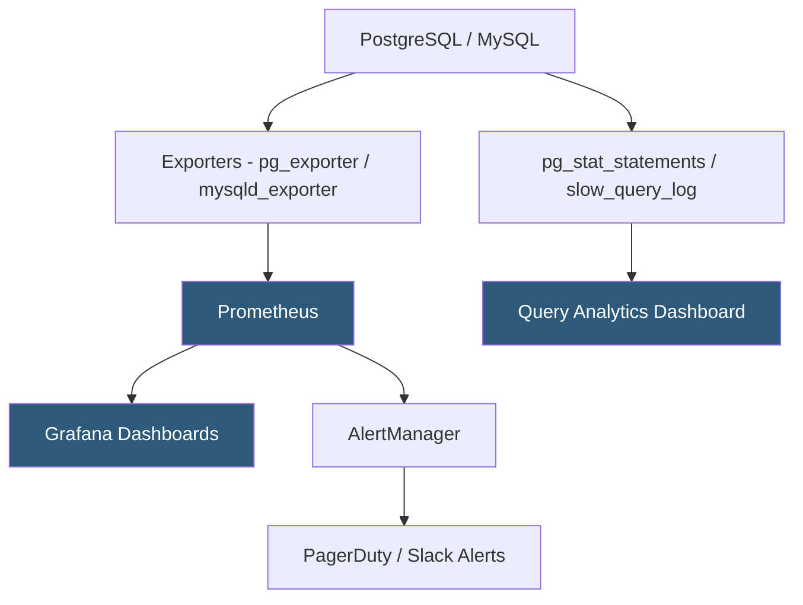

**Category:** Database Hosting
**Difficulty:** Intermediate
**Reading time:** 5 min read

---

Database monitoring and profiling instruments database servers to track performance metrics, identify bottlenecks, and detect anomalies before they become outages. Comprehensive monitoring covers query-level performance (latency, throughput), resource utilization (CPU, I/O, memory, connections), replication health, and storage capacity trends.

- **pg_stat_statements** — PostgreSQL extension tracking cumulative statistics per query: total execution time, mean time, calls, rows
- **performance_schema** — MySQL's built-in instrumentation framework; provides per-query, per-thread, and per-event statistics
- **Slow query log** — records queries exceeding a latency threshold; the primary tool for identifying optimization candidates
- **Prometheus postgres_exporter** — exports PostgreSQL metrics (connections, WAL lag, table bloat, lock waits) in Prometheus format for Grafana dashboards
- **pmm-agent (Percona Monitoring and Management)** — comprehensive MySQL/PostgreSQL monitoring agent with query analytics and advisor
- **Lock waits** — sessions blocked waiting for row or table locks; monitored via `pg_locks` / `information_schema.innodb_trx`
- **Replication lag** — delay between primary and replica; critical metric for HA and DR plans
- **Table bloat** — dead tuple accumulation in PostgreSQL tables reducing query performance; monitored via pgstattuple extension

Database monitoring operates at two levels: instance-level metrics (resource utilization, connection counts, cache hit rates) and query-level analytics (which specific queries consume the most resources).

Instance monitoring uses exporters that scrape database internal statistics views and expose them as Prometheus metrics. The `postgres_exporter` collects from PostgreSQL's system catalog views: `pg_stat_activity` (active connections and queries), `pg_stat_bgwriter` (buffer pool hit rate—target >99%), `pg_stat_replication` (replica lag in bytes and seconds), and `pg_stat_user_tables` (table I/O, dead tuples, autovacuum activity). Dashboards in Grafana (using pre-built PostgreSQL dashboards from Grafana Labs) visualize trends and anomalies over time.

Alerts should be configured for: connection count exceeding 80% of `max_connections`, replication lag exceeding RPO threshold, buffer hit rate dropping below 90%, disk usage exceeding 80% of allocated storage, and lock waits lasting more than 10 seconds.

Query analytics requires `pg_stat_statements` (enabled in `shared_preload_libraries`). This extension tracks aggregate statistics for every distinct query (normalized by replacing literals with parameters). Queries are ranked by `total_exec_time DESC` to identify the highest-impact optimization targets. `mean_exec_time` identifies individually slow queries; `calls` identifies hot paths. Periodic queries of `pg_stat_statements` (or automated dashboards via PMM or pganalyze) reveal query regressions after deployments.

Lock monitoring is critical during high-concurrency workloads. `SELECT pg_stat_activity.pid, query, wait_event_type, wait_event FROM pg_stat_activity WHERE wait_event IS NOT NULL` shows sessions waiting on locks. Long-running transactions that hold locks should be identified and killed when they block critical paths.

- Grafana dashboard showing PostgreSQL buffer hit rate, active connections, and replication lag for a SaaS production cluster
- Alert firing when connection count exceeds 400 on a database with max_connections=500, triggering PgBouncer pool expansion
- Weekly pg_stat_statements review identifying a newly deployed query consuming 30% of total database CPU
- Percona PMM query analytics showing a specific ORM-generated query causing 90% of database latency
- Replication lag alert sending PagerDuty notification when a replica falls 10 seconds behind the primary

| Advantage | Disadvantage |
|-----------|--------------|
| pg_stat_statements identifies top resource consumers without query-level logging overhead | pg_stat_statements normalizes queries; identifying specific problematic parameter values requires slow query log |
| Prometheus/Grafana stack provides flexible alerting and long-term trend analysis | Monitoring infrastructure (Prometheus, Grafana, exporters) requires its own maintenance and HA |
| Replication lag alerts catch DR-impacting issues before they become recovery-critical | False alerts from expected lag during bulk operations require alert tuning to avoid alert fatigue |
| Connection monitoring prevents connection exhaustion before it impacts availability | Lock wait monitoring shows symptoms; root-cause analysis still requires query inspection |

- [Slow Query Log Analysis](slow-query-log-analysis.md)
- [Query Optimization Techniques](query-optimization-techniques.md)
- [Database Capacity Planning](database-capacity-planning.md)

---
*Part of the [Database Hosting](index.md) category · [Back to Master Index](../../index.md)*
