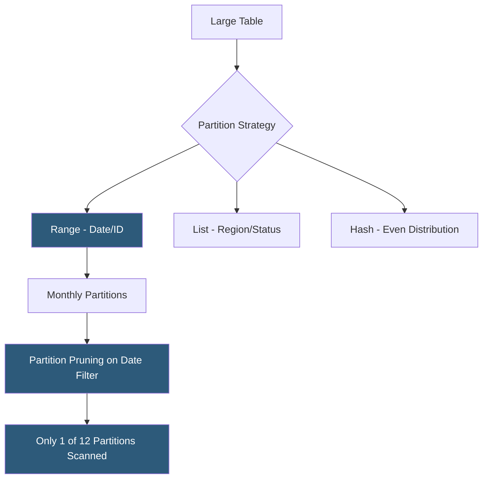

**Category:** Database Hosting
**Difficulty:** Advanced
**Reading time:** 6 min read

---

Database partitioning divides a large table into smaller, manageable physical segments (partitions) while presenting a single logical table to queries. It improves query performance through partition pruning, enables efficient bulk data management (archiving old partitions), and allows parallel query execution across partitions in large-scale hosting environments.

- **Range partitioning** — divides data by value ranges (e.g., one partition per month based on a date column); most common for time-series data
- **List partitioning** — divides data by discrete values (e.g., partition per country or region)
- **Hash partitioning** — distributes data evenly across partitions using a hash of the partition key; prevents hot spots
- **Partition pruning** — optimizer skips scanning partitions that cannot contain matching rows based on WHERE clause predicates
- **Partition key** — the column(s) used to determine which partition stores each row; must be included in WHERE clauses to enable pruning
- **Sub-partitioning** — partitions divided into further partitions (partition by month, then hash by user_id within each month)
- **Partition exchange** — attaching or detaching a partition as a table without data movement; enables zero-copy archiving
- **Global vs local indexes** — local indexes are partition-specific (faster maintenance); global indexes span all partitions (required for unique constraints across partition key)

Partitioning works by logically splitting one table's storage into multiple physical segments. The database maintains a partition table (parent) and the underlying partition tables that actually store data. When a query runs against the partitioned table, the optimizer evaluates the WHERE clause against the partition definition: a query for `WHERE event_date BETWEEN '2025-01-01' AND '2025-01-31'` only needs to scan the January 2025 partition rather than scanning the entire multi-year event table.

PostgreSQL declarative partitioning (version 10+) uses the `PARTITION BY` syntax. For a time-series events table: `CREATE TABLE events PARTITION BY RANGE (event_date)`, then individual partition creation: `CREATE TABLE events_2025_01 PARTITION OF events FOR VALUES FROM ('2025-01-01') TO ('2025-02-01')`. Indexes, constraints, and statistics are maintained per partition. New partitions are added regularly (often via a cron job or partition management tool like pg_partman).

Partition pruning occurs at both plan time and execution time. Plan-time pruning eliminates partitions using constant predicates in the query; execution-time pruning handles parameters from joins or variables. Without a partition key predicate, the query scans all partitions—worse than a non-partitioned table due to planning overhead.

Partition exchange (detach/attach) enables zero-copy archiving. When the January 2024 partition needs to be moved to cold storage, `ALTER TABLE events DETACH PARTITION events_2024_01` makes it a standalone table that can be queried independently, dumped to a data lake, or simply dropped. This operation is instantaneous—no data movement occurs.

MySQL range partitioning for InnoDB also enables partition-level operations: `ALTER TABLE t DROP PARTITION p0` purges a range of data as a fast DDL operation rather than a slow row-by-row DELETE.

- Monthly range partitioning of an event log table to enable fast range queries and instant archiving of old months
- Hash partitioning a transactions table to evenly distribute writes across partitions, preventing hot page contention
- Time-based partitioning of audit logs with automated oldest-partition DROP to implement rolling retention
- PostgreSQL `pg_partman` for automated partition creation and maintenance on a rapidly growing IoT sensor data table
- Read replica queries benefiting from parallel partition scans across multiple CPU cores via `max_parallel_workers_per_gather`

| Advantage | Disadvantage |
|-----------|--------------|
| Partition pruning reduces I/O for range queries to a fraction of the full table | Queries without partition key predicates scan all partitions; performance worse than non-partitioned |
| Partition exchange enables instant archiving without long-running DELETEs | Unique constraints across partition boundaries require global indexes; global index maintenance is expensive |
| Parallel partition scan leverages multi-core for large analytical queries | Partitioning adds planning overhead; small tables see no benefit and may see degradation |
| Rolling partition DROP is orders of magnitude faster than time-range DELETE | Adding partitions retroactively to a non-partitioned table requires table rebuilds |

- [Database Sharding Architectures](database-sharding-architectures.md)
- [Database Indexing Strategies](database-indexing-strategies.md)
- [Database Capacity Planning](database-capacity-planning.md)

---
*Part of the [Database Hosting](index.md) category · [Back to Master Index](../../index.md)*
