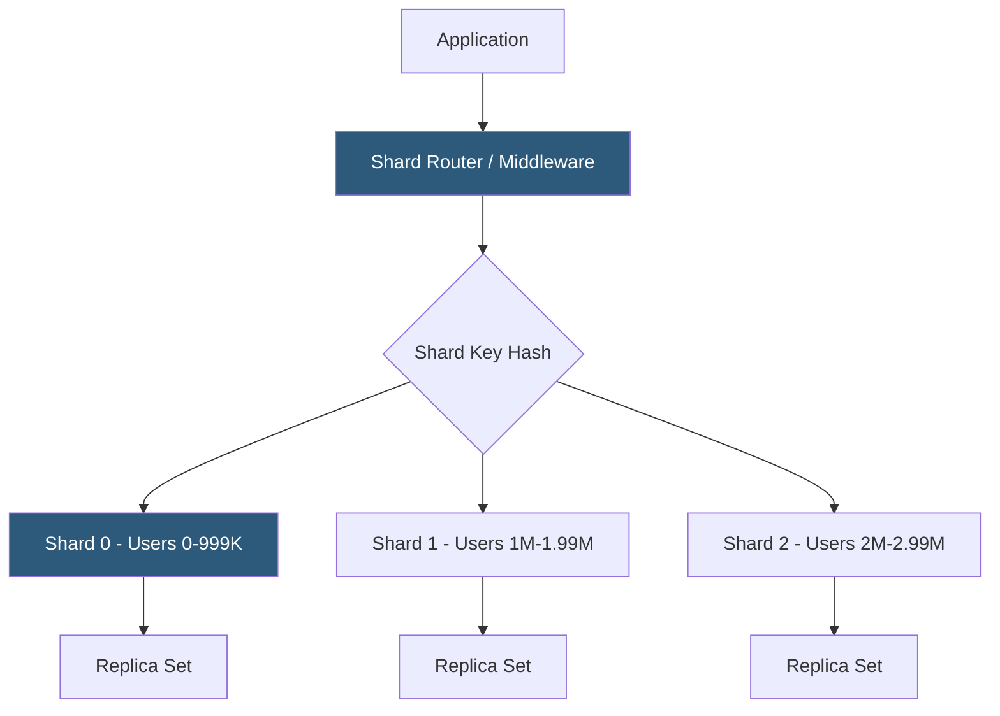

**Category:** Database Hosting
**Difficulty:** Advanced
**Reading time:** 7 min read

---

Database sharding horizontally partitions data across multiple independent database instances (shards), enabling write and storage scaling beyond the limits of a single server. Unlike replication (which copies the same data to multiple nodes), sharding divides data so each shard holds a distinct subset, with total capacity and write throughput scaling linearly with the number of shards.

- **Shard** — an independent database instance (or cluster) holding a subset of the total dataset
- **Shard key** — the column used to determine which shard stores a given row; choosing the right shard key is the most critical sharding decision
- **Range-based sharding** — rows assigned to shards based on shard key value ranges (user IDs 1–1M on shard 1, 1M–2M on shard 2)
- **Hash-based sharding** — shard assigned by `hash(shard_key) % num_shards`; distributes data evenly but makes range queries inefficient
- **Directory-based sharding** — a lookup table maps each shard key value to a shard; flexible but adds a lookup hop
- **Cross-shard query** — a query requiring data from multiple shards; must be executed in parallel and results aggregated (scatter-gather)
- **Shard rebalancing** — moving data between shards when shards become uneven; operationally complex and potentially disruptive
- **Vitess** — open-source sharding middleware for MySQL (used by YouTube, Slack) that handles shard routing, resharding, and connection pooling

Sharding splits a dataset so each shard is independently queryable and writable. The shard key determines data placement—every row is assigned to exactly one shard based on its shard key value. Applications route writes and reads to the correct shard using a shard router layer, which may be embedded in the application client library or implemented as a middleware proxy (Vitess, ProxySQL, Citus).

Shard key selection is the most consequential architectural decision. A poor shard key creates hot shards (one shard receiving disproportionate traffic) or makes common queries cross-shard. For a multi-tenant SaaS, `tenant_id` as shard key ensures all tenant data lands on one shard, making per-tenant queries single-shard. For a social platform, using `user_id` may work unless celebrities have disproportionate data. Sequential IDs as shard keys in range sharding create hot spots—all new inserts go to the latest range shard.

Cross-shard queries are the primary operational challenge. A query like `SELECT * FROM orders WHERE status = 'pending'` touches all shards, requiring the application to query all N shards in parallel and merge results. Aggregations (COUNT, SUM) must be performed per-shard and combined. Distributed JOINs across shards are extremely expensive and often avoided by denormalizing data.

Vitess is the most mature MySQL sharding solution. It provides VTGate (query router), VTTablet (per-shard MySQL management), and automated resharding. Vitess supports online resharding—splitting one shard into two by copying data in the background and cutting over with minimal downtime—addressing the operationally hardest part of sharding management.

Citus extends PostgreSQL with native sharding: tables are distributed across Citus worker nodes while the coordinator handles query routing and aggregation. Citus is particularly well-suited for multi-tenant analytics workloads where tenant colocation keeps most queries single-node.

- Multi-tenant SaaS where individual tenants have massive data volumes exceeding single-server capacity
- Social media platforms where user data grows beyond the storage and write capacity of a single PostgreSQL cluster
- High-throughput e-commerce platforms where order write rates exceed MySQL primary write capacity
- IoT time-series data at petabyte scale where hash-sharding by device ID distributes ingestion load
- B2B platforms with large enterprise customers collocated on dedicated shards for isolation and performance

| Advantage | Disadvantage |
|-----------|--------------|
| Write and storage capacity scales linearly with shard count | Cross-shard queries require scatter-gather; distributed JOINs are impractical |
| Tenant isolation on dedicated shards provides performance guarantees and security boundaries | Resharding (splitting shards) is operationally complex and disruptive without tooling like Vitess |
| Shard-local queries have low latency equal to single-node performance | Schema changes must be applied to all shards simultaneously; requires careful orchestration |
| Each shard can be a replica set for HA within its data partition | Shard key selection is irreversible without full data migration; wrong key creates long-term pain |

- [Database Partitioning](database-partitioning.md)
- [Master-Slave Replication](master-slave-replication.md)
- [Database High Availability](database-high-availability.md)

---
*Part of the [Database Hosting](index.md) category · [Back to Master Index](../../index.md)*
