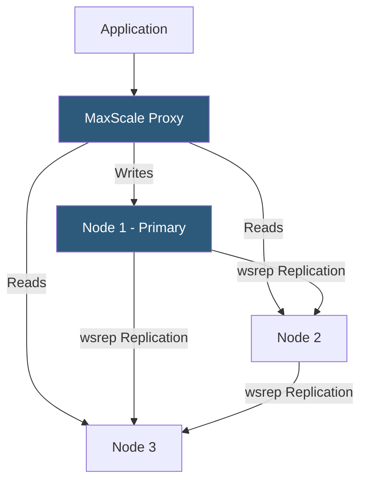

**Category:** Database Hosting
**Difficulty:** Advanced
**Reading time:** 6 min read

---

MariaDB clustering enables horizontal scaling and high availability by distributing data and query load across multiple database nodes. The primary clustering solutions—Galera Cluster (synchronous multi-master) and MaxScale (intelligent proxy)—provide different trade-offs between write scalability, consistency, and operational complexity.

- **Galera Cluster** — synchronous multi-master replication for MariaDB; every node has a full copy of all data and can accept writes
- **wsrep API** — Write Set Replication API that Galera implements; coordinates transaction certification across all cluster nodes
- **Certification-based replication** — Galera's conflict detection: transactions are applied optimistically and certified against concurrent transactions before committing
- **SST (State Snapshot Transfer)** — full data copy from an existing node to a newly joining node; uses Mariabackup or rsync
- **IST (Incremental State Transfer)** — faster rejoining using only missed write sets stored in the GCache buffer
- **MaxScale** — MariaDB's intelligent database proxy providing read/write splitting, load balancing, and connection routing
- **Spider storage engine** — MariaDB's built-in sharding engine for distributing tables across remote servers
- **Quorum** — minimum number of nodes (N/2 + 1) required for the cluster to remain operational; prevents split-brain

MariaDB Galera Cluster implements synchronous multi-master replication using the wsrep API. When a transaction is committed on any node, Galera broadcasts the write set (a record of all row changes) to all other nodes before acknowledging the commit. Other nodes apply the write set in parallel using optimistic concurrency control—if two nodes receive conflicting write sets simultaneously, the conflict is detected during certification and one transaction is rolled back.

This synchronous approach guarantees zero replication lag—every node always has a consistent, up-to-date copy of all data. Applications can read from any node with confidence, and any node can accept writes. However, write performance is limited by network round-trip latency between nodes: a write must be certified by all nodes before committing, making cross-datacenter Galera clusters impractical due to WAN latency.

MaxScale sits in front of the cluster as an intelligent proxy. It parses incoming SQL, routes writes to the primary (or distributes across masters in true active-active setups), and distributes reads across all healthy nodes. MaxScale monitors cluster health via the Galera metadata and automatically removes failed nodes from the read pool and promotes new primaries on node failure.

For clusters where a node falls far behind or a new node joins, SST performs a full data copy (blocking the donor node briefly) or IST uses cached write sets from the GCache ring buffer for faster rejoining without a full copy.

- High-availability MariaDB clusters for WordPress hosting platforms requiring zero-downtime database failures
- Active-active multi-datacenter deployments within a single region where WAN latency is acceptable
- Read-heavy workloads scaled by distributing SELECT queries across multiple Galera nodes via MaxScale
- Database clusters requiring automated failover without manual intervention using Galera + MaxScale
- Replacing single-node MariaDB with a 3-node Galera cluster for hosting control panel (cPanel/Plesk) environments

| Advantage | Disadvantage |
|-----------|--------------|
| Synchronous replication guarantees no data loss on node failure | Write throughput limited by network round-trip for certification across all nodes |
| Any node can accept writes; no single point of failure for writes | Certification conflicts can cause transaction rollbacks under high write contention |
| Automatic node recovery using IST when GCache contains missed write sets | SST blocks the donor node; new node joins can impact cluster performance |
| MaxScale provides transparent read scaling and automatic failover | Galera requires InnoDB; MyISAM tables are not replicated |

- [MySQL Optimization for Hosting](mysql-optimization-for-hosting.md)
- [Master-Slave Replication](master-slave-replication.md)
- [Database High Availability](database-high-availability.md)

---
*Part of the [Database Hosting](index.md) category · [Back to Master Index](../../index.md)*
