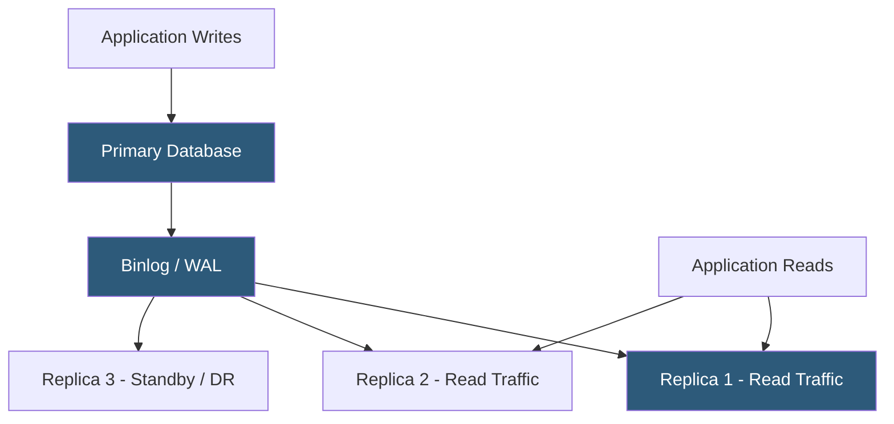

**Category:** Database Hosting
**Difficulty:** Intermediate
**Reading time:** 5 min read

---

Master-slave replication (also called primary-replica replication) copies data changes from a single writable primary database to one or more read-only replicas, providing horizontal read scaling, high-availability failover, and geographic data distribution. It is the foundational replication architecture for MySQL, PostgreSQL, and MongoDB in production hosting deployments.

- **Binary log (binlog)** — MySQL's record of all changes applied to the primary; replicas read and replay the binlog to stay synchronized
- **WAL (Write-Ahead Log)** — PostgreSQL's replication log; streaming replication transmits WAL segments to standbys in real-time
- **Replication lag** — delay between a write being committed on the primary and appearing on replicas; typically milliseconds but can grow under heavy load
- **Read replica** — a replica configured to serve SELECT queries; reduces primary load for read-heavy workloads
- **Asynchronous replication** — default mode; primary acknowledges writes before replicas confirm receipt; small data loss risk on primary failure
- **Synchronous replication** — primary waits for at least one replica to confirm write before acknowledging; zero data loss but higher write latency
- **Semi-synchronous replication** — MySQL feature; waits for one replica acknowledgment but times out to async if replica is slow
- **GTID (Global Transaction ID)** — MySQL feature assigning a unique ID to every transaction; simplifies replica management and automatic failover

In MySQL asynchronous replication, the primary records every write to the binary log. Each replica runs two threads: an I/O thread that connects to the primary and receives binlog events (storing them in a local relay log), and a SQL thread that replays relay log events against the replica's data. Replication proceeds independently of write performance—the primary doesn't wait for replica acknowledgment. Replication lag builds when the replica's SQL thread falls behind the I/O thread, typically during large bulk operations or index rebuilds on the primary.

PostgreSQL streaming replication transmits WAL records from primary to standby in real-time. Standbys in hot standby mode can serve read-only queries while continuously applying WAL changes. Synchronous standby configuration (`synchronous_standby_names`) waits for one or more standbys to confirm WAL receipt before committing, providing synchronous replication semantics at the cost of write latency proportional to network round-trip.

Read replicas are a common hosting pattern for offloading reporting, analytics, and search queries. Applications use a read/write splitting mechanism (ProxySQL, application-level, or a database proxy) to route SELECT queries to replicas and INSERT/UPDATE/DELETE to the primary. Replicas can also serve as backup sources—`mysqldump` or `pg_basebackup` run against a replica without locking the primary.

Failover automation (Orchestrator for MySQL, Patroni for PostgreSQL) monitors replication health and promotes a replica to primary automatically when the primary fails, updating DNS or proxy configuration to redirect traffic. GTID-based replication in MySQL simplifies failover by allowing replicas to self-configure against a new primary without specifying exact binlog position.

- Offloading analytics queries from a WooCommerce primary MySQL server to a read replica
- Providing a warm standby for a SaaS application's PostgreSQL database with sub-30-second automatic failover
- Geographically distributed replicas serving reads locally while writes go to a centralized primary
- Backup-safe replica: running continuous hot standby for streaming backup without impacting production
- Developer database clones: periodic promotion of a replica snapshot to a development/staging environment

| Advantage | Disadvantage |
|-----------|--------------|
| Read scaling with zero write impact; replicas added without primary changes | Replication lag means replicas may serve stale data; applications must tolerate eventual consistency |
| Warm standby enables fast automatic failover (10–60 seconds with tooling) | All writes still go to a single primary; write throughput limited to single-node capacity |
| Replicas can serve as live backup sources without primary impact | Asynchronous replication risks losing the most recent writes (seconds) on primary failure |
| GTID simplifies failover topology management | Semi-sync fallback to async on slow replicas can create unexpected durability degradation |

- [Multi-Master Replication](multi-master-replication.md)
- [Database High Availability](database-high-availability.md)
- [Database Failover Mechanisms](database-failover-mechanisms.md)

---
*Part of the [Database Hosting](index.md) category · [Back to Master Index](../../index.md)*
