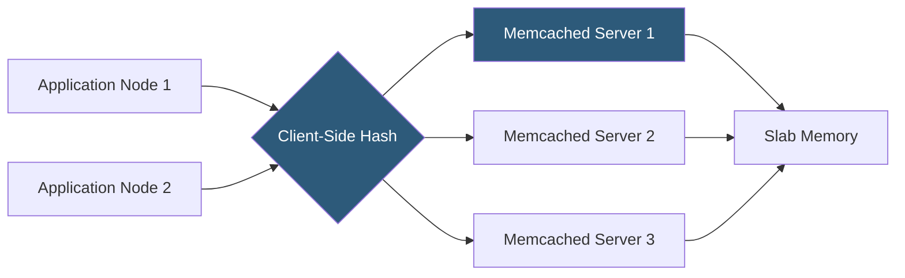

**Category:** Database Hosting
**Difficulty:** Intermediate
**Reading time:** 5 min read

---

Memcached is a high-performance, distributed memory caching system designed for simplicity and raw speed. Unlike Redis, it focuses exclusively on key-value string caching without persistence, data structures, or replication, making it exceptionally fast and memory-efficient for pure caching use cases in high-traffic hosting environments.

- **Slab allocator** — Memcached's memory management system that pre-allocates memory in fixed-size chunks (slabs) to avoid heap fragmentation
- **Slab class** — a category of slab sizes; items are stored in the smallest slab class that fits them, grouping similar-sized objects
- **LRU eviction** — Least Recently Used eviction within each slab class; when a slab is full, the oldest unused item is evicted to make room
- **Consistent hashing** — client-side sharding technique distributing keys across multiple Memcached servers; adding a server only remaps a fraction of keys
- **CAS (Compare And Swap)** — atomic operation for optimistic locking: `gets` retrieves a token, `cas` only stores if the token is still valid
- **-m flag** — maximum memory Memcached will use (MB); process stays within this limit using LRU eviction
- **-c flag** — maximum simultaneous connections; Memcached uses one thread per connection up to `-t` threads
- **SASL authentication** — optional SASL-based authentication for Memcached in multi-tenant environments

Memcached is designed as a single-purpose caching daemon. Unlike Redis, which handles sharding natively in cluster mode, Memcached distributes keys using client-side consistent hashing—the application client library determines which Memcached server stores each key based on the key hash. This design pushes complexity to the client but makes individual Memcached instances stateless and trivially replaceable.

Memory management uses a slab allocator rather than malloc/free. At startup, Memcached allocates pages of memory (default 1MB each) and divides them into slab classes of varying sizes (64B, 128B, 256B, up to the maximum item size). When storing an item, Memcached finds the smallest slab class that fits and stores it there. This prevents heap fragmentation over time—a significant advantage for long-running processes. The trade-off is memory waste when items don't pack efficiently into slab sizes.

LRU eviction operates per slab class. When all slabs in a class are full, the least recently accessed item in that class is evicted to make room. Critically, Memcached does not evict across slab classes—a full small-item slab won't evict items even if a large-item slab has free space. This can cause the "slab imbalance" problem where some classes are full while others are empty. The `-o lru_crawler` option enables background LRU crawling for better eviction accuracy.

Consistent hashing in clients (libmemcached, pymemcache, spymemcached) assigns each server a set of virtual nodes on a hash ring. When a server is added or removed, only the keys on adjacent ring segments require remapping—typically 1/N of total keys—minimizing cache miss spikes during scaling events.

- Session caching for PHP applications using Memcached via the `memcached` PECL extension
- HTML fragment caching in large-scale CMS deployments where multiple web servers share a single Memcached cluster
- Database query result caching for read-heavy social media sites needing maximum throughput
- API rate limiting counters using Memcached's atomic INCREMENT operation
- Object caching for Magento stores using the built-in Memcached backend integration

| Advantage | Disadvantage |
|-----------|--------------|
| Simpler than Redis; lower per-operation overhead for pure key-value caching | No persistence; all cached data is lost on restart or crash |
| Slab allocator prevents heap fragmentation for long-running deployments | Slab imbalance can waste significant memory if item size distribution is uneven |
| Multi-threaded architecture scales across multiple CPU cores natively | No native data structures, pub/sub, or scripting; only string key-value storage |
| Client-side sharding makes adding/removing servers straightforward | No built-in replication; server failure results in cache misses, not data corruption but lost cache |

- [Redis Caching Strategies](redis-caching-strategies.md)
- [Database Connection Pooling](database-connection-pooling.md)
- [MySQL Optimization for Hosting](mysql-optimization-for-hosting.md)

---
*Part of the [Database Hosting](index.md) category · [Back to Master Index](../../index.md)*
