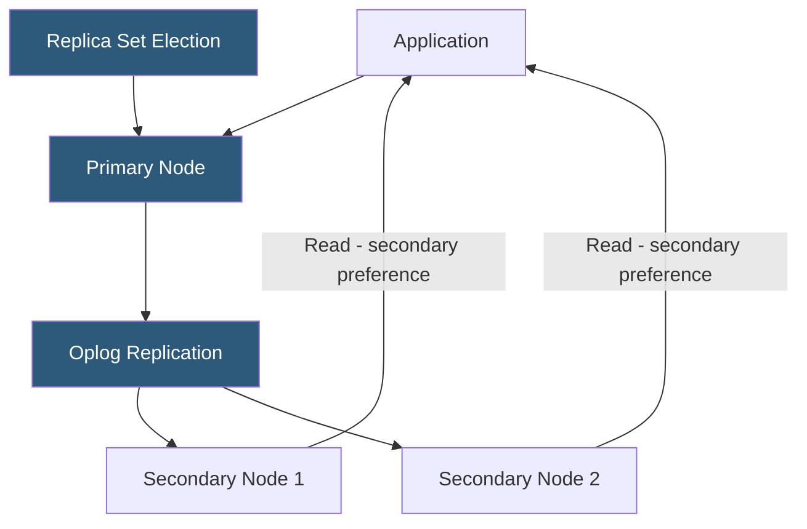

**Category:** Database Hosting
**Difficulty:** Intermediate
**Reading time:** 6 min read

---

MongoDB replica sets are groups of MongoDB instances that maintain synchronized copies of the same data, providing high availability through automatic failover and data redundancy. A replica set consists of a primary node receiving all writes, secondary nodes that replicate the primary's oplog, and optional arbiters that participate in elections without storing data.

- **Primary** — the single node in a replica set that accepts all write operations; elected by majority vote
- **Secondary** — node that replicates the primary's oplog and maintains a copy of all data; can serve reads with `readPreference`
- **Oplog (Operations Log)** — capped collection on each node recording all write operations; secondaries tail the primary's oplog to replicate changes
- **Election** — process triggered when the primary becomes unreachable; secondaries vote to elect a new primary from eligible candidates
- **Write concern** — specifies how many replica set members must acknowledge a write before it's considered successful (`w:1`, `w:majority`)
- **Read preference** — controls which replica set members serve read operations: primary, primaryPreferred, secondary, secondaryPreferred, nearest
- **Arbiter** — replica set member that votes in elections but stores no data; used to ensure odd node counts for majority elections
- **Priority** — per-member setting influencing likelihood of being elected primary; `priority:0` makes a member ineligible for election

A MongoDB replica set requires a minimum of three members (typically two data-bearing nodes plus an arbiter, or three full nodes) to ensure majority-based elections work correctly. All writes go to the primary node, which records each operation in its oplog—a special capped collection in the `local` database. Secondaries maintain a long-running tail operation against the primary's oplog, applying operations to their local copies as they arrive. Replication lag (typically milliseconds on low-latency networks) represents how far behind a secondary is from the primary.

Write concern determines durability. `w:1` (default) acknowledges writes when the primary writes to its in-memory journal. `w:majority` waits for a majority of data-bearing nodes to confirm the write, preventing data loss if the primary fails before replication completes. Majority write concern has latency proportional to network round-trip to secondaries.

When the primary becomes unavailable (network partition, crash, or maintenance), the remaining members hold an election. Any node with `priority > 0` and recent enough oplog position can be elected. The election completes in typically 10–30 seconds, during which the replica set is read-only. Applications should handle `NotPrimaryOrSecondary` errors and retry with backoff.

Read preference allows distributing reads to secondaries. `secondaryPreferred` routes reads to secondaries when available, reducing primary load for read-heavy workloads. However, reads from secondaries may return slightly stale data due to replication lag—applications must tolerate eventual consistency for those operations.

- Production MongoDB deployments requiring automatic failover without manual intervention
- Distributing read traffic across secondaries for analytics or reporting queries
- Providing a dedicated secondary in a separate availability zone for DR purposes with `priority:0`
- Using `w:majority` write concern for financial or user-data writes requiring durability guarantees
- MongoDB Atlas replica sets providing managed multi-AZ high availability out of the box

| Advantage | Disadvantage |
|-----------|--------------|
| Automatic failover with 10–30 second election time requires no manual intervention | Secondary reads may return stale data; applications must tolerate eventual consistency |
| `w:majority` prevents data loss on primary failure after write acknowledgment | Majority write concern adds latency proportional to secondary replication speed |
| Arbiters provide election quorum without full data copy hardware costs | Arbiters vote but don't provide data redundancy; losing two data nodes risks data loss |
| Read preference enables horizontal read scaling across secondaries | All writes go to the primary; write throughput is limited to single-node capacity |

- [Database High Availability](database-high-availability.md)
- [Database Failover Mechanisms](database-failover-mechanisms.md)
- [Multi-Master Replication](multi-master-replication.md)

---
*Part of the [Database Hosting](index.md) category · [Back to Master Index](../../index.md)*
