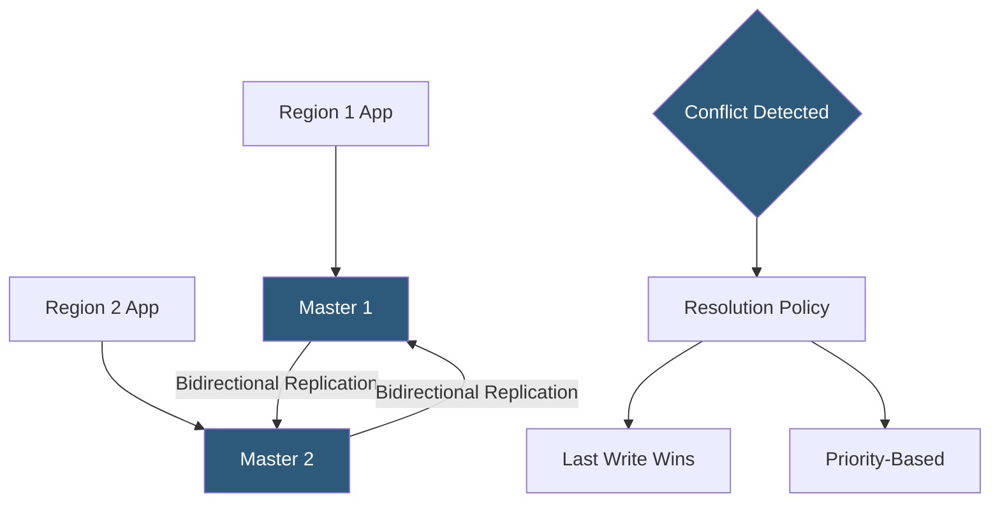

**Category:** Database Hosting
**Difficulty:** Advanced
**Reading time:** 6 min read

---

Multi-master replication allows multiple database nodes to accept write operations simultaneously, each replicating changes to all other masters. It enables active-active architectures where every node is both readable and writable, providing write redundancy, geographic write locality, and horizontal write scaling at the cost of conflict detection and resolution complexity.

- **Conflict** — occurs when two masters receive writes to the same row or key simultaneously before replicating to each other
- **Conflict resolution** — strategy for resolving simultaneous conflicting writes: last-write-wins (by timestamp), higher-priority master wins, or application-defined resolution
- **Circular replication** — MySQL multi-master topology where Master A replicates to Master B and B replicates to A; each ignores its own server_id to avoid loops
- **Galera Cluster** — MariaDB/MySQL multi-master solution using synchronous wsrep replication; prevents conflicts via certification rather than resolution
- **CockroachDB** — distributed SQL database with native multi-master semantics across multiple regions using Raft consensus
- **Active-active** — all nodes accept writes and serve reads; contrasted with active-passive where only one node is writable at a time
- **Split-brain** — scenario where two masters independently accept conflicting writes during network partition; mitigated by quorum requirements
- **Replication divergence** — masters becoming inconsistent due to unresolved conflicts; catastrophic and difficult to recover from

Traditional MySQL multi-master uses circular replication: each master is both a primary for its clients and a replica for the other master. Server IDs in the binlog prevent replication loops—each event carries the originating server ID, and replicas ignore events from their own server ID. Conflict detection relies on the application: if two masters simultaneously update the same row, the last replication event overwrites the previous one, potentially losing a write silently. This "last write wins" behavior is only acceptable when write conflicts are architecturally impossible (e.g., sharded by region so each region only writes its own data).

Galera Cluster takes a fundamentally different approach: synchronous certification-based replication prevents conflicts from occurring. When a write commits, it's broadcast to all nodes before acknowledging. If two nodes receive conflicting write sets for the same row, only one is certified and committed—the other receives a deadlock error and must retry. This eliminates conflicts but requires network round-trips for every commit, limiting geographic distribution to low-latency networks.

CockroachDB and YugabyteDB implement distributed SQL with Raft consensus per partition range. Each range has a leader that coordinates reads and writes using Raft quorum. Multi-region deployments configure follower reads for low-latency local reads while all writes go through the range leader's Raft group. This provides strong consistency without conflict resolution complexity at the cost of write latency for cross-region transactions.

Active-active geographic deployments often use region-specific write routing: users in Europe always write to the European master, users in the US to the US master. This prevents conflicts by ensuring geographic data ownership while providing low-latency reads from local masters. Galera or synchronous replication between regions ensures both masters are always consistent.

- Active-active multi-datacenter databases where writes must continue if one datacenter is unavailable
- Geographically distributed applications requiring low-latency writes from users in different regions
- Hosting platforms requiring zero-downtime maintenance: route traffic to one master while upgrading another
- Multi-tenant SaaS where tenant data is regionally owned, eliminating cross-master write conflicts by design
- Blue/green database migrations where both "blue" and "green" masters stay synchronized during the transition

| Advantage | Disadvantage |
|-----------|--------------|
| All nodes writable; no downtime on single node failure in active-active | Write conflicts require resolution policies; asynchronous setups risk silent data loss |
| Geographic write locality reduces write latency for globally distributed users | Galera's synchronous approach limits inter-node distance to low-latency (same region) networks |
| No single point of write failure; platform remains fully operational during master maintenance | Significantly higher operational complexity than primary-replica setup |
| Enables zero-downtime schema migrations by applying to one master at a time | Split-brain scenarios during network partitions can cause divergence requiring manual reconciliation |

- [Master-Slave Replication](master-slave-replication.md)
- [MariaDB Clustering](mariadb-clustering.md)
- [Database High Availability](database-high-availability.md)

---
*Part of the [Database Hosting](index.md) category · [Back to Master Index](../../index.md)*
