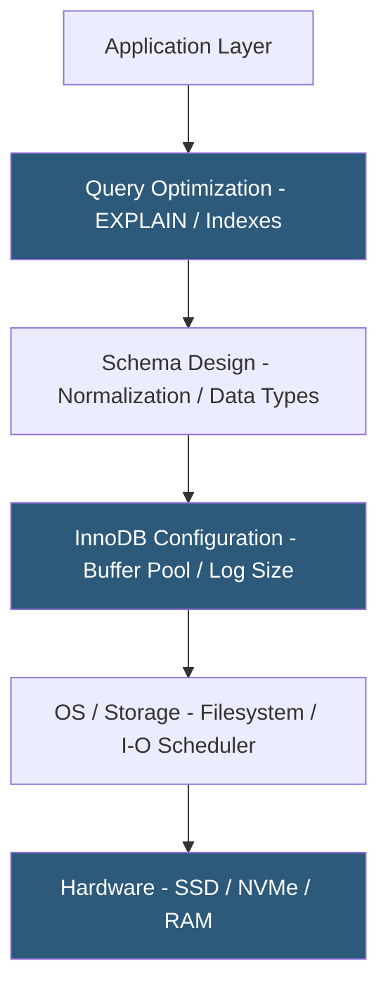

**Category:** Database Hosting
**Difficulty:** Intermediate
**Reading time:** 6 min read

---

MySQL optimization for hosting environments involves tuning server configuration, query design, and storage engine choices to maximize throughput, minimize latency, and efficiently use the resources available on shared or dedicated hosting infrastructure. Proper optimization can improve query performance by orders of magnitude and dramatically reduce infrastructure costs.

- **InnoDB buffer pool** — MySQL's primary memory cache for data and index pages; should be sized to 70–80% of available RAM on dedicated DB servers
- **Query cache** — deprecated in MySQL 8.0; was a cache for SELECT results, replaced by application-level caching (Redis/Memcached)
- **Slow query log** — MySQL feature logging queries exceeding a threshold (e.g., `long_query_time = 1`); essential for identifying optimization targets
- **EXPLAIN** — query execution plan analyzer showing how MySQL resolves indexes, joins, and sort operations
- **Index selectivity** — ratio of distinct values to total rows; high selectivity (close to 1) makes an index effective for filtering
- **Connection pool** — application-side or middleware (ProxySQL) pool of reusable connections reducing per-query connection overhead
- **innodb_flush_log_at_trx_commit** — durability setting: 1=flush on every commit (ACID), 2=flush per second (faster, slight data loss risk)
- **max_connections** — server-wide connection limit; each connection consumes ~1MB RAM; must balance concurrency vs memory

MySQL optimization follows a layered approach from application queries down to hardware. The most impactful changes are almost always at the query and index level before touching server configuration.

Query optimization begins with the slow query log. Enabling it with `long_query_time = 0.1` (100ms threshold) and `log_queries_not_using_indexes = ON` captures queries ripe for improvement. `EXPLAIN SELECT ...` reveals the query execution plan: `type=ALL` (full table scan) is the worst case; `type=ref` or `eq_ref` indicates effective index usage. Adding composite indexes aligned with WHERE clause column order and cardinality transforms full scans into index seeks.

InnoDB configuration has the largest server-level impact. `innodb_buffer_pool_size` should be 70–80% of RAM on a dedicated host—this is the primary driver of MySQL performance, as queries satisfied from the buffer pool never touch disk. `innodb_log_file_size` (InnoDB redo log) should be large enough to handle 1–2 hours of writes to avoid excessive log cycling overhead. `innodb_io_capacity` should match storage throughput—typically 200 for spinning disk, 2000+ for NVMe SSD.

Connection pooling is critical in high-concurrency hosting environments. Each MySQL connection is a separate OS thread consuming ~1MB RAM. With 500 concurrent PHP application connections, that's 500MB for connections alone. ProxySQL acts as a connection multiplexer, maintaining a smaller pool of backend MySQL connections and queuing application connections, dramatically reducing MySQL's connection overhead.

`innodb_flush_log_at_trx_commit=2` and `sync_binlog=0` reduce disk flush frequency, improving write throughput at the cost of losing up to 1 second of transactions on crash—acceptable for non-financial read-heavy workloads.

- Optimizing a WordPress or Magento site suffering from slow page loads due to unindexed MySQL queries
- Tuning a shared hosting MySQL instance to serve 200+ websites on limited RAM
- Reducing database server costs by maximizing throughput before scaling to a larger instance type
- Diagnosing slow query spikes in a SaaS application using slow query log analysis and ProxySQL routing
- Configuring read replicas to offload reporting queries from the primary

| Advantage | Disadvantage |
|-----------|--------------|
| Index optimization can deliver 100x+ query speedup without hardware changes | Indexes consume additional storage and slow down INSERT/UPDATE/DELETE operations |
| Large buffer pool satisfies most queries from memory, eliminating I/O | Buffer pool sizing requires dedicated RAM; not practical in memory-constrained shared hosting |
| ProxySQL connection pooling reduces connection overhead significantly | ProxySQL adds an infrastructure component to manage and monitor |
| innodb_flush_log_at_trx_commit=2 doubles write throughput | Reduced durability risks up to 1 second of data loss on unclean shutdown |

- [PostgreSQL Performance Tuning](postgresql-performance-tuning.md)
- [Database Connection Pooling](database-connection-pooling.md)
- [Slow Query Log Analysis](slow-query-log-analysis.md)

---
*Part of the [Database Hosting](index.md) category · [Back to Master Index](../../index.md)*
