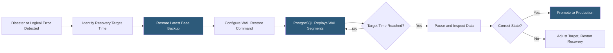

**Category:** Database Hosting
**Difficulty:** Advanced
**Reading time:** 6 min read

---

Point-in-Time Recovery (PITR) enables restoring a database to any specific moment in time, not just the most recent backup, by combining a base backup with a continuous stream of transaction logs. PITR is essential for recovering from logical errors—accidental data deletion, bad deployments, or incorrect bulk updates—that replication and snapshots cannot address.

- **WAL archiving** — continuous shipping of PostgreSQL WAL segments to object storage; combined with a base backup, enables recovery to any point
- **Binary log** — MySQL's transaction log that PITR replays from after a full backup to reach the target timestamp
- **Recovery target** — the timestamp, transaction ID, or LSN (Log Sequence Number) to stop replay at during recovery
- **Base backup** — consistent physical copy of database files that PITR uses as the starting point before replaying logs
- **WAL replay** — process of applying archived WAL segments to a base backup until the recovery target is reached
- **recovery.conf / postgresql.conf** — PostgreSQL configuration controlling PITR: `recovery_target_time`, `recovery_target_action`, WAL restore command
- **mysqlbinlog** — MySQL tool for parsing and replaying binary logs; used to apply specific transactions during PITR
- **LSN (Log Sequence Number)** — PostgreSQL's position marker in the WAL stream; uniquely identifies every byte of WAL

PITR requires two persistent streams: a base backup (taken periodically—daily is typical) and a continuous archive of transaction logs (WAL for PostgreSQL, binlog for MySQL) stored in durable object storage like S3 or GCS.

For PostgreSQL, WAL archiving is configured via `archive_command` in `postgresql.conf`: when each 16MB WAL segment fills, PostgreSQL calls the archive command to copy it to S3. Tools like WAL-G or pgBackRest automate WAL archiving with compression (lz4/zstd), encryption, parallel upload, and intelligent retention. WAL-G can reduce WAL storage by 90% compared to raw segment archiving through delta compression.

Recovery begins by restoring the most recent base backup taken before the target timestamp to a clean data directory. PostgreSQL is then configured with a `restore_command` (a script to retrieve WAL segments from S3) and a `recovery_target_time`. PostgreSQL enters recovery mode, continually requesting WAL segments via the restore command and applying them. When the target timestamp is reached, recovery pauses—the DBA can inspect the database state, run queries, and decide whether to promote (make read-write) or adjust the target and replay further.

MySQL PITR works similarly but uses binary logs. After restoring from a mysqldump or XtraBackup, `mysqlbinlog --start-datetime --stop-datetime` extracts the relevant binlog events between the backup's completion time and the target time, and applies them to the restored database.

Recovery time depends on how much WAL must be replayed. Recovering from a backup taken 12 hours before the target requires replaying 12 hours of WAL—for a busy database, this may mean applying hundreds of gigabytes of changes over several hours. Increasing backup frequency reduces replay time proportionally.

- Recovering from an accidental `DELETE FROM users WHERE 1=1` executed in production
- Rolling back the effects of a bad migration that ran at 3 PM by recovering to 2:59 PM
- Recovering a customer's data to a specific time they report data loss
- Forensic analysis: restoring to various historical points to trace when data corruption first appeared
- Compliance requirements mandating database state preservation for audit purposes

| Advantage | Disadvantage |
|-----------|--------------|
| Recovery to any second granularity without hourly snapshot overhead | Recovery time proportional to WAL replay volume; large databases with many changes take hours to recover |
| Protects against logical errors that replication propagates to all replicas | Requires continuous WAL archiving to object storage; adds storage costs and slight I/O overhead |
| WAL-G/pgBackRest compression reduces PITR storage to a fraction of raw WAL | WAL archive gaps (missed segments) make recovery to times after the gap impossible |
| Can recover to a point in time without affecting other databases on shared infrastructure | Testing PITR requires a full restore to a separate environment; cannot be tested in-place |

- [Database Backup Automation](database-backup-automation.md)
- [Database Disaster Recovery](database-disaster-recovery.md)
- [Database High Availability](database-high-availability.md)

---
*Part of the [Database Hosting](index.md) category · [Back to Master Index](../../index.md)*
