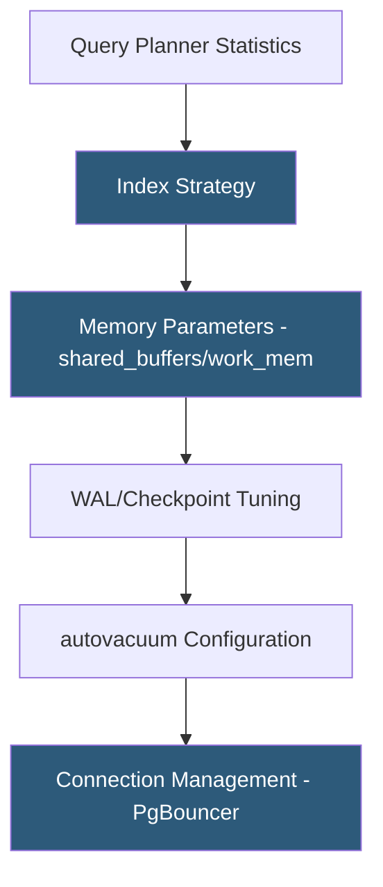

**Category:** Database Hosting
**Difficulty:** Intermediate
**Reading time:** 6 min read

---

PostgreSQL performance tuning involves configuring memory, parallelism, and storage parameters to maximize query throughput while maintaining data integrity. PostgreSQL's sophisticated query planner, rich index types (B-tree, GiST, BRIN, partial), and extensible architecture provide powerful optimization levers unavailable in simpler database engines.

- **shared_buffers** — PostgreSQL's buffer cache; typically set to 25% of RAM (PostgreSQL relies on OS page cache for the rest, unlike MySQL)
- **effective_cache_size** — hint to the query planner about how much memory is available for caching; set to 75% of RAM; does not allocate memory
- **work_mem** — memory per sort or hash operation per query; multiply by max concurrent queries to estimate maximum usage
- **autovacuum** — background process that reclaims dead tuple space and updates planner statistics; critical for MVCC performance
- **VACUUM ANALYZE** — manual process to reclaim bloat and refresh column statistics used by the query planner
- **WAL (Write-Ahead Log)** — PostgreSQL's durability mechanism; `wal_buffers`, `checkpoint_completion_target`, and `max_wal_size` affect write performance
- **EXPLAIN ANALYZE** — executes a query and shows actual execution statistics including row counts, timing per node, and buffer hit rates
- **Partial index** — index with a WHERE clause filtering to a subset of rows; dramatically reduces index size for sparse predicates

PostgreSQL tuning begins with the query planner. Unlike MySQL, PostgreSQL's planner uses cost-based optimization with detailed column statistics (histograms, most-common values, correlation coefficients) collected by ANALYZE. When planner estimates are wrong—visible in EXPLAIN ANALYZE output where "rows=1" but "actual rows=50000"—running `ANALYZE tablename` refreshes statistics, often fixing bad query plans without any configuration change.

Memory configuration is the most impactful server-level change. `shared_buffers` should be 25–40% of RAM (unlike MySQL where the buffer pool holds most cache, PostgreSQL benefits heavily from OS page cache). `work_mem` is per sort/hash operation—setting it too high on a busy server with 100 concurrent queries can exhaust RAM. `effective_cache_size` tells the planner how much total memory (shared_buffers + OS cache) to assume; higher values encourage index scans over sequential scans.

PostgreSQL's MVCC (Multi-Version Concurrency Control) creates dead tuples for every UPDATE and DELETE—old row versions remain until VACUUM reclaims them. Without adequate autovacuum, tables become bloated, sequential scans read more pages than necessary, and eventually table bloat causes significant performance degradation. Autovacuum tuning (`autovacuum_vacuum_scale_factor`, `autovacuum_analyze_scale_factor`) should be aggressive for high-write tables.

PgBouncer provides connection pooling in transaction mode: application connections are multiplexed onto a smaller pool of PostgreSQL backend connections. Since each PostgreSQL backend is a separate process consuming ~5–10MB, a 1000-connection PgBouncer pool backed by 50 PostgreSQL connections reduces memory overhead by 95% while serving the same concurrency.

- Optimizing a Rails application's PostgreSQL queries using pg_stat_statements to identify the most expensive queries
- Configuring autovacuum aggressively for an e-commerce site with high UPDATE/DELETE traffic to prevent table bloat
- Using BRIN indexes for time-series tables with natural physical ordering to dramatically reduce index size
- Deploying PgBouncer to handle 2000+ Django application connections pooled onto 50 PostgreSQL backends
- Tuning work_mem for a BI workload with complex analytical queries requiring large sort/hash operations

| Advantage | Disadvantage |
|-----------|--------------|
| Rich index types (partial, expression, GiST, BRIN) enable highly targeted optimization | MVCC dead tuple accumulation requires careful autovacuum tuning to prevent bloat |
| EXPLAIN ANALYZE provides detailed actual execution statistics for deep query analysis | work_mem multiplied by concurrent queries can exhaust RAM if set too aggressively |
| PgBouncer pooling in transaction mode handles thousands of application connections | PgBouncer in transaction mode incompatible with prepared statements and some advisory locks |
| Planner statistics enable sophisticated join reordering and parallel query execution | Large planner configuration space; wrong settings degrade rather than improve performance |

- [MySQL Optimization for Hosting](mysql-optimization-for-hosting.md)
- [Database Connection Pooling](database-connection-pooling.md)
- [Query Optimization Techniques](query-optimization-techniques.md)

---
*Part of the [Database Hosting](index.md) category · [Back to Master Index](../../index.md)*
