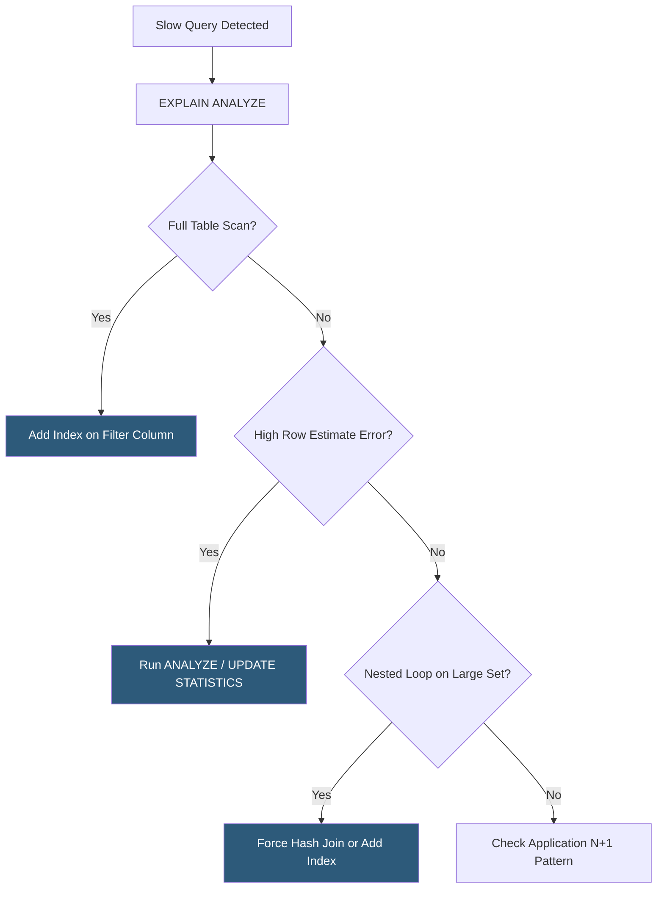

**Category:** Database Hosting
**Difficulty:** Intermediate
**Reading time:** 6 min read

---

Query optimization transforms slow, resource-intensive database queries into efficient operations through index usage, join strategy improvements, and result set reduction. Systematic optimization using execution plan analysis and query profiling can reduce query latency from seconds to milliseconds and dramatically decrease database server load.

- **Execution plan** — the sequence of operations the database chooses to fulfill a query; analyzed via EXPLAIN (MySQL/PostgreSQL)
- **Full table scan (Seq Scan)** — reading every row in a table to find matches; appropriate for small tables or when selecting most rows
- **Index scan** — using a B-tree or other index to locate rows; optimal for high-selectivity predicates
- **Join strategy** — how the database connects tables: Nested Loop (good for small result sets), Hash Join (large unsorted sets), Merge Join (sorted sets)
- **Predicate pushdown** — moving WHERE clause filters as early as possible in the execution plan to reduce rows processed by subsequent operations
- **N+1 query problem** — application anti-pattern executing N additional queries for each of N results; solved by JOIN or batch fetching
- **Query hints** — directives telling the optimizer to use a specific index or join strategy; last resort when optimizer makes poor choices
- **pg_stat_statements / performance_schema** — PostgreSQL/MySQL system views tracking cumulative query statistics (total time, call count, mean time) for identifying hot queries

Query optimization starts with identifying candidates. `pg_stat_statements` in PostgreSQL (or `performance_schema.events_statements_summary_by_digest` in MySQL 8.0) ranks queries by total execution time, call count, and mean time. The top 10 queries by cumulative time are the highest-leverage optimization targets—improving a query used 10,000 times/day has more impact than one used once.

`EXPLAIN ANALYZE` executes the query and returns the actual execution plan with timings. The key indicators are: `Seq Scan` on large tables (missing index opportunity), `Rows Removed by Filter` (predicates applied after scan rather than via index), actual row estimates vs. estimated rows (planner statistics staleness), and expensive sort or hash operations that spill to disk.

Adding indexes is the most impactful change. Composite indexes should match the query's WHERE clause column order, with the highest-cardinality (most selective) column first in equality predicates, followed by range predicates. Covering indexes include all columns referenced in the query (WHERE + SELECT), allowing index-only scans that never touch the base table.

Query rewriting addresses structural issues. The N+1 problem—common in ORMs—is solved by replacing N queries with a single JOIN or using the ORM's eager loading feature (`includes` in ActiveRecord, `prefetch_related` in Django). Subqueries in WHERE clauses are often rewritten as JOINs to allow the optimizer to reorder operations. CTEs (Common Table Expressions) in PostgreSQL are optimization fences in older versions; `WITH foo AS (SELECT ...) SELECT ...` should be replaced with inline subqueries or materialization disabled via `MATERIALIZED`/`NOT MATERIALIZED` hints in PostgreSQL 12+.

- Identifying the top 5 slowest queries in a production Django application using pg_stat_statements
- Replacing a full-table-scan query on a 50M-row orders table with a composite index (customer_id, created_at)
- Fixing an ORM N+1 issue in a Rails admin panel that executed 1000 queries per page load
- Rewriting a correlated subquery as a JOIN to allow the optimizer to use hash join instead of nested loop
- Using partial indexes to optimize queries that always filter by `status = 'pending'` on a small fraction of rows

| Advantage | Disadvantage |
|-----------|--------------|
| Index optimization provides large gains with zero schema changes | Each additional index increases INSERT/UPDATE/DELETE overhead and storage |
| Statistics refresh (ANALYZE) often fixes bad plans without code changes | Execution plan changes can be unpredictable after statistics updates |
| N+1 fixes dramatically reduce database round trips | Eager loading can fetch excessive data if not scoped carefully |
| Covering indexes eliminate heap fetches for common read patterns | Covering indexes become very wide and costly to maintain for frequently updated columns |

- [Database Indexing Strategies](database-indexing-strategies.md)
- [Slow Query Log Analysis](slow-query-log-analysis.md)
- [MySQL Optimization for Hosting](mysql-optimization-for-hosting.md)

---
*Part of the [Database Hosting](index.md) category · [Back to Master Index](../../index.md)*
