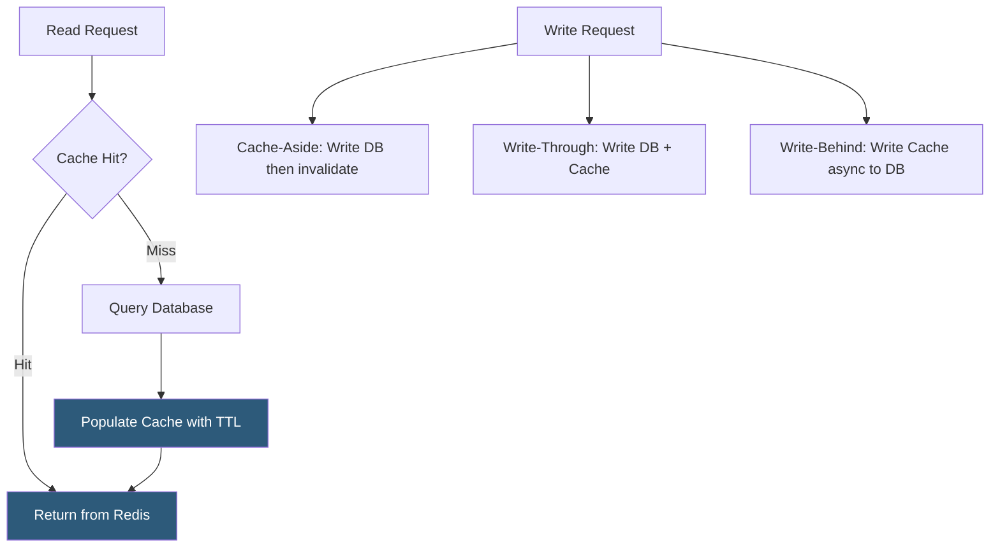

**Category:** Database Hosting
**Difficulty:** Intermediate
**Reading time:** 6 min read

---

Redis is an in-memory data structure store widely used as a caching layer to reduce database load and improve application response times. Choosing the right caching strategy—cache-aside, write-through, write-behind, or read-through—and configuring appropriate eviction policies and TTLs directly determines the effectiveness of Redis as a performance accelerator in production hosting environments.

- **Cache-aside (lazy loading)** — application checks cache first; on miss, queries database and populates cache; most common pattern for read caching
- **Write-through** — writes go to cache and database simultaneously; ensures cache consistency but adds write latency
- **Write-behind (write-back)** — writes go to cache immediately, asynchronously flushed to database; high write performance but risk of data loss
- **TTL (Time To Live)** — expiration time on cache entries; prevents stale data accumulation and manages memory usage
- **Eviction policy** — Redis behavior when memory is full: `allkeys-lru` (evict least recently used), `volatile-lru` (LRU among keys with TTL), `noeviction` (return errors)
- **Cache stampede** — simultaneous cache misses by many requests for the same expired key, overwhelming the database; mitigated by mutex locks or probabilistic early expiry
- **Pub/Sub** — Redis messaging pattern for real-time notifications and cache invalidation signaling across application instances
- **Redis Cluster** — sharding mode distributing data across 16,384 hash slots across multiple Redis nodes for horizontal scaling

Cache-aside is the most commonly implemented Redis pattern. The application code first checks Redis for a key; on a cache hit, the cached value is returned immediately without touching the database. On a cache miss, the application queries the database, stores the result in Redis with an appropriate TTL, and returns the value. This pattern gives the application full control over what is cached and for how long.

TTL selection is critical and workload-dependent. A product catalog that changes hourly can use a 3600-second TTL. User session data should use a sliding TTL that refreshes on each access. For data that changes unpredictably, write-through or explicit cache invalidation (deleting the cache key on every write) prevents stale data issues.

Cache stampede prevention is essential for high-traffic sites. When a popular cache key expires, hundreds of concurrent requests may simultaneously miss the cache and hammer the database. The mutex lock pattern has one request set a "lock" key (with a short TTL) and query the database while other requests wait and retry. Probabilistic early expiry (XFetch algorithm) randomly re-computes cached values slightly before expiry to warm the cache proactively.

Redis eviction policies determine behavior under memory pressure. `allkeys-lru` is appropriate for pure caching workloads where all keys are ephemeral—Redis automatically evicts the least recently used keys when memory fills. `volatile-lru` only evicts keys with TTL set, protecting keys that must persist. For critical session storage, `noeviction` returns errors on new writes rather than losing existing session data.

Redis Cluster shards keys across multiple nodes using consistent hashing, enabling horizontal memory scaling. Applications use cluster-aware clients (redis-py, ioredis) that automatically route commands to the correct shard.

- Caching database query results for product listings in e-commerce platforms, reducing MySQL load by 90%+
- Session storage for web applications requiring fast session lookup across multiple application servers
- Rate limiting using Redis atomic INCREMENT and TTL operations on per-IP or per-user counters
- Leaderboards and sorted sets for gaming or analytics rankings using Redis sorted sets (ZADD/ZRANK)
- Full-page HTML caching in WordPress (WP Object Cache) to serve cached pages without PHP/MySQL overhead

| Advantage | Disadvantage |
|-----------|--------------|
| Sub-millisecond read latency from in-memory storage | Cache misses add latency compared to direct database reads; first-request "cold start" is always a miss |
| TTL-based expiry automatically manages cache freshness | Stale reads are possible with any TTL-based approach; write-through eliminates this but adds write latency |
| Redis eviction handles memory pressure without application code changes | Cache stampede on popular key expiry can create database spikes without mitigation |
| Cluster sharding enables horizontal memory scaling | Redis Cluster adds operational complexity; cross-slot transactions are unsupported |

- [Memcached Deployment](memcached-deployment.md)
- [Database Connection Pooling](database-connection-pooling.md)
- [Database Monitoring and Profiling](database-monitoring-and-profiling.md)

---
*Part of the [Database Hosting](index.md) category · [Back to Master Index](../../index.md)*
