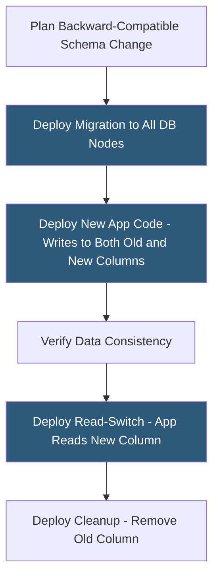

**Category:** Database Hosting
**Difficulty:** Advanced
**Reading time:** 5 min read

---

Zero-downtime database updates apply schema changes, software version upgrades, and data migrations to production databases without interrupting application availability. They combine backward-compatible change patterns, rolling upgrades, and online schema change tools to maintain continuous service while evolving database structure and infrastructure.

- **Backward compatibility** — new database schema supports both old and new application code simultaneously during deployment transitions
- **Rolling upgrade** — updating database nodes one at a time while the cluster continues serving traffic
- **Online DDL** — database feature executing ALTER TABLE without table locks (MySQL 8.0 ALGORITHM=INPLACE, PostgreSQL 12+ concurrent index builds)
- **Concurrent index creation** — PostgreSQL's `CREATE INDEX CONCURRENTLY` builds indexes without exclusive lock; reads and writes continue
- **Non-blocking migrations** — schema changes that avoid AccessExclusiveLock in PostgreSQL or metadata locks in MySQL
- **Feature flag** — application-level toggle allowing new code that depends on new schema to be enabled after the migration completes
- **Shadow table** — technique using gh-ost or pt-online-schema-change to alter tables via a parallel copy rather than direct ALTER
- **Monitoring hooks** — automated checks during migrations to detect replication lag or error rate increases before continuing

Zero-downtime database updates require discipline in sequencing application deployments and schema changes. The fundamental rule is that the database schema must support both the old and new application code versions simultaneously, since during a rolling deployment both versions run in parallel.

Adding a column: add it as nullable (no default or a constant default in modern PostgreSQL). Old app ignores the column; new app writes to it. Once all application instances run the new code, backfill the column if needed, then add the NOT NULL constraint (after verifying no nulls exist).

Removing a column: stop reading/writing it in application code first (deploy the "stop using it" version), wait until all instances are updated, then drop the column. Dropping a column that's still referenced in production queries causes immediate application errors.

Online index creation uses `CREATE INDEX CONCURRENTLY` in PostgreSQL. Unlike standard index creation that holds an exclusive lock for the full build duration (minutes to hours on large tables), concurrent index creation uses two table scans and only requires brief locks during the final swap phase. Applications can read and write normally throughout the build.

For MySQL ALTER TABLE on large tables, gh-ost copies the table to a shadow copy while applying CDC changes from the original, then performs an atomic table swap. Percona's pt-online-schema-change (pt-osc) uses trigger-based replication to the shadow table. Both avoid the multi-minute exclusive lock of traditional ALTER TABLE.

Database version upgrades use rolling restarts: on a Patroni cluster, replicas are upgraded first (upgraded replica runs alongside original primary), then a controlled failover promotes an upgraded replica to primary, and the original primary is upgraded last. Applications experience a brief connection reset during failover but no extended downtime.

- Adding a `last_login_at` timestamp column to a 100M-row users table without downtime
- Renaming a column using the expand-contract pattern across three application deployment cycles
- Building a new index on a 500GB PostgreSQL table overnight using `CONCURRENTLY` without impacting daytime traffic
- Performing a MySQL 5.7 to 8.0 major version upgrade via rolling replica upgrade with Orchestrator failover
- Removing deprecated columns after confirming zero reads in application performance monitoring

| Advantage | Disadvantage |
|-----------|--------------|
| Continuous application availability maintains SLA and revenue during database changes | Multi-phase migrations (expand → use → contract) require 3+ deployments vs a single big-bang change |
| Concurrent index builds eliminate hours-long locking windows on large tables | Concurrent index builds consume more I/O and time than direct builds; take 2–3x longer |
| Rolling upgrades upgrade databases one version at a time without full-cluster downtime | During rolling upgrade, mixed-version cluster has limited cross-version feature availability |
| Feature flags decouple schema deployment from feature activation timing | Maintaining backward compatibility constraints limits schema change options |

- [Database Migration Strategies](database-migration-strategies.md)
- [Database High Availability](database-high-availability.md)
- [Database Indexing Strategies](database-indexing-strategies.md)

---
*Part of the [Database Hosting](index.md) category · [Back to Master Index](../../index.md)*
