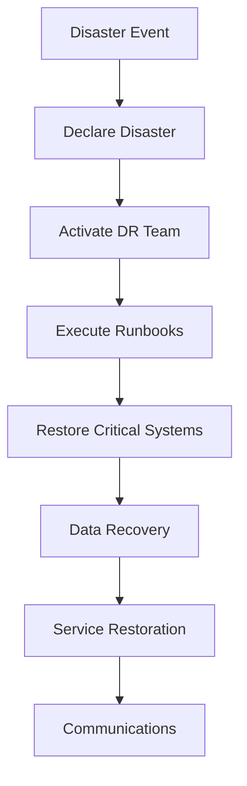

**Category:** Disaster Recovery
**Difficulty:** Intermediate
**Reading time:** 6 min read

---

Disaster recovery planning establishes strategies and procedures for business continuity after catastrophic events. Effective DR planning defines objectives, identifies critical functions, documents recovery procedures, and ensures organizational readiness through testing and maintenance.

- **Recovery Time Objective (RTO)** — Maximum acceptable downtime after disaster
- **Recovery Point Objective (RPO)** — Maximum acceptable data loss after disaster
- **Critical Business Functions** — Essential operations that must recover first
- **DR Runbooks** — Step-by-step procedures for recovery execution
- **Stakeholder Communication** — Plans for notifying and coordinating with customers, regulators, and employees

Disaster recovery planning begins with business impact analysis identifying critical functions and their recovery priorities. RTO and RPO determine recovery strategy and technology investments. Recovery sites are selected (hot, warm, cold) based on objectives. Detailed runbooks document each step for different disaster types (data center failure, ransomware, natural disaster). Recovery teams are designated with specific responsibilities. Testing schedules ensure plans remain current and teams understand procedures. Post-recovery, lessons learned refine procedures and identify improvements. Ongoing maintenance updates procedures as systems evolve.

- Enterprise data center disaster recovery
- Cloud-based multi-region failover
- Software-as-a-service provider resilience
- Healthcare system patient record protection
- Financial institution regulatory compliance
- Ransomware response and recovery

| Advantage | Disadvantage |
|-----------|--------------|
| Minimizes downtime and data loss | Significant upfront planning investment |
| Regulatory compliance and certification | Ongoing maintenance and testing overhead |
| Stakeholder confidence and trust | Technology costs for redundancy |
| Rapid decision-making during crisis | Coordination complexity across teams |
| Reduces business impact | Requires executive commitment |

- [Business Impact Analysis](business-impact-analysis.md)
- [Recovery Time Objective RTO Definition](recovery-time-objective-rto-definition.md)
- [Recovery Point Objective RPO Definition](recovery-point-objective-rpo-definition.md)

---
*Part of the [Disaster Recovery](index.md) category · [Back to Master Index](../../index.md)*
