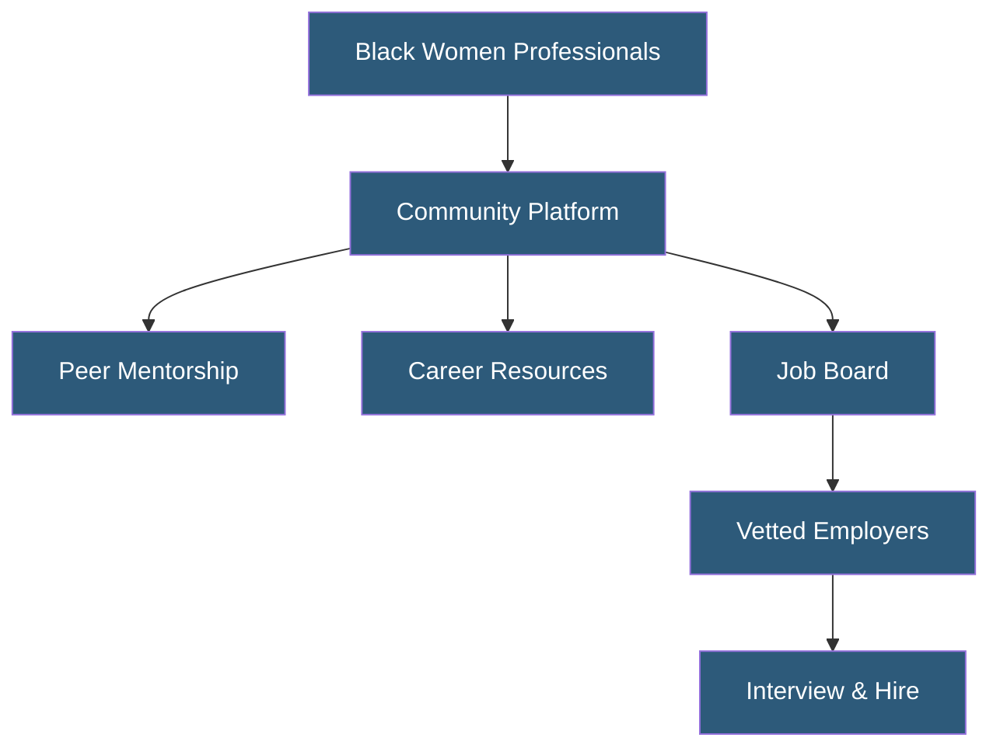

**Category:** Diversity & Inclusion Recruiting
**Difficulty:** Beginner
**Reading time:** 5 min read

---

A Seat at the Table is a community and career platform centered on amplifying Black women professionals in the workplace. It connects members with employers, mentors, and peer networks committed to equitable advancement for Black women in corporate and entrepreneurial settings.

- **Sponsorship** — Active advocacy by senior leaders who use their influence to advance a protégé's career
- **ERG (Employee Resource Group)** — Internal company affinity groups supporting underrepresented employees
- **Pay Equity** — Ensuring equal compensation for equal work regardless of race or gender
- **Leadership Pipeline** — The structured path developing employees toward senior and executive roles
- **Community-Led Recruiting** — Sourcing talent through trust-based professional communities rather than cold outreach
- **Intersectionality** — The compounded effects of holding multiple marginalized identities (e.g., being both Black and a woman)

A Seat at the Table operates as a community-first platform where trust and peer connection precede job matching. Members join by creating profiles that capture professional background, career goals, and areas of expertise. The community structure allows Black women to share experiences, seek advice, and refer opportunities within a safe, moderated environment.

Employers gain access through a vetting process that screens for genuine DEI commitments — companies must demonstrate inclusive policies, equitable pay practices, and leadership diversity before posting jobs. This gatekeeping model distinguishes the platform from general job boards where employers can post without accountability.

The platform surfaces job opportunities relevant to each member's background, while also providing salary transparency data to help members negotiate with confidence. Content programming — including webinars, workshops, and interview preparation guides — builds career capital alongside recruiting functionality.

Analytics for employers track not just application volume but also offer acceptance rates and retention indicators for Black women hires, creating a feedback loop that measures the quality of the hiring experience rather than just pipeline numbers.

- Corporate DEI teams sourcing senior-level Black women professionals
- Startups building founding teams with intentional demographic diversity
- HR departments offering ERG members access to external peer communities
- Mentorship programs pairing early-career Black women with senior professionals
- Organizations benchmarking pay equity for Black women in their industry

| Advantage | Disadvantage |
|-----------|--------------|
| High-trust community improves candidate engagement | Smaller candidate pool than general platforms |
| Employer vetting ensures authentic DEI commitment | Employers may face lengthy onboarding process |
| Salary transparency empowers negotiation | Requires ongoing content investment to retain members |
| Intersectional focus addresses compounded barriers | Platform relevance tied to community activity levels |

- [Tech While Black Platform](tech-while-black-platform.md)
- [Blavity Career Opportunities](blavity-career-opportunities.md)
- [National Black MBA Association](national-black-mba-association.md)

---
*Part of the [Diversity & Inclusion Recruiting](index.md) category · [Back to Master Index](../../index.md)*
