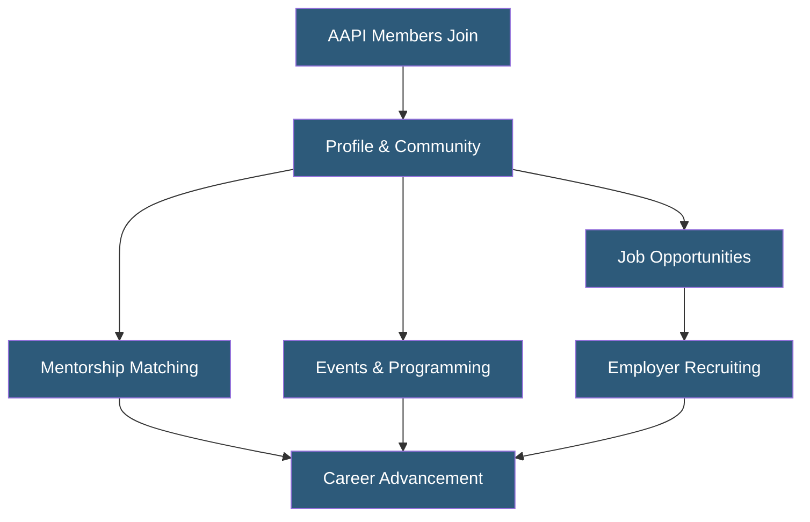

**Category:** Diversity & Inclusion Recruiting
**Difficulty:** Beginner
**Reading time:** 5 min read

---

AAPI professional networks are membership organizations and online communities that build career capital for Asian American and Pacific Islander professionals through peer connection, mentorship, and employer partnerships. They serve both as talent sourcing channels for employers and as community infrastructure for professional growth and advocacy.

- **Professional Network** — A community of peers organized around shared identity, industry, or career stage that enables information and opportunity exchange
- **Mentorship Matching** — Algorithmic or curated pairing of early-career members with experienced professionals for guidance
- **Talent Community** — A pool of engaged professionals a company maintains relationships with for future hiring needs
- **Cultural Competency** — Awareness and skills enabling effective interaction across cultural differences in workplace settings
- **Affinity Network** — An organization based on shared identity rather than purely professional function
- **Reciprocal Benefit** — The dual value exchange where candidates gain career resources while employers gain recruiting access

AAPI professional networks operate through a combination of digital platforms and physical chapters. Members create profiles capturing their professional background, ethnic heritage, languages spoken, and career interests. This richer identity data enables more relevant matching — both for mentorship pairings and employer outreach.

Many networks segment programming by career stage: student groups focus on internship and first-job placement, while senior groups address leadership advancement and board representation. Cross-stage programming like reverse mentoring creates value for both ends of the career spectrum.

Employer engagement typically involves sponsoring network events, hosting roundtables with AAPI leaders at their organizations, and maintaining a presence in the network's job board. Sponsorship levels determine visibility and access, with premium partners gaining the ability to message members directly or host featured recruiting events.

Some networks maintain industry-specific verticals — technology, finance, healthcare, law — allowing employers to reach AAPI professionals with specific expertise. Data sharing agreements let employer partners receive aggregate analytics on AAPI candidate engagement with their brand, helping talent acquisition teams refine their outreach messaging.

- Technology companies building relationships with AAPI engineers before active hiring
- Law firms recruiting AAPI associates and summer clerks
- Nonprofits building boards with AAPI community representation
- Corporate ERG teams seeking external peer programming for AAPI employees
- Venture capital firms sourcing AAPI founders and investment professionals

| Advantage | Disadvantage |
|-----------|--------------|
| Community trust creates higher response rates to employer outreach | Building trust requires long-term, consistent employer presence |
| Multi-generational network addresses full career pipeline | AAPI community includes 50+ ethnic groups requiring nuanced approach |
| Industry verticals enable precise talent sourcing | Network fragmentation across many organizations reduces scale |
| Cultural programming helps employers build competency | Programming quality varies significantly across networks |

- [Asian American Careers Platforms](asian-american-careers-platforms.md)
- [Native American Job Platforms](native-american-job-platforms.md)
- [Prospanica Hispanic Professionals](prospanica-hispanic-professionals.md)

---
*Part of the [Diversity & Inclusion Recruiting](index.md) category · [Back to Master Index](../../index.md)*
