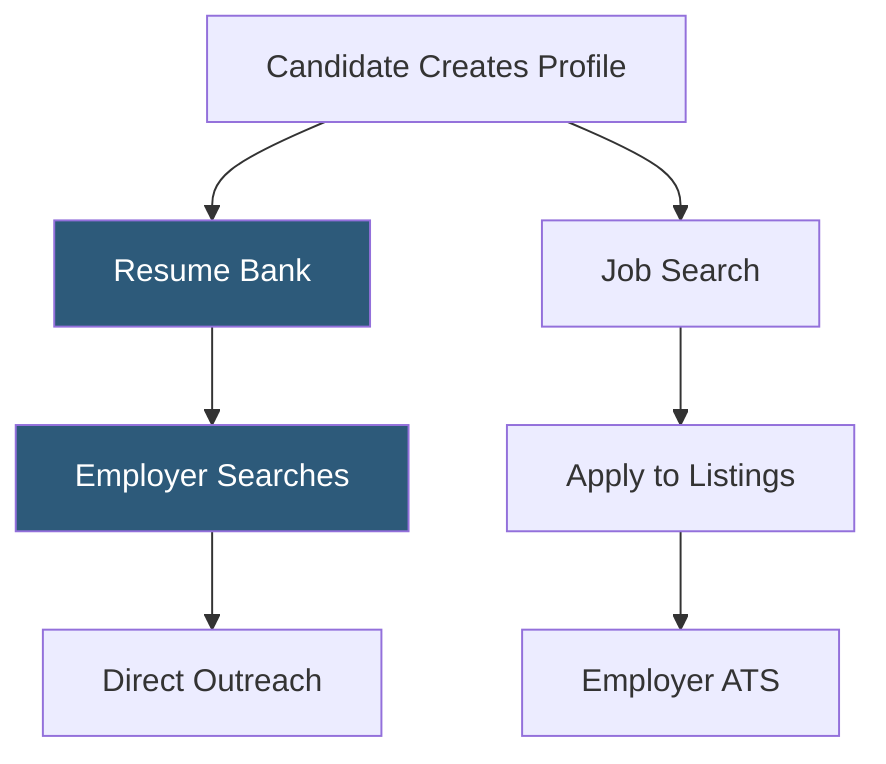

**Category:** Diversity & Inclusion Recruiting
**Difficulty:** Beginner
**Reading time:** 5 min read

---

Ability Jobs is one of the largest online job boards focused on disability employment, connecting people with physical and cognitive disabilities to employers who have demonstrated commitment to disability inclusion through accessible hiring practices and workplace accommodations.

- **Disability job board** — specialized employment platform serving candidates with physical, sensory, or cognitive disabilities
- **Accessible job listing** — posting format compatible with screen readers and assistive technologies
- **Accommodation statement** — employer communication in job postings indicating willingness to provide reasonable accommodations
- **Disability ERG** — Employee Resource Group for employees with disabilities advocating for inclusive policies
- **Reasonable accommodation** — workspace or process modification required by the ADA that does not create undue hardship for the employer
- **Resume bank** — searchable database of candidate profiles that employers can proactively browse

Ability Jobs maintains a large database of job seekers with disabilities and a curated set of employer listings from companies with inclusive hiring practices. The platform operates on both active job search (candidates browsing and applying to listings) and passive sourcing (employers searching the resume bank for candidates with specific skills).

Job listings on Ability Jobs include standard details — role description, qualifications, compensation — supplemented by disability-specific information: whether the role is remote-friendly, what physical demands exist, and how to request accommodations during the application process. Many postings include an explicit ADA accommodation statement.

The platform's accessible design is a differentiating feature: it is built to comply with WCAG 2.1 accessibility standards, ensuring candidates using screen readers, keyboard navigation, or other assistive technologies can use the platform without barriers. This technical accessibility is often overlooked on mainstream job boards.

Employers access Ability Jobs through subscription packages that grant access to the resume bank for proactive sourcing, the ability to post listings, and access to compliance reporting tools. The compliance tools help federal contractors and companies tracking disability representation generate reports documenting their outreach activity.

- A veteran with a service-related disability searching for civilian employment with accommodation support
- An HR team proactively sourcing candidates with disabilities from the resume bank
- A federal contractor demonstrating disability outreach for annual affirmative action reporting
- A deaf candidate searching for remote roles that minimize communication accommodation barriers
- A company building its disability ERG and recruiting employee leaders for it

| Advantage | Disadvantage |
|-----------|--------------|
| Platform accessibility compliance benefits users of assistive technologies | Smaller job volume than mainstream boards |
| Resume bank enables proactive sourcing beyond active applicants | Employer vetting is less rigorous than some platforms |
| ADA accommodation statements set clear candidate expectations | Limited to US-centric disability employment market |
| Compliance reporting tools support affirmative action documentation | Not specialized by disability type or technical role |

- [Getting Hired Disability Jobs](getting-hired-disability-jobs.md)
- [Disability:IN Inclusion](disabilityin-inclusion.md)
- [National Organization on Disability](national-organization-on-disability.md)

---
*Part of the [Diversity & Inclusion Recruiting](index.md) category · [Back to Master Index](../../index.md)*
