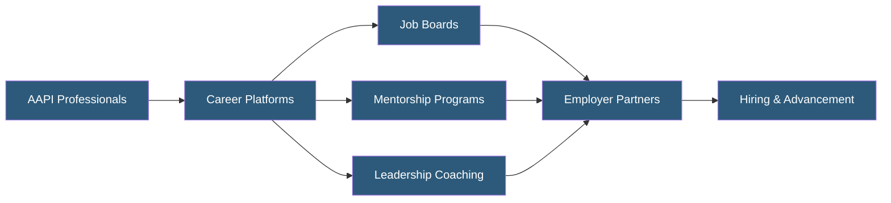

**Category:** Diversity & Inclusion Recruiting
**Difficulty:** Beginner
**Reading time:** 5 min read

---

Asian American careers platforms are specialized recruiting and professional development services that connect Asian American and Pacific Islander (AAPI) professionals with employers committed to equity and advancement. These platforms address the "bamboo ceiling" — the systemic barriers limiting AAPI professionals from advancing to leadership despite high workforce representation.

- **Bamboo Ceiling** — Informal barriers preventing Asian American professionals from advancing to executive and board-level positions
- **Model Minority Myth** — The harmful stereotype that Asian Americans universally succeed, which obscures individual barriers and diversity within the community
- **AAPI** — Asian American and Pacific Islander, an umbrella demographic encompassing dozens of ethnic and cultural groups
- **Leadership Advancement** — Programs specifically targeting the transition from individual contributor to management roles
- **Ethnic Affinity Groups** — Professional communities organized around shared ethnic or cultural identity
- **Disaggregated Data** — Breaking down AAPI statistics by ethnicity (e.g., Vietnamese, Hmong, Filipino) to reveal disparities hidden in aggregated figures

Asian American career platforms differentiate from general diversity recruiting by addressing the specific advancement barriers AAPI professionals face. While AAPI individuals are often well-represented in entry and mid-level positions — particularly in technology and engineering — representation drops sharply at management and executive levels. Platforms focused on this community therefore emphasize leadership development alongside recruitment.

Employers access these platforms primarily to identify AAPI candidates for mid-to-senior roles and to signal commitment to equitable advancement rather than just representation at hiring. Company profiles typically include data on AAPI representation at management levels, ERG existence, and senior AAPI leader spotlights.

Platforms may provide language-accessible resources for recent immigrants navigating US workplace norms, as well as programs addressing communication and leadership style differences that contribute to advancement gaps. Data analytics help employers measure not just AAPI hiring rates but also promotion rates, compensation equity, and retention — metrics that reveal whether inclusion extends beyond the front door.

Partnerships with organizations like OCA-Asian Pacific American Advocates and the Asian American Chamber of Commerce extend reach into professional networks across geographic regions and industry sectors.

- Technology companies sourcing AAPI candidates for senior engineering and product roles
- Financial services firms addressing AAPI representation at the managing director level
- Healthcare organizations recruiting AAPI clinical leaders and administrators
- Consulting firms building diverse partnership tracks
- Employers demonstrating DEI commitment to AAPI employee communities

| Advantage | Disadvantage |
|-----------|--------------|
| Addresses advancement gaps, not just hiring | AAPI community diversity requires careful segmentation |
| Leadership programming aligns with actual barrier | Disaggregated data may not be available for all subgroups |
| Employer accountability for advancement metrics | Smaller individual platforms may have limited reach |
| Addresses bamboo ceiling with targeted programming | Model minority myth can reduce employer urgency |

- [AAPI Professional Networks](aapi-professional-networks.md)
- [Native American Job Platforms](native-american-job-platforms.md)
- [Jopwell Diverse Professionals](jopwell-diverse-professionals.md)

---
*Part of the [Diversity & Inclusion Recruiting](index.md) category · [Back to Master Index](../../index.md)*
