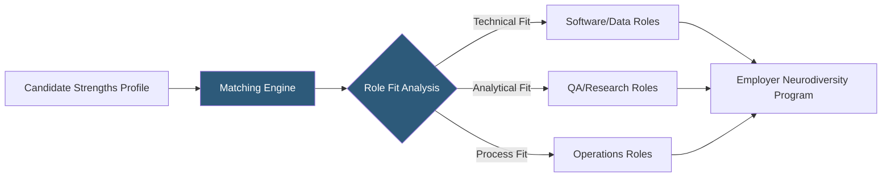

**Category:** Diversity & Inclusion Recruiting
**Difficulty:** Intermediate
**Reading time:** 5 min read

---

AutismAbility is a platform connecting autistic job seekers with employers committed to neurodiversity inclusion, emphasizing strengths-based matching that highlights the cognitive advantages autistic individuals often bring to technical and analytical roles.

- **Strengths-based recruiting** — matching approach that focuses on autistic candidates' exceptional abilities (pattern recognition, attention to detail, systematic thinking) rather than deficit-based evaluation
- **Neurodiversity hiring program** — employer-structured initiative specifically designed to recruit and retain autistic and neurodiverse talent
- **Task-based assessment** — practical work-sample evaluation replacing or supplementing traditional interviews
- **Accommodation planning** — proactive documentation of workplace modifications before the first day of employment
- **Sensory-friendly workplace** — office environment designed to minimize sensory overload for neurodiverse employees
- **Manager training** — instruction for direct supervisors on communication styles and management approaches effective with autistic employees

AutismAbility's platform emphasizes what autistic candidates can do exceptionally well rather than what they may find challenging in traditional workplace environments. The intake process documents strengths including hyperfocus capabilities, pattern recognition, logical reasoning, and precision — attributes highly valued in software quality assurance, data analysis, cybersecurity, and research roles.

Employers accessing AutismAbility have typically already established or are launching formal neurodiversity hiring programs. The platform verifies that employers have taken concrete steps — manager training, accommodation processes, sensory-aware facilities — before listing their roles. This prevents autistic candidates from applying to companies that will not support their needs after hire.

Task-based assessments replace or supplement traditional behavioral interviews. Candidates are evaluated on actual work samples — debugging code, analyzing data sets, identifying process errors — in conditions that match the real job environment. This approach dramatically reduces interview-stage attrition for autistic candidates who may under-perform in unstructured social interviews despite high technical ability.

The platform also maintains a resource library for employers covering legal accommodation obligations, communication guidelines, and case studies of successful neurodiversity programs from companies like SAP, Microsoft, and EY.

- A company seeking QA engineers with exceptional precision and pattern-recognition skills
- An autistic developer who consistently fails traditional interviews despite strong technical skills
- An HR team designing task-based assessments to replace behavioral interviews for technical roles
- A cybersecurity team wanting analysts with the focus characteristics common in autistic professionals
- A manager seeking guidance on effective communication with an autistic new hire

| Advantage | Disadvantage |
|-----------|--------------|
| Strengths-based approach surfaces talent overlooked by traditional screening | Smaller talent network than general job boards |
| Employer vetting protects candidates from unsuitable environments | Requires significant employer commitment before listing |
| Task-based assessments improve technical hiring accuracy | Assessment design requires investment from hiring teams |
| Addresses a genuine talent supply for high-demand technical skills | May not cover all industries or role types |

- [Hire Autism Neurodiverse Talent](hire-autism-neurodiverse-talent.md)
- [Specialisterne Autism Employment](specialisterne-autism-employment.md)
- [Disability:IN Inclusion](disabilityin-inclusion.md)

---
*Part of the [Diversity & Inclusion Recruiting](index.md) category · [Back to Master Index](../../index.md)*
