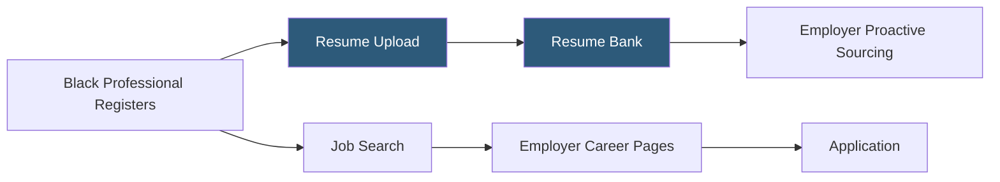

**Category:** Diversity & Inclusion Recruiting
**Difficulty:** Beginner
**Reading time:** 5 min read

---

Black Career Network is an online job board and career community dedicated to connecting Black professionals with employers who actively recruit diverse talent. It provides job listings, resume posting, and employer branding tools within a focused Black professional community.

- **Niche job board** — specialized employment platform targeting a specific professional demographic
- **Resume bank** — searchable candidate database that employers can proactively browse for outreach
- **Employer career page** — branded company presence displaying open roles, culture content, and DEI commitments
- **Job alert** — automated email notification when new listings match a candidate's saved search criteria
- **Diversity-committed employer** — company that has self-identified as actively recruiting Black talent
- **Career resources** — articles, resume guides, and interview tips tailored to Black professional experiences

Black Career Network operates as a focused niche job board with dual functionality: active job search for candidates and proactive sourcing for employers. The platform's value proposition to employers is access to a pre-qualified, engaged audience of Black professionals who have specifically opted into a diversity-focused job search experience.

Candidates upload resumes and create profiles that are included in the searchable resume bank. Employers with paid subscriptions can search this bank by job title, skills, location, and experience level to proactively reach out to matching candidates — enabling sourcing rather than just waiting for applications on posted roles.

On the active job search side, candidates browse employer career pages that combine job listings with company culture content. Employers can customize their career pages with employee testimonials, DEI initiative descriptions, and demographic representation data to differentiate themselves in candidates' evaluation process.

The platform integrates job alerts allowing candidates to receive notifications when relevant roles are posted, keeping them engaged between active search periods without requiring daily platform visits.

Career resources on the platform address specific professional development needs of Black job seekers — including navigating workplace bias in interviews, salary negotiation in environments where Black professionals face systemic pay gaps, and strategies for building visibility in predominantly white corporate environments.

- A Black marketing professional proactively searching for companies with demonstrated Black inclusion records
- A recruiter sourcing mid-level Black candidates for a corporate communications team
- An employer building a Black talent pipeline for management rotation programs
- A Black professional setting up job alerts for marketing director roles in the healthcare industry
- A company with existing NBMBAA relationships extending reach through Black Career Network's online channel

| Advantage | Disadvantage |
|-----------|--------------|
| Focused community provides high signal-to-noise ratio for relevant candidates | Smaller total volume than mainstream job boards |
| Resume bank enables proactive sourcing beyond posted job applicants | Employer vetting is self-certification without third-party verification |
| Career resources address Black-specific professional challenges | Less brand recognition than NBMBAA for MBA-level talent |
| Niche focus reduces competition noise compared to general boards | Platform reach primarily US-focused |

- [NBMBAA Black MBAs](nbmbaa-black-mbas.md)
- [Tech While Black Platform](tech-while-black-platform.md)
- [Blavity Career Opportunities](blavity-career-opportunities.md)

---
*Part of the [Diversity & Inclusion Recruiting](index.md) category · [Back to Master Index](../../index.md)*
