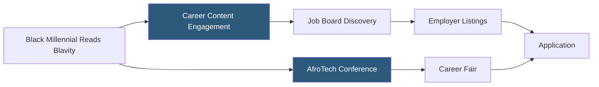

**Category:** Diversity & Inclusion Recruiting
**Difficulty:** Beginner
**Reading time:** 5 min read

---

Blavity is a media and technology company serving Black millennials, with a career opportunities platform that connects Black professionals with jobs at companies actively recruiting diverse talent, integrated within a broader Black culture and news media ecosystem.

- **Media-to-career pipeline** — using content engagement with Black media to identify and connect with career-ready audiences
- **AfroTech** — Blavity's technology-focused subsidiary hosting the AfroTech conference, a major event for Black technologists
- **Millennial-focused positioning** — targeting Black professionals aged 25–40 with digital-first career content
- **Corporate partnership** — employer relationships providing job listings, sponsored content, and event access
- **Branded content integration** — embedding career opportunities within editorial and media content consumed by target audience
- **AfroTech career fair** — annual tech recruiting event attracting thousands of Black technologists and major tech employers

Blavity's career platform leverages the company's primary asset: a large, engaged audience of Black millennials who consume Blavity's news, culture, and technology content daily. This media foundation creates a career platform with organic discovery advantages — candidates encounter job opportunities through content they already trust and engage with regularly.

The AfroTech conference is Blavity's flagship career platform in the physical world. AfroTech attracts 10,000+ Black tech professionals annually to a multi-day event combining career fair, speaker programming, and networking. The conference has become one of the most important recruiting events for major tech companies — Google, Amazon, Microsoft, Meta, and hundreds of others maintain presences — because it concentrates a large volume of Black tech talent in one place.

Employer partnerships with Blavity include the full media spectrum: sponsored articles, social media campaigns, job board listings, and event sponsorships. This multi-channel approach allows companies to build authentic brand presence with the Black millennial audience over time, not just post reactive diversity job listings.

The jobs platform itself functions as a standard job board with additional context from Blavity's editorial content — company profiles include links to relevant Blavity coverage and employee stories.

- A Black software engineer discovering a job opportunity through a Blavity article about a company's engineering culture
- A tech company using AfroTech sponsorship as its primary Black tech talent recruiting channel
- A Black product designer attending AfroTech to meet recruiters from 50+ companies over two days
- A startup with limited budget using Blavity sponsored content for employer brand building with Black talent
- A Black VC-backed founder recruiting early Black team members through AfroTech networking

| Advantage | Disadvantage |
|-----------|--------------|
| Media audience provides organic, trusted candidate discovery | Career platform secondary to media business model |
| AfroTech scale creates uniquely dense tech recruiting opportunity | AfroTech conference costs are significant for smaller companies |
| Millennial demographic alignment with high-demand career stage | Less coverage for mid-career professionals 40+ |
| Branded content integration is more authentic than pure job board ads | Editorial-commercial boundary can blur with sponsor content |

- [Tech While Black Platform](tech-while-black-platform.md)
- [Black Career Network](black-career-network.md)
- [A Seat at the Table Black Women](a-seat-at-the-table-black-women.md)

---
*Part of the [Diversity & Inclusion Recruiting](index.md) category · [Back to Master Index](../../index.md)*
