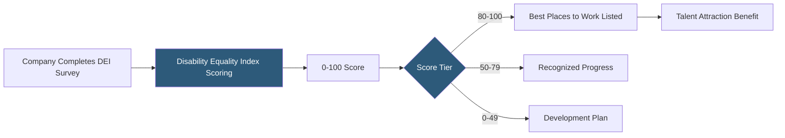

**Category:** Diversity & Inclusion Recruiting
**Difficulty:** Intermediate
**Reading time:** 6 min read

---

Disability:IN is a global nonprofit advancing disability inclusion in business through a supplier diversity program, the Disability Equality Index (DEI), and a network of over 500 corporate partners committed to disability employment and supplier inclusion.

- **Disability Equality Index (DEI)** — annual benchmarking tool scoring companies 0–100 on disability inclusion across culture, leadership, enterprise-wide access, employment practices, and community engagement
- **Disability:IN Affiliate** — regional chapter network providing local disability employment programs and events
- **NextGen Leaders** — Disability:IN's program connecting disabled college students with internship opportunities at partner companies
- **Disability-owned business** — supplier certification program for businesses owned by people with disabilities
- **Best Places to Work for Disability Inclusion** — annual ranking based on DEI scores published with the American Association of People with Disabilities (AAPD)
- **Supplier diversity** — procurement practice of buying from disability-owned and veteran-owned businesses

The Disability Equality Index is Disability:IN's flagship product. Companies voluntarily complete a comprehensive survey covering five weighted categories: Culture & Leadership (20%), Enterprise-Wide Access (20%), Employment Practices (30%), Community Engagement (15%), and Supplier & Procurement Diversity (15%). Scores are calculated based on responses, resulting in a 0–100 composite score.

Companies scoring 80 or above earn the "Best Places to Work for Disability Inclusion" designation — a widely recognized credential used in employer branding and DEI reporting. This designation is valued by employees with disabilities, investors focused on ESG metrics, and customers evaluating supplier ethics.

The NextGen Leaders program addresses the disability employment pipeline at the early-career stage. Disability:IN partners with corporate members to offer paid internships specifically for college students with disabilities. Companies gain access to pre-screened, high-potential interns, and students gain experience at inclusive workplaces that understand accommodation needs.

The supplier diversity component certifies disability-owned businesses and helps corporate members meet inclusion commitments in their procurement supply chains — an increasingly important metric in ESG reporting frameworks.

- A corporation using the DEI score for ESG investor reporting on disability inclusion
- A recruiting team advertising the "Best Places to Work" designation to attract disabled talent
- A college student with a disability accessing an internship at a DEI-recognized company
- A procurement team identifying certified disability-owned suppliers
- A DEI leader using the DEI survey gap analysis to build a 3-year disability inclusion roadmap

| Advantage | Disadvantage |
|-----------|--------------|
| DEI score is industry-standard benchmark recognized by investors and candidates | Survey self-reporting limits accuracy without third-party verification |
| "Best Places to Work" designation provides tangible employer branding value | Companies with 80+ scores may still have significant implementation gaps |
| Supplier diversity component addresses full inclusion ecosystem | Smaller supplier network than general diversity procurement platforms |
| NextGen Leaders builds early-career disability talent pipeline | Corporate membership fees limit accessibility for smaller companies |

- [National Organization on Disability](national-organization-on-disability.md)
- [Getting Hired Disability Jobs](getting-hired-disability-jobs.md)
- [Ability Jobs Disability Platform](ability-jobs-disability-platform.md)

---
*Part of the [Diversity & Inclusion Recruiting](index.md) category · [Back to Master Index](../../index.md)*
