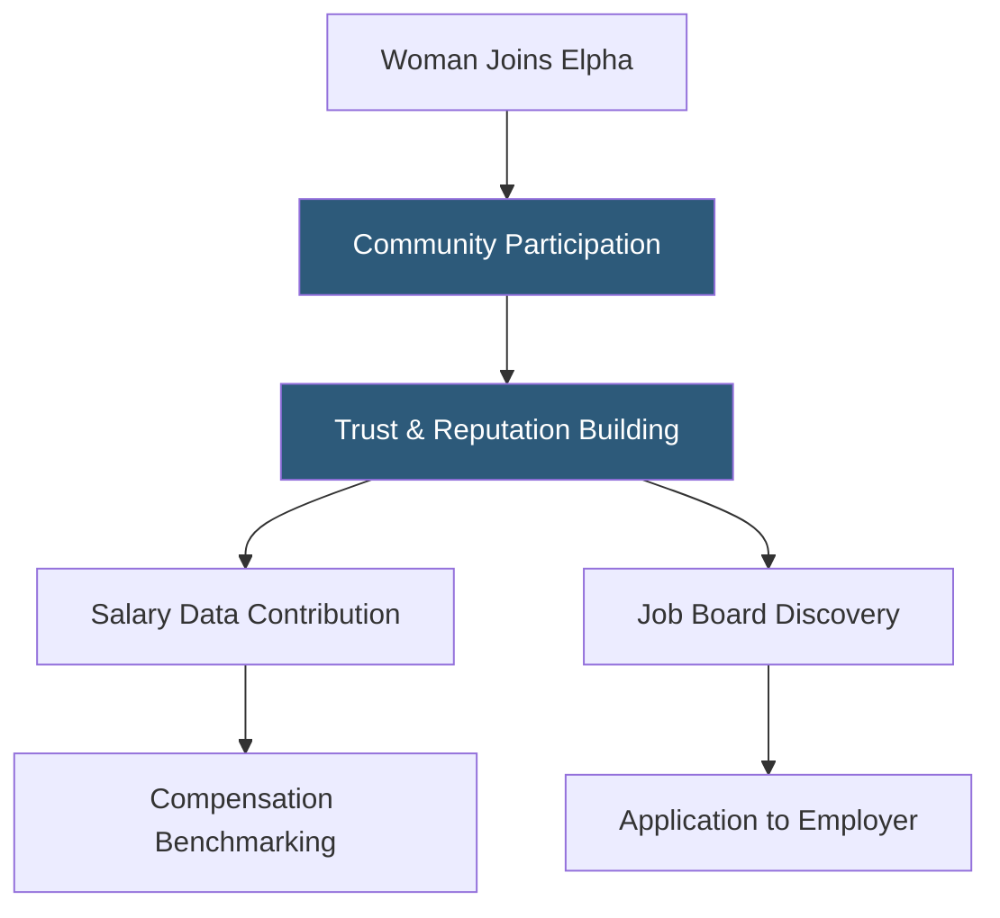

**Category:** Diversity & Inclusion Recruiting
**Difficulty:** Beginner
**Reading time:** 5 min read

---

Elpha is an online community and job platform for women in tech that combines peer support forums, salary transparency data, and job listings in a single platform. It emphasizes honest conversations about workplace challenges, compensation, and career navigation.

- **Salary transparency** — community-contributed compensation data allowing women to benchmark their pay
- **Peer forum** — discussion threads where members share career advice, workplace experiences, and job leads
- **Verified member** — account confirmed as a real professional through LinkedIn or email domain verification
- **Job board integration** — employer listings embedded in the community feed with cultural context from member discussions
- **Ask Me Anything (AMA)** — live Q&A sessions with successful women in tech sharing career insights
- **Employer advertorial** — paid content from employers presented as authentic culture storytelling

Elpha differs from most job boards by being community-first. The platform operates as a private, verified community of women in tech where conversation, not job listings, drives daily engagement. Members post questions about compensation negotiation, difficult manager situations, industry trends, and career decisions — and receive candid peer responses.

Salary transparency is a cornerstone feature. Members voluntarily contribute their compensation data (role, company, years of experience, location, base salary, equity, and bonus) to a crowd-sourced database. This database is searchable and allows women to verify whether their compensation is competitive before entering salary negotiations or evaluating offers.

The job board is integrated into the community experience. Employers purchase listings that appear in member feeds alongside relevant community discussions. A job posting for a senior product manager role might appear adjacent to a thread discussing equity negotiation at growth-stage startups — contextualizing the listing within real community conversations.

Employers can also pay for sponsored AMAs, where their engineering leaders or DEI officers participate in live community Q&A sessions. This provides authentic brand exposure to an engaged, skeptical audience that values substance over marketing.

- A mid-level engineer checking whether her compensation is below market before negotiating
- A woman navigating a toxic manager situation and seeking anonymous peer advice
- An employer wanting to reach experienced female tech professionals through trusted community channels
- A career switcher researching what skills are valued at top tech companies
- A VP of Engineering hosting an AMA to build employer brand in the female tech community

| Advantage | Disadvantage |
|-----------|--------------|
| Community trust produces high-quality, engaged candidates | Private community creates onboarding friction for new members |
| Crowd-sourced salary data empowers compensation negotiations | Salary data self-reported and may not account for all variables |
| Honest peer conversations signal genuine employer interest | Employers have limited control over community narrative |
| Verified membership reduces spam and low-quality interactions | Smaller community size than general platforms |

- [Women Who Code Job Board](women-who-code-job-board.md)
- [Fairygodboss Women Workplace](fairygodboss-women-workplace.md)
- [PowerToFly Women in Tech](powertofly-women-in-tech.md)

---
*Part of the [Diversity & Inclusion Recruiting](index.md) category · [Back to Master Index](../../index.md)*
