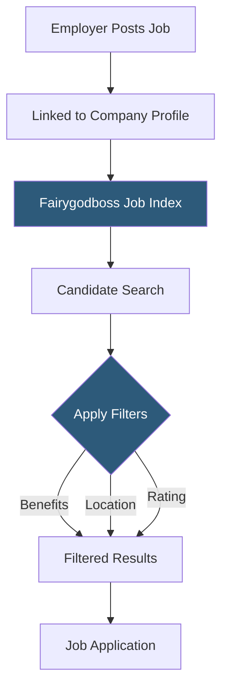

**Category:** Diversity & Inclusion Recruiting
**Difficulty:** Beginner
**Reading time:** 5 min read

---

The Fairygodboss job board is a curated listing of open roles at companies with strong female workplace ratings, allowing women to search for jobs while simultaneously evaluating employer culture through peer-generated reviews.

- **Employer-linked listing** — every job post is attached to a company profile with gender equity scores and reviews
- **Benefits filter** — search filter allowing candidates to narrow listings by maternity leave, flex work, or remote options
- **Featured employer placement** — paid premium placement boosting employer visibility in search results
- **Job alert** — automated notifications sent to candidates matching new postings to their saved search criteria
- **Application tracking** — candidate-facing dashboard for monitoring application status across multiple roles
- **Role category tagging** — classification system organizing postings by function, seniority, and industry

Unlike generic job boards where postings are disconnected from employer culture data, Fairygodboss automatically links every listing to the posting company's profile page. When a candidate clicks a job, they see the role description alongside the employer's gender equity score, top employee reviews, and disclosed benefits — all in the same view.

Employers post jobs through the Fairygodboss employer portal. Premium subscribers get featured placement in search results and category spotlights that appear in weekly email digests sent to the platform's female candidate base. Basic-tier employers can post jobs but appear lower in organic search rankings.

Candidates can filter jobs using standard criteria (location, salary, role type) and Fairygodboss-specific filters including minimum gender equity score, maternity leave duration, and remote work availability. These filters allow women to eliminate employers who don't meet their minimum inclusion standards before investing time in applications.

Job alerts allow candidates to save search criteria and receive email notifications when matching new roles are posted. The notification system segments by job function, experience level, and industry to avoid notification fatigue.

Integration with major ATS platforms — Greenhouse, Lever, Workday — means employers can syndicate their existing job feeds to Fairygodboss without manual duplication.

- A female product manager filtering for companies with 16+ weeks paid maternity leave
- An engineering candidate searching only companies with a gender equity score above 4/5
- A recruiter syndicating their ATS job feed to reach the Fairygodboss audience
- A remote worker narrowing results to fully distributed companies with strong female leadership ratings
- A senior woman searching for director-level roles at companies with gender-balanced executive teams

| Advantage | Disadvantage |
|-----------|--------------|
| Culture data embedded in job listings reduces research time | Job volume lower than LinkedIn or Indeed |
| Benefits filters reduce wasted applications | Filter accuracy depends on employer self-disclosure |
| ATS sync eliminates duplicate posting effort | Premium placement costs add to recruiting budget |
| Gender equity filter helps candidates avoid toxic workplaces | Scores may lag recent cultural changes at companies |

- [Fairygodboss Women Workplace](fairygodboss-women-workplace.md)
- [InHerSight Women-Rated Companies](inhersight-women-rated-companies.md)
- [Women Who Code Job Board](women-who-code-job-board.md)

---
*Part of the [Diversity & Inclusion Recruiting](index.md) category · [Back to Master Index](../../index.md)*
