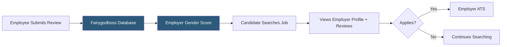

**Category:** Diversity & Inclusion Recruiting
**Difficulty:** Beginner
**Reading time:** 5 min read

---

Fairygodboss is a job search and career community platform where women rate their employers anonymously, creating a crowd-sourced database of female workplace experiences. Employers use the platform to attract female talent by improving and showcasing their workplace ratings.

- **Anonymous employer review** — women rate their employers on gender equity, pay, flexibility, and culture without identifying themselves
- **Gender equity score** — aggregate rating computed from employee reviews assessing how fairly women are treated
- **Company benefits transparency** — employer-disclosed data on maternity leave, pay equity, and flexibility policies
- **Community Q&A** — peer-to-peer forum where women ask and answer career and workplace questions
- **Job board integration** — job postings attached to employer profiles so candidates can evaluate culture before applying
- **Employer brand score** — composite rating used by employers to track reputation improvements over time

Fairygodboss operates on two loops: review collection and job search. On the review side, registered women submit anonymous ratings of current or former employers across dimensions including gender equity, pay equity, management support, and work-life balance. These reviews are aggregated into employer scores that are publicly visible to all platform users.

On the job search side, women browse listings that are directly linked to employer profiles. Before applying, candidates can see the company's gender equity score, recent reviews, and self-disclosed benefits data — including paid maternity leave duration, childcare support, and remote work policies. This integration of social proof with job listings is Fairygodboss's core value proposition.

Employers access the platform through paid subscriptions that allow them to claim their company profile, respond to reviews, publish job listings, and access analytics on their reputation trends. The employer dashboard shows review volume, score trajectory, and how their profile compares to industry benchmarks.

Fairygodboss also maintains active community forums where women discuss salary negotiation, career pivots, discrimination experiences, and workplace advice. This content generates organic SEO traffic and increases platform stickiness for candidates.

- A woman evaluating two job offers and wanting peer insight on workplace culture
- An HR team monitoring employee sentiment and responding to public reviews
- A recruiting team using employer brand improvements to attract female engineers
- A career changer researching industries with the best gender equity reputations
- A compensation analyst benchmarking maternity leave policies against competitors

| Advantage | Disadvantage |
|-----------|--------------|
| Anonymous reviews provide authentic workplace signals | Reviews can be biased or represent outlier experiences |
| Integrates employer reviews with job listings | Smaller job volume than major boards |
| Community forums create long-term user engagement | Competitor companies can influence review scores |
| Self-disclosed benefits data reduces information asymmetry | Employers control their own benefits disclosures |

- [Fairygodboss Job Board](fairygodboss-job-board.md)
- [InHerSight Women-Rated Companies](inhersight-women-rated-companies.md)
- [PowerToFly Women in Tech](powertofly-women-in-tech.md)

---
*Part of the [Diversity & Inclusion Recruiting](index.md) category · [Back to Master Index](../../index.md)*
