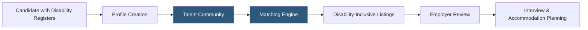

**Category:** Diversity & Inclusion Recruiting
**Difficulty:** Beginner
**Reading time:** 5 min read

---

Getting Hired is a disability-inclusive employment platform connecting job seekers with disabilities to employers committed to accessible, inclusive workplaces. It provides job listings, career resources, and employer branding tools within a disability-focused talent ecosystem.

- **Disability-inclusive employer** — company with documented policies, facilities, and practices supporting employees with disabilities
- **Section 503 compliance** — US federal contractor requirement to engage in affirmative action for people with disabilities
- **Accessibility-first job listing** — role postings that explicitly describe physical demands, accessibility features, and accommodation processes
- **Talent community** — opt-in database of job seekers with disabilities who have consented to employer outreach
- **OFCCP compliance** — Office of Federal Contract Compliance Programs requirements that federal contractors must meet for disability hiring goals
- **Disability etiquette training** — employer-facing education on appropriate, respectful communication with disabled employees and candidates

Getting Hired operates as a two-sided platform focused on the disability employment market. Job seekers with physical, cognitive, or invisible disabilities create profiles and browse listings from employers who have been vetted for disability-inclusive practices. Candidates can filter by accommodation type, remote work availability, and specific disability-friendly certifications held by employers.

Employers use Getting Hired to meet federal contractor compliance requirements under Section 503 and OFCCP regulations, which require good-faith efforts to achieve a 7% disability representation target across their workforce. The platform provides documentation and reporting tools that help federal contractors demonstrate compliance during OFCCP audits.

Beyond compliance, employers can build proactive disability-inclusive cultures through Getting Hired's employer branding tools. Companies publish their accommodation policies, Employee Resource Group (ERG) information, and accessibility certifications on their profile pages. Profiles also display whether the company has signed the Disability:IN pledge or earned accessibility certifications.

Getting Hired provides employers with disability etiquette training content, accommodation request playbooks, and guidance on creating accessible job descriptions — removing barriers that discourage disabled candidates from applying.

- A federal contractor documenting disability outreach efforts for OFCCP compliance
- A job seeker with a physical disability filtering listings by physical accessibility requirements
- An HR team building a disability ERG and recruiting disabled employees to lead it
- A technology company accessing remote-work-friendly candidates with disabilities globally
- A compliance officer generating audit-ready documentation of disability hiring outreach

| Advantage | Disadvantage |
|-----------|--------------|
| OFCCP compliance tools reduce federal contractor legal risk | Smaller community than general job boards |
| Vetting ensures employers have genuine accessibility commitments | Geographic focus primarily US federal contractor market |
| Accommodation-forward listings reduce candidate uncertainty | Compliance-driven employers may not have genuine inclusion cultures |
| Documentation features simplify audit preparation | Platform primarily useful for regulated industries |

- [Ability Jobs Disability Platform](ability-jobs-disability-platform.md)
- [Disability:IN Inclusion](disabilityin-inclusion.md)
- [Specialisterne Autism Employment](specialisterne-autism-employment.md)

---
*Part of the [Diversity & Inclusion Recruiting](index.md) category · [Back to Master Index](../../index.md)*
