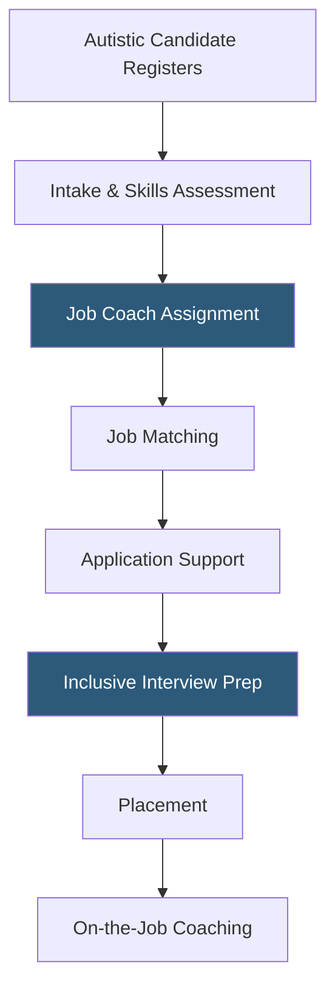

**Category:** Diversity & Inclusion Recruiting
**Difficulty:** Intermediate
**Reading time:** 6 min read

---

Hire Autism is a job placement and employment support platform connecting autistic adults with employers who have established neurodiversity-inclusive hiring programs. It provides candidates with job-matching support and employers with guidance on accommodations and inclusive interview practices.

- **Neurodiversity** — the natural variation in human brain function, including autism, ADHD, dyslexia, and other neurological differences
- **Supported employment** — job placement model pairing autistic candidates with job coaches during the application and onboarding process
- **Workplace accommodation** — modifications to work environment, schedule, or communication style that enable an autistic employee to perform optimally
- **Inclusive interview** — structured interview process designed to reduce social communication barriers that disadvantage autistic candidates
- **Job coach** — professional who provides on-the-job support and advocacy for neurodiverse employees
- **Disclosure support** — guidance for autistic candidates on whether, when, and how to disclose neurodivergence to employers

Hire Autism takes a supported employment approach that differentiates it from traditional job boards. Autistic candidates who register are assigned to employment specialists who conduct intake assessments covering work history, skills, sensory preferences, communication style, and employment goals. This detailed profile informs job matching that accounts for environmental factors — noise levels, lighting, remote work options — alongside technical skills.

Job coaches support candidates through the entire placement process: from resume writing to interview preparation to negotiating accommodations. Interview preparation specifically addresses the social communication aspects of typical interviews that disadvantage autistic candidates — such as small talk, ambiguous questions, and rapid information processing demands. Coaches help candidates request modified interview formats such as written-answer questions, working interviews, or structured task-based assessments.

On the employer side, Hire Autism consults with hiring managers and HR teams on creating neurodiversity-inclusive processes. This includes training on recognizing autism in interviews, avoiding bias-inducing questions, and designing onboarding processes that accommodate sensory and communication differences.

Post-placement, job coaches maintain contact with both the employee and employer to address accommodation needs, communication challenges, and career development planning.

- An autistic software developer with exceptional coding skills struggling with social interview formats
- A company implementing a neurodiversity hiring program for QA testing or data entry roles
- An HR team training hiring managers to conduct structured, bias-reduced interviews
- A job coach supporting an autistic data analyst through onboarding at a new employer
- A manufacturing firm adding autistic workers to roles requiring high attention to detail and process adherence

| Advantage | Disadvantage |
|-----------|--------------|
| Supported model addresses barriers beyond the job board | Higher resource cost per placement than passive job boards |
| Environmental job matching reduces mismatch and turnover | Limited to employers with existing neurodiversity programs |
| Post-placement coaching improves retention rates | Smaller scale than general disability employment platforms |
| Disclosure support reduces legal risk for both parties | Geographic coverage primarily US-based |

- [AutismAbility Neurodiverse Hiring](autismability-neurodiverse-hiring.md)
- [Specialisterne Autism Employment](specialisterne-autism-employment.md)
- [Disability:IN Inclusion](disabilityin-inclusion.md)

---
*Part of the [Diversity & Inclusion Recruiting](index.md) category · [Back to Master Index](../../index.md)*
