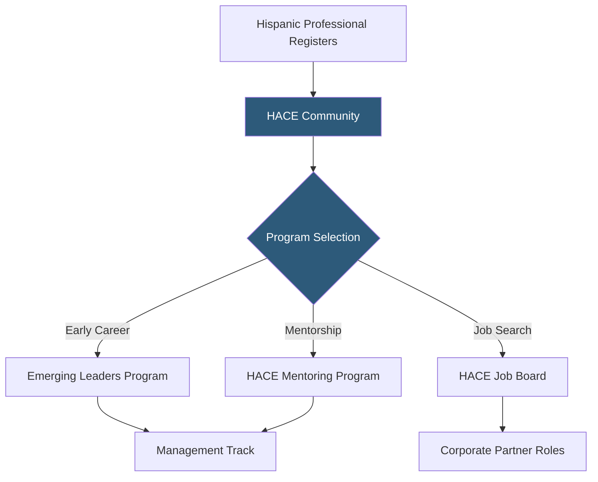

**Category:** Diversity & Inclusion Recruiting
**Difficulty:** Beginner
**Reading time:** 5 min read

---

The Hispanic Alliance for Career Enhancement (HACE) is a nonprofit organization focused on the employment and leadership development of Hispanic professionals, offering a job board, mentoring programs, and career development resources supported by corporate partners.

- **HACE Mentoring Program** — structured mentorship pairing Hispanic professionals with experienced leaders for career guidance
- **Corporate partner network** — companies providing funding, mentors, and job opportunities in exchange for access to HACE's talent community
- **Job board** — curated listings from corporate partners committed to Hispanic inclusion
- **Career development resources** — online learning, webinars, and tools addressing Hispanic professional advancement
- **Emerging Leaders program** — targeted development for early-career Hispanic professionals transitioning into management
- **Virtual career fair** — online events connecting Hispanic candidates with multiple employers simultaneously

HACE differentiates itself from event-heavy organizations like Prospanica by emphasizing year-round programming over a single annual conference. The organization runs continuous career development programs, mentoring cohorts, and virtual events that maintain engagement with Hispanic professionals throughout the year.

The HACE Mentoring Program operates in cohort cycles — typically 6–9 months — pairing Hispanic professionals with experienced mentors from HACE's corporate partner network. Mentors and mentees are matched on career stage, industry, and development goals. The structured program includes monthly check-in milestones, reflection exercises, and end-of-cohort reporting.

The Emerging Leaders program targets Hispanic professionals transitioning from individual contributor to management roles — a critical career inflection point where attrition among Hispanic professionals is disproportionately high. The program combines skills workshops with peer learning cohorts and executive coaching.

HACE's job board is smaller than mainstream boards but carries the credibility of being backed by corporate partners who are active participants in HACE programming — giving candidates confidence that listed employers have genuine Hispanic inclusion commitments rather than performative diversity statements.

- An early-career Hispanic professional joining the Emerging Leaders program to transition into management
- A Hispanic mid-level manager seeking a mentor from HACE's corporate partner network
- A corporate partner building brand recognition with Hispanic professionals through year-round engagement
- A job seeker filtering opportunities to companies with active HACE corporate relationships
- A talent acquisition team participating in a HACE virtual career fair

| Advantage | Disadvantage |
|-----------|--------------|
| Year-round programming provides consistent engagement versus event-only models | Smaller scale and brand recognition than Prospanica |
| Mentoring program produces measurable career advancement outcomes | Mentoring program capacity limited by volunteer mentor availability |
| Emerging Leaders focus addresses a specific high-attrition career inflection point | Job board volume smaller than general platforms |
| Virtual model provides geographic reach beyond major metros | Digital-first model misses relationship-building of in-person events |

- [Prospanica Hispanic Professionals](prospanica-hispanic-professionals.md)
- [ALPFA Latino Professionals](alpfa-latino-professionals.md)
- [NSHMBA Hispanic MBAs](nshmba-hispanic-mbas.md)

---
*Part of the [Diversity & Inclusion Recruiting](index.md) category · [Back to Master Index](../../index.md)*
