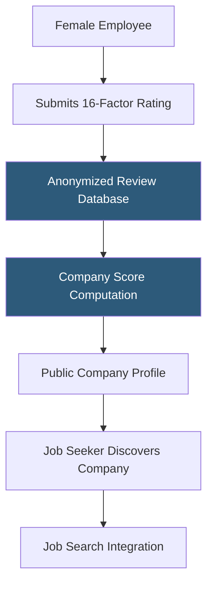

**Category:** Diversity & Inclusion Recruiting
**Difficulty:** Beginner
**Reading time:** 5 min read

---

InHerSight is an employer rating platform where women anonymously rate their workplaces across 16 metrics specific to gender equity and inclusion. The aggregated data creates public company scores that help female job seekers evaluate employers before applying.

- **16 rating factors** — InHerSight's proprietary framework covering topics from equal opportunities to management transparency
- **Anonymous review** — employee ratings submitted without identifying information to enable candid feedback
- **Company comparison** — side-by-side analysis of two or more employers on specific equity metrics
- **Industry benchmarking** — how a company's scores compare to the average across its industry sector
- **Star rating** — 5-star composite score computed from weighted averages across all 16 factors
- **Review verification** — process of validating that reviewers are genuine current or former employees

InHerSight's 16 rating factors span categories including: equal opportunities for women and men, flexible work options, family growth support, paid time off policies, maternity and paternity leave, management opportunities for women, salary satisfaction, and overall company culture. Each dimension is rated on a 5-star scale by women who work or have worked at the company.

Ratings are averaged across all submissions to generate a company's InHerSight score. The platform weights recent reviews more heavily than older ones to account for cultural changes within organizations. Companies with fewer than a minimum number of reviews are flagged as having insufficient data to avoid misleading scores.

The employer portal allows HR teams to claim company profiles, add official company information, respond to reviews publicly, and access analytics showing where their scores lag behind industry benchmarks. This data helps DEI teams identify specific improvement areas — for example, if a company scores well on maternity leave but poorly on management opportunities for women, it can direct resources accordingly.

The platform integrates a job board so candidates can browse listings ranked by company score. Job seekers can filter companies by minimum rating on specific factors most important to them, creating a highly personalized search experience that general job boards cannot replicate.

- A woman comparing two job offers based on management opportunity scores
- A DEI leader identifying which of InHerSight's 16 factors their company scores lowest on
- A job seeker filtering companies by minimum score on family growth support
- An HR team benchmarking their maternity leave policy against industry averages
- A researcher studying gender equity trends across tech industry employers

| Advantage | Disadvantage |
|-----------|--------------|
| 16-factor framework provides more nuance than single scores | Smaller review volume per company than Glassdoor |
| Industry benchmarking contextualizes individual company scores | Review gaming by employers responding with pressure |
| Women-specific metrics capture dynamics invisible on general review sites | Limited international coverage outside US |
| Job board integration reduces need to switch platforms | Self-reported employer information may be optimistic |

- [Fairygodboss Women Workplace](fairygodboss-women-workplace.md)
- [Fairygodboss Job Board](fairygodboss-job-board.md)
- [PowerToFly Women in Tech](powertofly-women-in-tech.md)

---
*Part of the [Diversity & Inclusion Recruiting](index.md) category · [Back to Master Index](../../index.md)*
