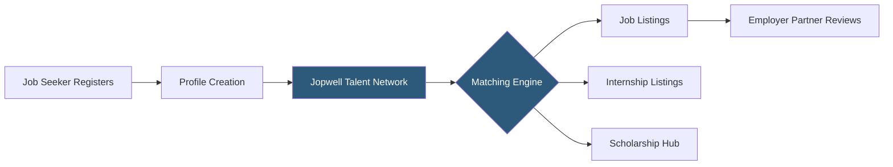

**Category:** Diversity & Inclusion Recruiting
**Difficulty:** Beginner
**Reading time:** 5 min read

---

Jopwell is a career advancement platform connecting Black, Latino/Hispanic, and Native American professionals with employers who are actively committed to diversity hiring. The platform curates job postings, internship listings, and scholarship opportunities specifically for underrepresented talent in corporate America.

- **Diversity pipeline** — a structured approach to building a candidate pool from underrepresented communities
- **Talent network** — Jopwell's database of verified diverse professionals available to employer partners
- **Employer partner** — a company that pays for access to Jopwell's talent pool and posts open roles
- **Candidate profile** — a member's resume, skills, and preferences stored on the platform
- **Scholarship hub** — curated list of financial awards available to Jopwell members
- **Cultural fit signal** — employer-provided content showing DEI initiatives to attract candidates

Jopwell operates as a two-sided marketplace. Job seekers from Black, Latino/Hispanic, and Native American backgrounds create free profiles that include work history, education, skills, and job preferences. Jopwell's talent network aggregates these profiles and surfaces them to paying employer partners.

On the employer side, companies subscribe to Jopwell's services and gain access to sourcing tools, job posting capabilities, and a curated candidate database. Employers can post positions that are distributed to relevant network members based on role type, location, and seniority level. Jopwell's editorial team also produces career advice content and company spotlights that help candidates research employers' DEI commitments.

The matching logic factors in candidate location preferences, job function, industry, and experience level. Members receive email notifications when relevant positions open. Jopwell also facilitates direct outreach from recruiters to candidates who have opted into recruiter contact.

Jopwell differentiates itself from general job boards by requiring employer partners to demonstrate genuine DEI commitment — companies go through a vetting process before being listed. This gives candidates more confidence that posted opportunities come from organizations invested in inclusive hiring rather than performative diversity efforts.

- A recent HBCU graduate seeking tech internships at companies known for inclusive cultures
- A Latina software engineer looking for senior roles at companies with executive-level Hispanic representation
- A corporate recruiter trying to diversify a predominantly homogeneous engineering team
- A financial services firm meeting ESG diversity hiring targets
- A Native American professional relocating and seeking employers with strong DEI records

| Advantage | Disadvantage |
|-----------|--------------|
| Pre-vetted employer partners signal genuine DEI commitment | Limited to Black, Latino, and Native American candidates only |
| Free for job seekers | Smaller job volume than general boards like LinkedIn |
| Curated scholarship and internship listings in one place | Employer partner quality varies by industry |
| Reduces noise from non-inclusive employers | Geographic concentration in major metro areas |

- [Jopwell Employer Partners](jopwell-employer-partners.md)
- [PowerToFly Women in Tech](powertofly-women-in-tech.md)
- [Black Career Network](black-career-network.md)

---
*Part of the [Diversity & Inclusion Recruiting](index.md) category · [Back to Master Index](../../index.md)*
