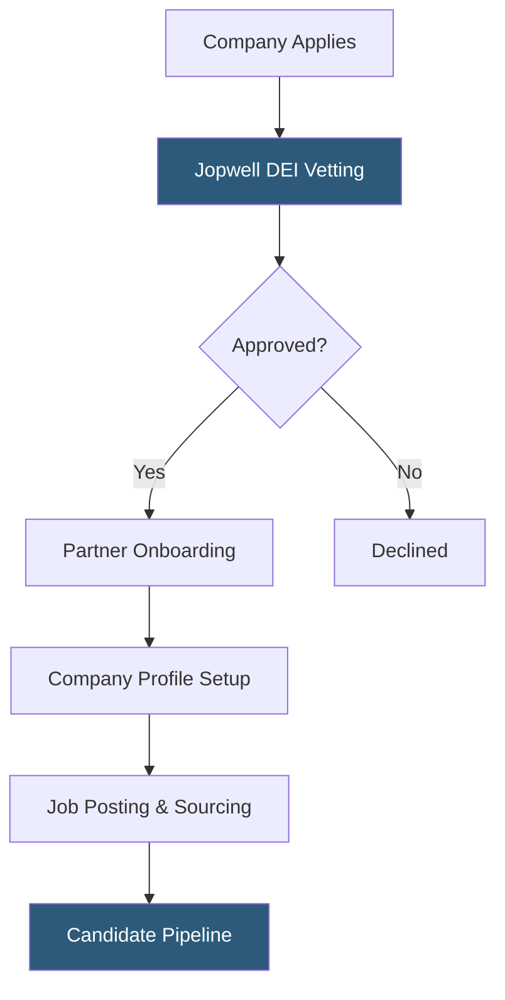

**Category:** Diversity & Inclusion Recruiting
**Difficulty:** Intermediate
**Reading time:** 5 min read

---

Jopwell's employer partner program allows companies to access its curated talent network of Black, Latino/Hispanic, and Native American professionals. Employers pay subscription fees for sourcing tools, branded company profiles, and candidate outreach capabilities to build diverse pipelines.

- **Subscription tier** — pricing level determining the volume of candidate contacts and job postings allowed
- **Company profile page** — employer-controlled page showing culture, DEI initiatives, and open roles
- **Pipeline analytics** — dashboard metrics tracking candidate views, applications, and conversion rates
- **Recruiter sourcing** — proactive outreach to qualified candidates who have opted in to recruiter contact
- **Vetting process** — Jopwell's review of employer DEI policies before granting partner status
- **Candidate engagement** — email and in-platform campaigns targeting relevant Jopwell members

Companies seeking to partner with Jopwell submit an application that includes information about their existing DEI programs, employee resource groups, hiring targets, and leadership diversity. Jopwell's team reviews this information to ensure the employer is making substantive efforts — not just posting jobs on a diversity board for optics.

Once approved, companies gain access to the Jopwell employer dashboard. Recruiters can browse candidate profiles filtered by skills, location, education, and experience. They can send direct InMail-style messages to candidates who have enabled recruiter contact. Employers can also post open roles that are then matched and distributed to relevant Jopwell members via email and in-platform notifications.

Employer profiles serve a dual purpose: they help candidates research company culture and verify DEI claims, and they act as a marketing channel for talent brand. Companies can publish blog posts, employee spotlights, and event announcements directly to their Jopwell profile page.

Analytics dashboards give talent acquisition teams data on how their job posts and sourcing campaigns are performing. Metrics include profile views, application click-throughs, and candidate conversion rates broken down by role type.

- A Fortune 500 technology company launching a diversity hiring initiative for engineering roles
- A financial firm trying to meet board-mandated diversity recruiting KPIs
- A startup building an inclusive founding team from day one
- An HR team supplementing LinkedIn Recruiter with a diversity-focused sourcing tool
- A consulting firm recruiting diverse analysts for entry-level rotation programs

| Advantage | Disadvantage |
|-----------|--------------|
| Access to pre-verified, diversity-focused candidates | Subscription cost adds to recruiting budget |
| Vetting reduces reputational risk of insincere DEI claims | Smaller total candidate volume than LinkedIn or Indeed |
| Branded profile pages build authentic employer brand | Limited industry vertical depth outside tech and finance |
| Analytics provide ROI visibility on diversity spend | Vetting process adds time to partner onboarding |

- [Jopwell Diverse Professionals](jopwell-diverse-professionals.md)
- [Black Career Network](black-career-network.md)
- [NBMBAA Black MBAs](nbmbaa-black-mbas.md)

---
*Part of the [Diversity & Inclusion Recruiting](index.md) category · [Back to Master Index](../../index.md)*
