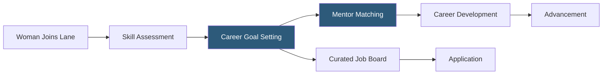

**Category:** Diversity & Inclusion Recruiting
**Difficulty:** Beginner
**Reading time:** 5 min read

---

Lane is a career development and job search platform designed for professional women, combining mentorship matching, skill development resources, and a curated job board to help women advance their careers at inclusive employers.

- **Mentorship matching** — algorithm pairing women with experienced mentors in their field for career guidance
- **Skill assessment** — tools evaluating candidate competencies to surface appropriate roles and learning paths
- **Curated listings** — job postings screened for employers with verified inclusion programs
- **Career pathway mapping** — personalized plan showing steps from current role to target position
- **Peer accountability groups** — small cohorts of women supporting each other's career goals
- **Employer partnership** — companies paying for talent access and branded presence in Lane's community

Lane positions itself as a full-stack career platform for women rather than solely a job board. Upon registration, candidates complete a skills assessment that evaluates their current competencies, experience level, and career aspirations. This data drives personalized recommendations across the platform's three main pillars: mentorship, learning, and job matching.

The mentorship component matches women with experienced professionals who have volunteered as mentors through the Lane network. Matching factors in industry, function, career stage, and specific development goals — for example, a junior data analyst aspiring to become a data science manager would be matched with a mentor who navigated that exact transition.

The job board curates listings from employer partners who have passed Lane's inclusivity criteria. Listings include not just role descriptions but employer-specific data on advancement rates for women, parental policies, and representation at senior levels. Candidates can view how many women hold director and VP roles at a given company before applying.

Peer accountability groups — cohorts of 4–6 women at similar career stages — meet weekly to share progress, challenges, and mutual support. This feature creates retention and daily engagement that differentiates Lane from passive job boards.

- An analyst wanting structured mentorship for her transition into product management
- A woman evaluating companies on female representation at the VP level and above
- An employer building an authentic employer brand within a trusted female professional community
- A recent MBA graduate seeking structured peer support during her job search
- A career development manager identifying skills gaps among female employees

| Advantage | Disadvantage |
|-----------|--------------|
| Holistic career development beyond job search | Smaller platform scale than mainstream job boards |
| Mentorship matching adds value beyond competing platforms | Mentor availability can create matching delays |
| Employer representation data reduces information asymmetry | Representation data depends on employer self-disclosure |
| Accountability groups create lasting community engagement | Weekly group commitments require sustained user time |

- [Elpha Professional Women](elpha-professional-women.md)
- [PowerToFly Women in Tech](powertofly-women-in-tech.md)
- [Fairygodboss Women Workplace](fairygodboss-women-workplace.md)

---
*Part of the [Diversity & Inclusion Recruiting](index.md) category · [Back to Master Index](../../index.md)*
