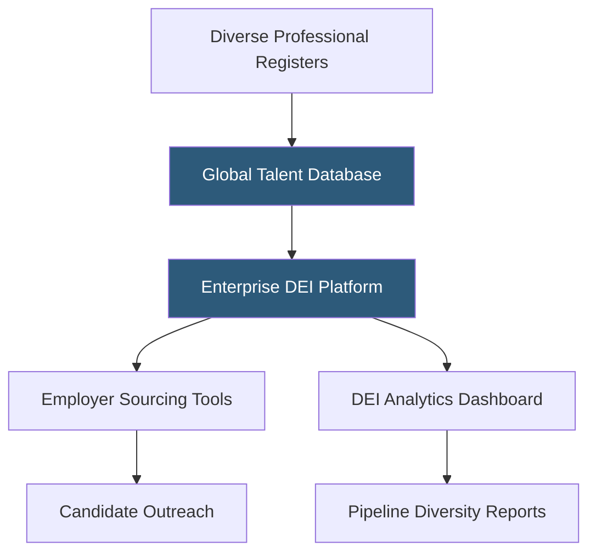

**Category:** Diversity & Inclusion Recruiting
**Difficulty:** Beginner
**Reading time:** 5 min read

---

Mogul is a global platform connecting diverse talent — with a focus on women and underrepresented professionals — to career opportunities, leadership development content, and enterprise diversity recruiting solutions. It combines a talent marketplace with an employer-facing DEI analytics platform.

- **Diverse talent marketplace** — searchable database of candidates from underrepresented backgrounds
- **DEI analytics** — employer-facing dashboards measuring diversity metrics across hiring pipelines
- **Leadership development content** — articles, courses, and events focused on professional growth for diverse talent
- **Enterprise DEI solution** — comprehensive platform sold to large employers for end-to-end diversity recruiting
- **Global reach** — talent community spanning professionals across 196 countries
- **Inclusive employer branding** — tools for companies to communicate their diversity commitments to candidates

Mogul operates on two parallel tracks: a candidate-facing career platform and an enterprise-facing DEI talent solution. On the candidate side, professionals create profiles and access leadership development content, job listings, and community events. Mogul's editorial team produces content specifically addressing the career challenges faced by women and diverse professionals — from negotiation guides to profiles of successful leaders from underrepresented backgrounds.

On the enterprise side, Mogul sells DEI talent solutions to large corporations. The core offering is access to Mogul's global diverse talent database combined with analytics tools that measure diversity at each stage of the hiring funnel. Employers can track metrics like the percentage of diverse candidates at application, phone screen, final interview, and offer stages — identifying where attrition of diverse candidates occurs.

Mogul's sourcing tools allow enterprise recruiters to build targeted campaigns reaching specific diversity segments. For example, a healthcare company might run a campaign targeting Black women with clinical informatics backgrounds in specific metropolitan areas.

The platform's global footprint — claiming professionals across 196 countries — differentiates it from US-centric diversity boards, making it useful for multinationals building globally diverse teams.

- A Fortune 100 company measuring funnel diversity metrics across 200+ active job requisitions
- A global technology firm sourcing candidates in 15 countries with DEI hiring targets
- A woman leader consuming leadership development content and networking with peers globally
- An HR team identifying at which interview stage diverse candidates drop out of the pipeline
- A media company diversifying its editorial and creative teams globally

| Advantage | Disadvantage |
|-----------|--------------|
| Global candidate base supports multinational DEI hiring | Enterprise pricing excludes small and mid-size employers |
| DEI funnel analytics identify specific problem stages | Analytics only as good as data employers input accurately |
| Broad diverse talent coverage beyond women only | Less community depth than niche single-group platforms |
| Leadership development content retains engaged candidates | Content quality variable across editorial topics |

- [Jopwell Diverse Professionals](jopwell-diverse-professionals.md)
- [PowerToFly Women in Tech](powertofly-women-in-tech.md)
- [Black Career Network](black-career-network.md)

---
*Part of the [Diversity & Inclusion Recruiting](index.md) category · [Back to Master Index](../../index.md)*
