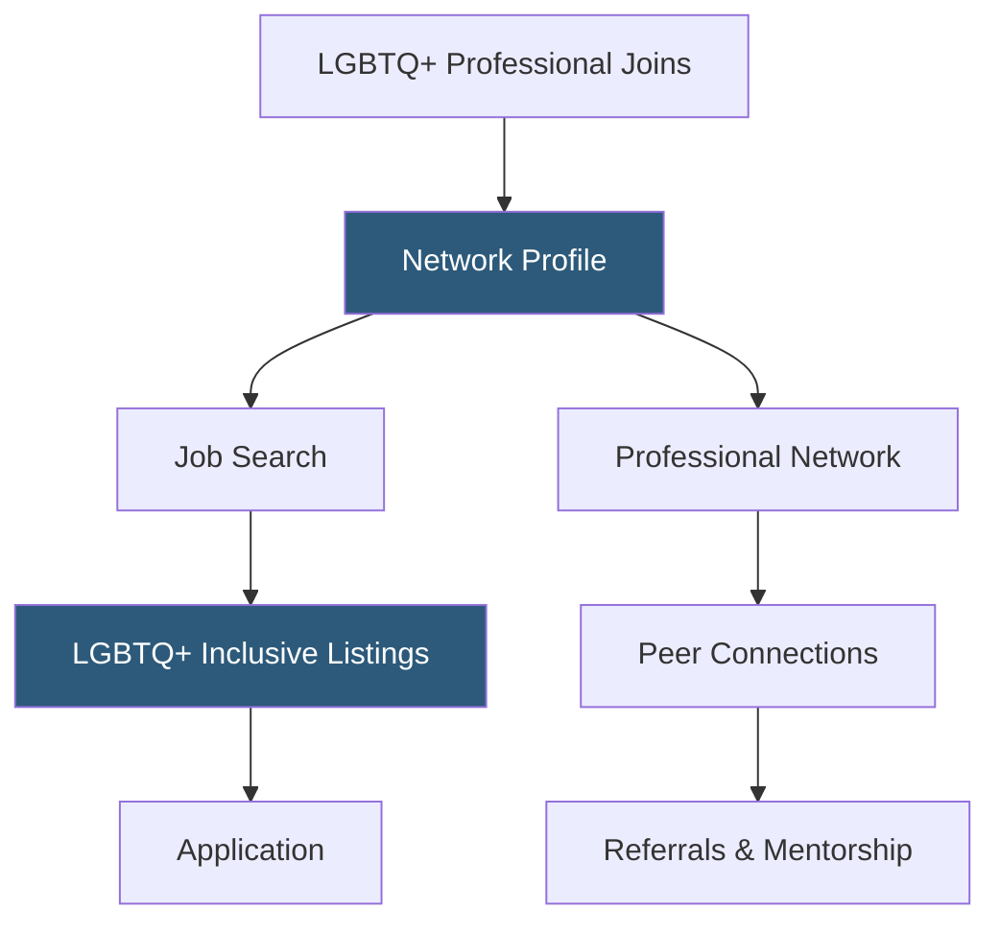

**Category:** Diversity & Inclusion Recruiting
**Difficulty:** Beginner
**Reading time:** 5 min read

---

myGwork is a global professional networking and job search platform specifically for LGBTQ+ professionals. It provides job listings from LGBTQ+-inclusive employers, a professional network for LGBTQ+ career connections, and business directory listings for LGBTQ+-owned businesses.

- **LGBTQ+-inclusive employer** — company that has demonstrated policies, benefits, and culture supporting LGBTQ+ employee wellbeing
- **Professional networking** — peer-to-peer connections within a trusted LGBTQ+ community context
- **Business directory** — listing of LGBTQ+-owned businesses for professional partnerships and supplier diversity
- **Safe to be out** — myGwork's ethos that professionals should be able to be openly LGBTQ+ at work without career risk
- **Internship program** — early-career opportunities specifically at LGBTQ+-inclusive employers for students and recent graduates
- **Global reach** — platform covering LGBTQ+ professionals and employers across multiple countries

myGwork combines a job board, a professional network, and a business directory in a single platform designed specifically for the LGBTQ+ community. The platform's core proposition is creating a safe space where LGBTQ+ professionals can be open about their identity while pursuing career opportunities — contrasting with mainstream platforms where disclosure decisions are complex and risky.

Employers access myGwork through paid memberships that grant access to job posting, candidate sourcing, and employer branding features. myGwork assesses employers against inclusion criteria — evaluating their equality policies, healthcare benefits, and public commitments — before featuring them as endorsed employers. This vetting creates trust with LGBTQ+ candidates who are understandably skeptical of diversity washing.

The professional network allows LGBTQ+ members to connect with peers across industries and companies — building the kind of mentorship and referral networks that heterosexual workers have long accessed through old-boy networks and informal channels. Senior LGBTQ+ professionals can serve as mentors and career sponsors for early-career members.

The international scope distinguishes myGwork from US-centric platforms. The platform actively recruits employers with global operations and LGBTQ+ professionals across Europe, Asia, and Latin America, acknowledging that LGBTQ+ workplace experiences vary dramatically by geography.

- An LGBTQ+ software engineer searching for employers where being openly gay will not affect career advancement
- A bi professional connecting with LGBTQ+ mentors in the finance industry
- An employer building an LGBTQ+-inclusive employer brand internationally
- A transgender professional finding employers with confirmed gender-affirming healthcare benefits
- An LGBTQ+-owned business seeking directory listing and supplier diversity partnerships

| Advantage | Disadvantage |
|-----------|--------------|
| Safe space design removes disclosure decision pressure for candidates | Smaller job volume than mainstream boards |
| Employer vetting reduces diversity washing risk | Vetting standards not publicly detailed |
| International scope serves LGBTQ+ professionals globally | Coverage depth varies significantly by country |
| Business directory supports LGBTQ+ supplier diversity ecosystem | Network critical mass varies by industry |

- [Out & Equal LGBTQ+ Workplace](out-equal-lgbtq-workplace.md)
- [Pride at Work LGBTQ+ Jobs](pride-at-work-lgbtq-jobs.md)
- [Out Professionals LGBTQ+ Network](out-professionals-lgbtq-network.md)

---
*Part of the [Diversity & Inclusion Recruiting](index.md) category · [Back to Master Index](../../index.md)*
