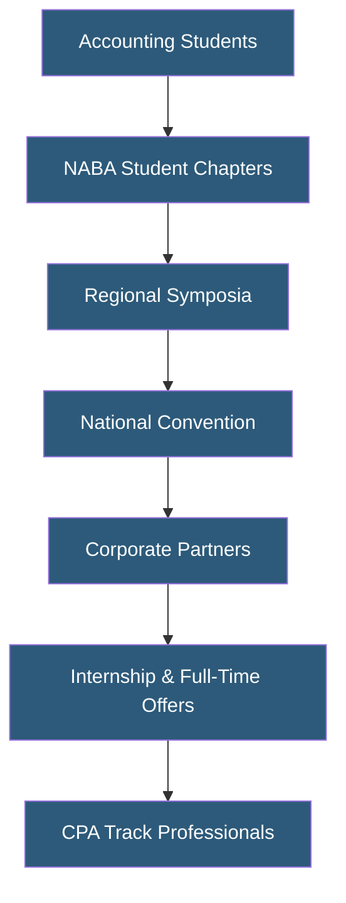

**Category:** Diversity & Inclusion Recruiting
**Difficulty:** Beginner
**Reading time:** 5 min read

---

NABA (National Association of Black Accountants) is a professional organization dedicated to advancing the interests of Black and minority accounting and finance professionals. It connects members with employers through career fairs, scholarships, and networking events that build diverse pipelines for accounting, finance, and business roles.

- **CPA Pipeline** — The pathway developing accounting students through licensure and into professional practice
- **Corporate Partner** — Companies that fund NABA programming in exchange for recruiting access to members
- **Accounting & Finance Diversity** — The effort to increase Black and minority representation in historically homogeneous professions
- **Student Chapter** — University-based NABA groups that recruit and develop undergraduate accounting talent
- **Regional Symposia** — NABA events held across geographic regions providing local recruiting and networking opportunities
- **Scholarship Program** — Financial support for NABA members pursuing accounting and finance degrees

NABA operates a national chapter network spanning over 200 professional and student chapters. Student chapters focus on career preparation — resume workshops, CPA exam study groups, and mock interview sessions — while professional chapters provide ongoing development for practitioners at all career stages.

Corporate partners access NABA's talent through tiered sponsorship programs. Entry-level firms participate in regional symposia that bring together students and early-career professionals with recruiters. Premier partners gain placement at NABA's annual national convention, which draws thousands of members and represents one of the most concentrated pipelines of Black accounting talent in the country.

NABA's job board and resume database allow partner recruiters to search for candidates by skill, location, and graduation date. The organization also facilitates direct campus recruiting partnerships at HBCUs and majority-minority universities where NABA chapters are active.

Professional development programming — including NABA's accounting faculty and management conferences — attracts senior members, giving employers access to mid-career and leadership-level Black finance professionals who may not be actively searching through general job boards.

- Big Four accounting firms building diverse associate and manager pipelines
- Corporate finance departments recruiting Black controllers and CFO-track professionals
- Internal audit functions sourcing diverse talent for compliance and risk roles
- Banking institutions recruiting credit analysts and financial planners
- Government and nonprofit organizations building inclusive finance teams

| Advantage | Disadvantage |
|-----------|--------------|
| Deep specialization in accounting and finance talent | Narrow focus limits cross-functional hiring use cases |
| Chapter network provides early-career pipeline from HBCUs | Convention-dependent access creates annual recruiting cycles |
| Scholarship program creates loyalty among recipients | Premium partnership costs may be high for smaller firms |
| Senior professional programming enables mid-career recruiting | Requires active chapter engagement for best results |

- [NBMBAA Black MBAs](nbmbaa-black-mbas.md)
- [National Black MBA Association](national-black-mba-association.md)
- [Black Career Network](black-career-network.md)

---
*Part of the [Diversity & Inclusion Recruiting](index.md) category · [Back to Master Index](../../index.md)*
