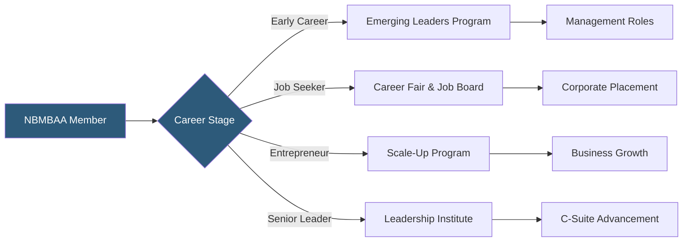

**Category:** Diversity & Inclusion Recruiting
**Difficulty:** Intermediate
**Reading time:** 6 min read

---

The National Black MBA Association (NBMBAA) is a US nonprofit developing Black business leaders through a comprehensive ecosystem of career programming, executive development, entrepreneurship support, and one of the largest diversity career fairs in the country.

- **Dual mission** — both career placement for job-seeking members and executive development for established leaders
- **Scale-Up! program** — business accelerator and pitch competition for Black entrepreneurs
- **NBMBAA Emerging Leaders** — program for early-career Black professionals accelerating management readiness
- **Virtual career hub** — year-round online platform extending career fair access beyond the annual conference
- **Chapter network** — 40+ professional chapters in major US cities providing local programming
- **DEI consulting** — advisory services offered to corporations building Black talent inclusion strategies

NBMBAA's organizational architecture is designed to serve Black professionals across the full career lifecycle, not just the job-seeking phase. This lifecycle approach differentiates NBMBAA from transactional job boards and makes it a long-term professional home for members.

The Emerging Leaders program serves Black professionals 1–5 years into their careers, providing management skills training, executive mentorship matching, and a cohort peer network. Studies consistently show that Black professionals face specific barriers to entering management — including exclusion from informal networks and sponsorship gaps — that this program directly addresses.

The Scale-Up! accelerator and pitch competition supports Black entrepreneurs seeking funding and business development support. This extends NBMBAA's mission beyond corporate employment to recognizing entrepreneurship as a valid and important career pathway for Black business school graduates.

The virtual career hub extends conference career fair access year-round. Employers maintain profiles and post jobs that are searchable by NBMBAA members between annual conferences. This addresses the limitation of a conference-only model where hiring happens in bursts rather than continuously.

NBMBAA's DEI consulting arm provides advisory services to corporations building Black talent strategies — from pipeline development to retention analysis to executive sponsorship program design.

- A Black associate at a consulting firm accessing the Emerging Leaders program for management accelerated development
- A Black entrepreneur pitching at Scale-Up! to access angel investors and MBDA connections
- A Black SVP seeking a C-suite sponsor through the Leadership Institute executive network
- A corporate talent team hiring year-round through the NBMBAA virtual career hub
- A DEI strategist engaging NBMBAA consulting to design a comprehensive Black advancement program

| Advantage | Disadvantage |
|-----------|--------------|
| Lifecycle model retains members through entire career progression | Breadth of programs requires significant operational scale to execute well |
| Scale-Up supports entrepreneurship as alternative to corporate career track | Annual conference critical mass still essential for peak recruiting access |
| Virtual career hub addresses year-round hiring needs | Chapter quality varies significantly by city |
| DEI consulting generates revenue while advancing mission | Consulting creates potential conflict if client interests diverge from member interests |

- [NBMBAA Black MBAs](nbmbaa-black-mbas.md)
- [Black Career Network](black-career-network.md)
- [Tech While Black Platform](tech-while-black-platform.md)

---
*Part of the [Diversity & Inclusion Recruiting](index.md) category · [Back to Master Index](../../index.md)*
