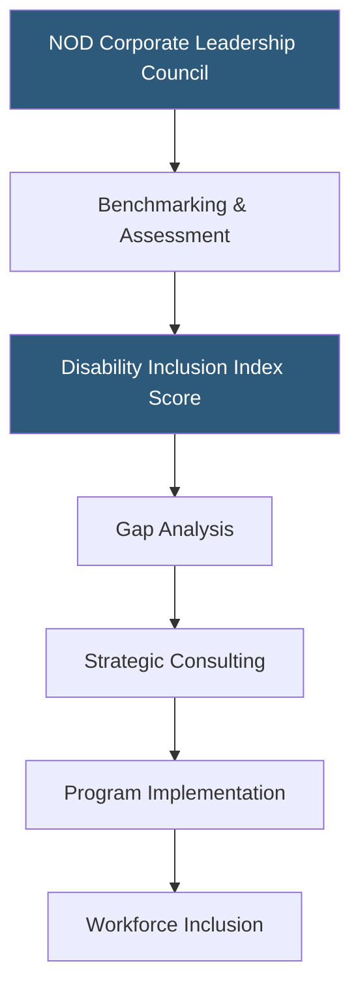

**Category:** Diversity & Inclusion Recruiting
**Difficulty:** Beginner
**Reading time:** 5 min read

---

The National Organization on Disability (NOD) is a US nonprofit that helps corporations build disability-inclusive workplaces through strategic consulting, workforce inclusion programs, and a corporate leadership council that benchmarks disability employment practices.

- **Disability Inclusion Index** — NOD's annual benchmarking tool assessing corporate disability inclusion maturity
- **NOD Corporate Leadership Council (CLC)** — membership network of companies committed to advancing disability inclusion
- **Inclusion maturity model** — framework categorizing employers from reactive (ADA compliance) to proactive (leadership inclusion)
- **Disability employment consulting** — strategic advisory services helping companies build structured disability hiring and retention programs
- **Workforce Inclusion Programs** — direct job placement and training programs for people with disabilities
- **Disability affinity** — employee identity connection to disability that influences workplace culture and policy advocacy

NOD's primary offering for corporations is the Disability Inclusion Index, a rigorous assessment tool that measures an organization's disability inclusion practices across four dimensions: culture, leadership, strategy, and employment. Companies that participate receive a score relative to peers and a gap analysis identifying specific improvement areas.

The Corporate Leadership Council is a membership organization where senior HR and DEI leaders from major corporations share best practices, benchmark their programs against each other, and collaborate on advancing disability inclusion standards across industries. CLC membership signals public commitment to disability inclusion and provides access to NOD's network and research.

Beyond assessment, NOD provides strategic consulting to help companies build disability hiring programs from scratch or improve existing ones. This includes developing disability ERG frameworks, creating accommodation request processes, training hiring managers, and establishing partnerships with disability service organizations for talent pipelines.

NOD's workforce inclusion programs connect people with disabilities directly to employment through career fairs, job placement services, and employer partnerships specifically designed to hire people with significant disabilities who face the highest employment barriers.

- A Fortune 500 company benchmarking its disability inclusion program against industry peers
- An HR leader seeking data-driven gaps in their company's disability accommodation processes
- A CLC member company sharing best practices with peer companies through quarterly convenings
- A DEI team building the company's first formal disability ERG from a NOD framework
- A CEO looking to make a public disability inclusion commitment through a recognized vehicle

| Advantage | Disadvantage |
|-----------|--------------|
| Disability Inclusion Index provides rigorous, third-party benchmarking | Consulting and CLC membership costs are significant |
| Peer network accelerates learning from leading companies | Primarily serves large corporations; less accessible for SMBs |
| Strategic consulting goes beyond compliance to culture change | Impact depends on sustained organizational commitment |
| Research credibility supports internal business cases for inclusion investment | Index methodology updated periodically, affecting year-over-year comparisons |

- [Disability:IN Inclusion](disabilityin-inclusion.md)
- [Getting Hired Disability Jobs](getting-hired-disability-jobs.md)
- [Ability Jobs Disability Platform](ability-jobs-disability-platform.md)

---
*Part of the [Diversity & Inclusion Recruiting](index.md) category · [Back to Master Index](../../index.md)*
