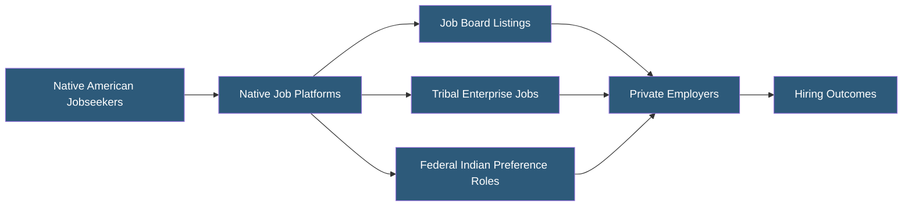

**Category:** Diversity & Inclusion Recruiting
**Difficulty:** Beginner
**Reading time:** 5 min read

---

Native American job platforms are specialized recruiting services connecting American Indian, Alaska Native, and Native Hawaiian professionals with employers committed to Indigenous inclusion. These platforms address the unique employment challenges facing Native communities, including geographic barriers, cultural preservation, and tribal sovereignty considerations.

- **Tribal Sovereignty** — The inherent right of Native nations to govern themselves, with implications for employment law and workplace policy
- **Indian Preference** — Legal provisions in some contexts allowing preference for Native American candidates in federally contracted positions
- **Indigenous Employment** — Workforce participation by American Indian, Alaska Native, and Native Hawaiian individuals
- **Remote Native Communities** — Geographically isolated reservation and rural communities requiring remote work or relocation support
- **TERO (Tribal Employment Rights Ordinance)** — Tribal laws requiring employers operating on tribal lands to give hiring preference to tribal members
- **Cultural Integration** — Workplace practices that respect Indigenous cultural values, ceremonies, and community obligations

Native American job platforms operate at the intersection of general job board functionality and culturally specific community resources. Platforms like NativeHire, Indianz.com Jobs, and tribal employment networks list roles from both private sector employers and tribal enterprises, government agencies, and nonprofits serving Native communities.

Many positions on these platforms involve work directly in or with tribal communities — healthcare providers serving reservation populations, educators working in Bureau of Indian Education schools, infrastructure developers on tribal lands, and government roles requiring knowledge of federal Indian law. Platforms therefore often include filters for roles requiring or preferring candidates with tribal affiliation or Native language skills.

Employers posting on these platforms typically demonstrate cultural competency commitments: training for supervisors managing Native employees, flexibility policies accommodating seasonal cultural obligations (e.g., ceremonies, harvest), and relocation support for candidates from rural reservation communities.

Some platforms partner directly with tribal workforce development programs, which provide job-readiness training and act as a conduit between tribal members and private employers. Government contractors with Indian preference requirements use these platforms to document compliance with federal contracting diversity mandates.

- Federal government agencies recruiting in Indian preference-eligible positions
- Healthcare systems serving reservation and rural Native communities
- Construction companies with tribal land development contracts
- Energy companies operating on or near Native lands
- Nonprofit organizations providing services to Indigenous communities

| Advantage | Disadvantage |
|-----------|--------------|
| Access to candidates with Indigenous community knowledge | Very small candidate pool relative to general platforms |
| Tribal partnership credibility builds authentic relationships | Geographic concentration in rural/reservation areas limits location flexibility |
| Cultural specificity reduces mismatch in sensitive roles | Complex legal landscape (TERO, Indian preference) requires employer education |
| Demonstrates authentic commitment beyond surface-level DEI | Sustained engagement required to build tribal trust |

- [Asian American Careers Platforms](asian-american-careers-platforms.md)
- [Veteran Job Platforms](veteran-job-platforms.md)
- [Jopwell Diverse Professionals](jopwell-diverse-professionals.md)

---
*Part of the [Diversity & Inclusion Recruiting](index.md) category · [Back to Master Index](../../index.md)*
