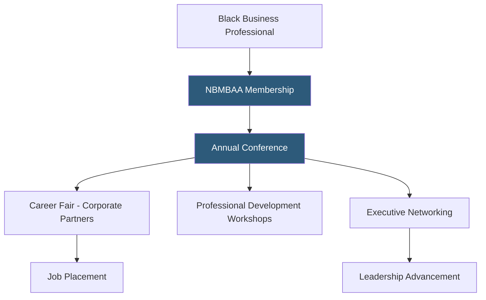

**Category:** Diversity & Inclusion Recruiting
**Difficulty:** Beginner
**Reading time:** 5 min read

---

The National Black MBA Association (NBMBAA) is a nonprofit organization that develops business leaders of African descent through a large annual conference, scholarship programs, and a corporate partnership network connecting Black business professionals with major US employers.

- **NBMBAA Annual Conference** — flagship event with 10,000+ attendees combining career fair, professional development, and networking
- **Scale-Up pitch competition** — entrepreneurship program supporting Black-owned business development
- **Corporate partner** — employers paying membership fees for conference access, job posting, and talent sourcing
- **Collegiate membership** — chapter program at university business schools developing the next generation of Black business leaders
- **Leadership Institute** — executive development program for senior Black professionals advancing to C-suite roles
- **MBDA (Minority Business Development Agency) partnership** — federal agency collaboration supporting Black entrepreneurship

NBMBAA operates one of the largest Black professional conferences in the United States. The annual conference — typically held in fall — draws over 10,000 attendees and 300+ exhibiting companies. The conference career fair is the primary recruiting mechanism: companies pay substantial booth fees for the privilege of interviewing candidates over 2–3 days, creating an intensely concentrated recruiting event.

The conference's scale is its primary competitive advantage. A Black MBA student or professional attending the conference can have substantive conversations with dozens of major employers in a single weekend, significantly compressing a job search that might otherwise take months.

NBMBAA's collegiate chapter network extends the organization's reach into university business schools, recruiting members early and providing leadership development opportunities to students before graduation. This creates a pipeline from undergraduate and MBA programs directly into the NBMBAA ecosystem and, subsequently, into corporate careers.

The Leadership Institute targets Black professionals who have already achieved management roles and are positioned for senior leadership advancement. This executive-level programming addresses the specific barriers Black executives face in moving from director to VP to C-suite levels — a transition where racial advancement gaps are statistically largest.

- A Black MBA graduate from Wharton using the NBMBAA conference to interview with 20 companies in one weekend
- A Fortune 500 company maintaining a prominent conference presence to signal Black executive sponsorship
- A Black director in a corporate finance role seeking executive coaching for a C-suite transition
- A collegiate chapter leader building professional development programming at their business school
- A talent acquisition team sourcing Black candidates for a management rotation program

| Advantage | Disadvantage |
|-----------|--------------|
| Conference scale creates unique high-density recruiting opportunity | Annual conference model creates inconsistent year-round engagement |
| Leadership Institute addresses executive-level advancement gaps specifically | Premium corporate partner fees can be prohibitive for small companies |
| Collegiate chapters build pipeline from graduate school through career | Primarily MBA-focused; less coverage of undergraduate or non-degree talent |
| National scale means access to candidates across all US geographies | Conference attendance requires travel investment from candidates |

- [National Black MBA Association](national-black-mba-association.md)
- [Black Career Network](black-career-network.md)
- [Prospanica Hispanic Professionals](prospanica-hispanic-professionals.md)

---
*Part of the [Diversity & Inclusion Recruiting](index.md) category · [Back to Master Index](../../index.md)*
