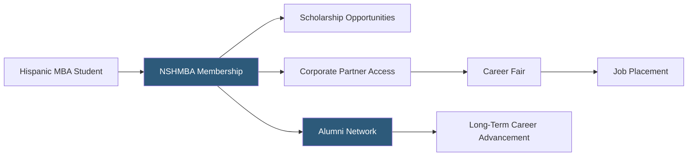

**Category:** Diversity & Inclusion Recruiting
**Difficulty:** Beginner
**Reading time:** 5 min read

---

NSHMBA (National Society of Hispanic MBAs) is the precursor organization to Prospanica, representing the historical foundation of the Hispanic business professional community in the US. Its legacy infrastructure — chapters, scholarship programs, and corporate partnerships — now operates under the Prospanica brand but the NSHMBA identity remains recognized by long-tenured members and corporate partners.

- **Hispanic MBA pipeline** — structured pathway from graduate business education to corporate career advancement for Hispanic professionals
- **Corporate recruiting partnership** — employer relationships providing access to NSHMBA/Prospanica talent in exchange for sponsorship
- **National scholarship competition** — merit-based financial awards for Hispanic graduate business students
- **Career development programming** — workshops, mentorship, and executive coaching for Hispanic business professionals
- **Alumni network** — ongoing community of NSHMBA graduates providing referrals and mentorship across decades of program alumni
- **Diversity recruiting event** — structured conference and career fair connecting Hispanic MBA graduates with employers

NSHMBA built its reputation over decades as the primary organization advancing Hispanic business professionals in the United States. The organization pioneered the model of combining a graduate student scholarship program with corporate partnership recruiting events — a model that influenced the broader landscape of diversity professional organizations.

The core operational model connects Hispanic MBA students and graduates with corporate employers through an annual conference featuring a large career fair, professional development programming, and executive networking events. Corporate sponsors — including major employers in finance, consulting, technology, and consumer goods — pay sponsorship fees that fund scholarships and organization operations while gaining preferential access to the Hispanic MBA talent pool.

The chapter network — established over decades of NSHMBA operations — provides local year-round programming that maintains member engagement between annual conferences. Long-tenured NSHMBA alumni serve as mentors and executive sponsors for newer members, creating a multi-generational career advancement ecosystem.

Under the Prospanica rebrand, the NSHMBA model was preserved and expanded. Legacy corporate partners who had built relationships with NSHMBA over years maintained their commitments through the transition, ensuring continuity of the talent pipeline.

- An employer with decades of NSHMBA corporate sponsorship maintaining relationships through the Prospanica transition
- A Hispanic MBA alumni member accessing the multi-decade alumni network for executive referrals
- A graduate student leveraging NSHMBA scholarship history and brand recognition in job applications
- A chapter leader drawing on long-established chapter infrastructure for programming
- A talent acquisition professional explaining the NSHMBA-to-Prospanica transition to internal stakeholders

| Advantage | Disadvantage |
|-----------|--------------|
| Decades of brand equity with corporate partners and candidates | Organization now operates under Prospanica brand, causing some identity confusion |
| Multi-generational alumni network provides deep career advancement resources | Legacy infrastructure requires ongoing modernization |
| Scholarship history builds loyalty among early-career Hispanic professionals | Rebrand created transition friction with some long-term stakeholders |
| Proven model adopted widely by other diversity professional organizations | Focus primarily on MBA-level talent limits broader workforce coverage |

- [Prospanica Hispanic Professionals](prospanica-hispanic-professionals.md)
- [Hispanic Alliance for Career Enhancement](hispanic-alliance-for-career-enhancement.md)
- [NBMBAA Black MBAs](nbmbaa-black-mbas.md)

---
*Part of the [Diversity & Inclusion Recruiting](index.md) category · [Back to Master Index](../../index.md)*
