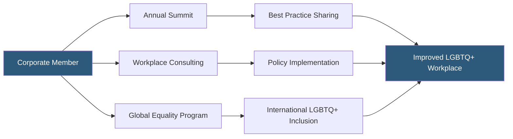

**Category:** Diversity & Inclusion Recruiting
**Difficulty:** Intermediate
**Reading time:** 6 min read

---

Out & Equal Workplace Advocates is a nonprofit dedicated to achieving LGBTQ+ workplace equality through an annual summit, employer consulting services, and a professional network connecting LGBTQ+ professionals with inclusive employers and peer communities.

- **Out & Equal Workplace Summit** — annual conference bringing together LGBTQ+ employees, allies, and corporate DEI leaders
- **Workplace inclusion consulting** — advisory services helping companies build LGBTQ+-inclusive policies and cultures
- **Global workplace equality program** — resources for multinationals navigating LGBTQ+ inclusion in countries with varied legal environments
- **Safe space certification** — organizational designation indicating a workplace has committed to specific LGBTQ+ inclusion standards
- **Ally development** — training programs building non-LGBTQ+ employees' understanding and advocacy capabilities
- **ERG leadership development** — programs for LGBTQ+ Employee Resource Group leaders building facilitation and advocacy skills

Out & Equal's primary engagement model is through corporate membership, which funds the organization's mission and provides member companies with a suite of services. The flagship offering is the annual Workplace Summit — the largest LGBTQ+ workplace equality event globally — attracting thousands of LGBTQ+ employees and allies from hundreds of corporations.

The Summit provides a platform for LGBTQ+ professionals to network across companies, identify inclusive employers, and evaluate potential employers through genuine employee testimonials. Companies use Summit sponsorship to build employer brand directly with the LGBTQ+ professional community in an authentic context.

Out & Equal's consulting services help companies design LGBTQ+-inclusive HR policies, from domestic partner benefits to gender-neutral bathroom access to inclusive healthcare. The global workplace equality program is particularly valuable for multinationals: it provides guidance on how to maintain consistent LGBTQ+ inclusion commitments in countries with anti-LGBTQ+ laws — a complex but increasingly urgent challenge for global DEI leaders.

The ERG leadership development program trains LGBTQ+ ERG leaders to run effective employee resource groups, engage with senior leadership, and advocate for policy improvements. Effective ERGs correlate strongly with LGBTQ+ employee retention and engagement.

- A global corporation determining how to balance LGBTQ+ inclusion commitments with operations in restrictive jurisdictions
- An LGBTQ+ professional evaluating potential employers at the Summit through authentic peer conversations
- An ERG leader seeking facilitation training and peer learning from ERG leaders at other companies
- A DEI team using Out & Equal consulting to redesign healthcare benefits to include gender-affirming coverage
- A company building LGBTQ+ ally training programs for managers

| Advantage | Disadvantage |
|-----------|--------------|
| Summit provides direct access to large LGBTQ+ professional community | Corporate membership costs limit access for smaller companies |
| Global program addresses genuinely complex multinational inclusion challenges | Global guidance navigates legal gray areas with no perfect answers |
| Credible nonprofit status builds trust with LGBTQ+ candidates | Annual Summit is one event; year-round touchpoints less robust |
| ERG development improves retention beyond initial recruitment | Impact depends on internal champion commitment |

- [myGwork LGBTQ+ Professionals](mygwork-lgbtq-professionals.md)
- [Pride at Work LGBTQ+ Jobs](pride-at-work-lgbtq-jobs.md)
- [Out Professionals LGBTQ+ Network](out-professionals-lgbtq-network.md)

---
*Part of the [Diversity & Inclusion Recruiting](index.md) category · [Back to Master Index](../../index.md)*
