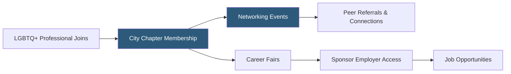

**Category:** Diversity & Inclusion Recruiting
**Difficulty:** Beginner
**Reading time:** 5 min read

---

Out Professionals is a US-based LGBTQ+ professional networking organization providing community events, career resources, and job leads to LGBTQ+ professionals in major US cities. It focuses on peer networking and professional development within the LGBTQ+ community.

- **LGBTQ+ professional networking** — career-focused relationship building within an LGBTQ+-identified community
- **City chapter events** — local in-person and virtual networking events for LGBTQ+ professionals in major metros
- **Sponsor employer** — company that pays to participate in Out Professionals events to access LGBTQ+ talent
- **Professional development programming** — panels, workshops, and speaker series on career advancement topics relevant to LGBTQ+ professionals
- **Career fair** — events connecting LGBTQ+ job seekers with inclusive employers in person or virtually
- **Alumni network** — ongoing connections among professionals who have participated in Out Professionals programs

Out Professionals operates primarily through city chapter events rather than a digital-first platform model. Chapters in cities including New York, Chicago, Los Angeles, Boston, and Washington DC run regular networking events — happy hours, panel discussions, career workshops, and annual career fairs — where LGBTQ+ professionals connect with each other and with sponsor employers.

Employer sponsors pay to participate in events and gain access to the LGBTQ+ professional community in an authentic setting. Unlike job board advertising, event participation allows recruiters to have real conversations with candidates and demonstrate genuine organizational commitment to LGBTQ+ inclusion rather than posting a flag on a website.

The career fair format — typically an annual or semi-annual event per chapter — brings multiple employers to one location, giving LGBTQ+ candidates the ability to evaluate many employers' cultures in a single day through direct conversation rather than research alone.

Professional development programming addresses specific challenges LGBTQ+ professionals face: disclosure decisions in the workplace, navigating hostile environments, building credibility while being out, and accessing the same informal networks that drive advancement for heterosexual colleagues.

- An LGBTQ+ MBA graduate in Chicago networking with potential employers at the city chapter career fair
- A financial firm participating in an Out Professionals event to build genuine LGBTQ+ employer brand
- A mid-level professional seeking peer mentorship from senior LGBTQ+ leaders in their industry
- A transgender professional learning from a panel discussion on workplace rights and disclosure strategies
- A startup founder connecting with LGBTQ+ professionals for potential early hires

| Advantage | Disadvantage |
|-----------|--------------|
| In-person events enable authentic employer evaluation beyond marketing claims | Geographic coverage limited to major US cities |
| Event-based networking builds stronger relationships than digital platforms | Less scalable for job seekers outside chapter cities |
| Sponsor participation builds genuine employer brand credibility | Employer sponsor commitments vary in sincerity |
| Career development content addresses LGBTQ+-specific professional challenges | No persistent job board for between-event job searching |

- [myGwork LGBTQ+ Professionals](mygwork-lgbtq-professionals.md)
- [Out & Equal LGBTQ+ Workplace](out-equal-lgbtq-workplace.md)
- [Pride at Work LGBTQ+ Jobs](pride-at-work-lgbtq-jobs.md)

---
*Part of the [Diversity & Inclusion Recruiting](index.md) category · [Back to Master Index](../../index.md)*
