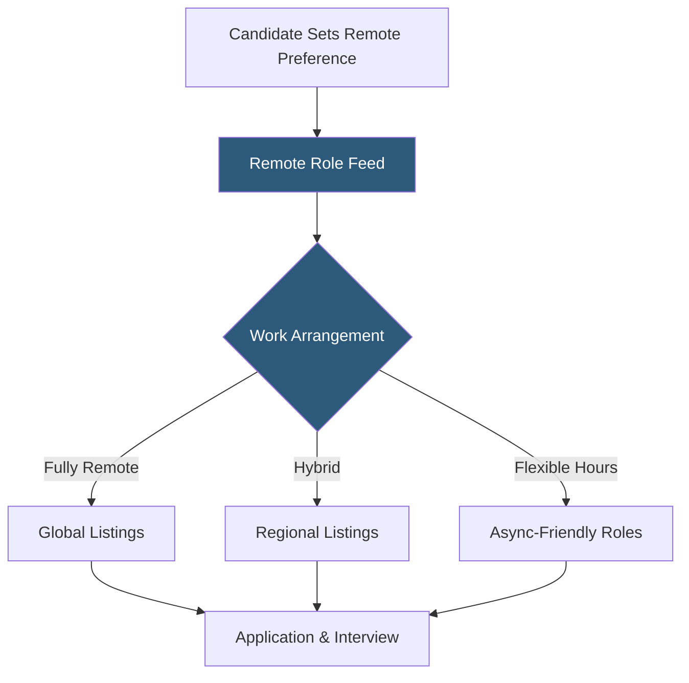

**Category:** Diversity & Inclusion Recruiting
**Difficulty:** Beginner
**Reading time:** 5 min read

---

PowerToFly's remote women segment focuses on connecting women and non-binary professionals with fully remote and flexible-work roles globally. It addresses the unique career challenges women face with geographic constraints, caregiving responsibilities, and work-life balance needs.

- **Remote-first employer** — a company where remote work is the default, not an exception
- **Flexible scheduling** — roles with asynchronous or adjustable hours accommodating caregiving duties
- **Global talent pool** — accessing candidates across countries without requiring relocation
- **Caregiving-aware recruiting** — employer signaling of policies like parental leave and childcare support
- **Async work culture** — distributed teams that minimize real-time meeting dependencies
- **Return-to-work program** — structured re-entry pathway for women who took career breaks

PowerToFly's remote-focused features allow women to filter job searches specifically by work arrangement: fully remote, hybrid, or flexible hours. This filtering is applied against the full employer partner database, surfacing only roles that match the candidate's geographic and scheduling preferences.

Employer partners list explicit remote work policies on their company profiles, including time zone requirements, async versus synchronous expectations, and travel requirements. This transparency helps candidates evaluate cultural fit before applying, reducing wasted applications on roles that are technically "remote" but require daily video calls across incompatible time zones.

The platform highlights caregiving-friendly employers by surfacing policies like paid parental leave, childcare subsidies, and schedule flexibility directly on job listings. Women returning from career breaks can use return-to-work filters to find companies with structured re-entry programs.

PowerToFly also hosts remote-specific virtual events targeting internationally distributed candidates. These events connect women in regions like Latin America, Eastern Europe, and Southeast Asia with US- and EU-based employers who hire remotely. The event infrastructure handles multi-time-zone scheduling, automated recordings, and post-event follow-up sequences.

- A software engineer in Mexico City seeking a US-based remote role with async flexibility
- A mother returning to the workforce after a two-year career break
- An HR team expanding hiring globally without opening international offices
- A startup wanting to access a wider talent pool without geographic constraints
- A marketing professional in rural areas seeking remote opportunities with city-level salaries

| Advantage | Disadvantage |
|-----------|--------------|
| Expands talent access beyond geographic boundaries | Time zone mismatches can complicate team collaboration |
| Caregiving-aware filters reduce mismatched applications | Not all posted "remote" roles offer true flexibility |
| Return-to-work programs address career gap stigma | Limited to PowerToFly's partner employer base |
| Global candidate pool increases competition for candidates | Compensation parity for international hires complex |

- [PowerToFly Women in Tech](powertofly-women-in-tech.md)
- [The Mom Project Flexible Work](the-mom-project-flexible-work.md)
- [Fairygodboss Job Board](fairygodboss-job-board.md)

---
*Part of the [Diversity & Inclusion Recruiting](index.md) category · [Back to Master Index](../../index.md)*
