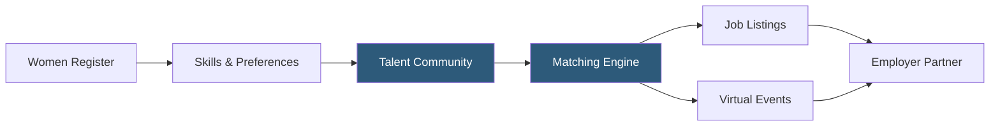

**Category:** Diversity & Inclusion Recruiting
**Difficulty:** Beginner
**Reading time:** 5 min read

---

PowerToFly is a diversity recruiting platform focused on connecting women — particularly women in technology and other underrepresented groups — with employers committed to inclusive hiring. It combines a job board, virtual hiring events, and DEI training content into a single platform.

- **DEI hiring event** — virtual or hybrid recruiting event connecting diverse candidates with employer partners
- **Talent community** — opt-in pool of registered candidates across tech, finance, and corporate functions
- **Inclusion resources** — training and content library for employers building equitable workplaces
- **Skills matching** — algorithm pairing candidate skills with open roles at partner companies
- **Salary transparency** — feature allowing employers to display pay ranges on posted roles
- **Remote-first focus** — emphasis on flexible and fully remote opportunities for women

PowerToFly serves as a talent marketplace and employer brand platform simultaneously. Women and non-binary professionals register for free, building profiles that include skills, experience, salary expectations, and remote work preferences. The platform's matching engine then connects profiles to suitable open roles at paying employer partners.

The employer side involves a subscription that grants access to candidate sourcing, branded company pages, and the ability to host virtual hiring events on the PowerToFly platform. Companies showcase their inclusion initiatives, employee testimonials, and workplace benefits to attract culturally aligned candidates.

PowerToFly's virtual events feature is a key differentiator. Employers can run live hiring fairs with video sessions, real-time Q&A, and automated follow-up sequences. These events are branded and promoted to the PowerToFly community, giving companies direct access to thousands of diverse candidates in a single session.

The platform also provides DEI consulting content, salary benchmarking tools, and inclusion analytics that help HR teams track the effectiveness of diversity hiring programs. Integrations with applicant tracking systems (ATS) like Greenhouse and Lever let recruiters sync candidates directly into their existing workflows without duplicate data entry.

- A tech company building a female-majority data science team
- A financial institution hosting a virtual internship fair for women in finance
- An HR leader benchmarking salary equity across gender lines
- A startup offering remote-first roles to attract global female talent
- A corporate DEI team accessing training content to upskill managers on inclusive practices

| Advantage | Disadvantage |
|-----------|--------------|
| Strong remote-work focus broadens geographic reach | Primarily focused on women; limited for broader DEI goals |
| Virtual event hosting reduces recruiting event costs | Subscription costs can be high for small companies |
| ATS integration reduces manual candidate data entry | Community size smaller than general-purpose platforms |
| Salary transparency tools support pay equity initiatives | Employer quality varies; vetting less rigorous than some competitors |

- [PowerToFly Remote Women](powertofly-remote-women.md)
- [Fairygodboss Women Workplace](fairygodboss-women-workplace.md)
- [Women Who Code Job Board](women-who-code-job-board.md)

---
*Part of the [Diversity & Inclusion Recruiting](index.md) category · [Back to Master Index](../../index.md)*
