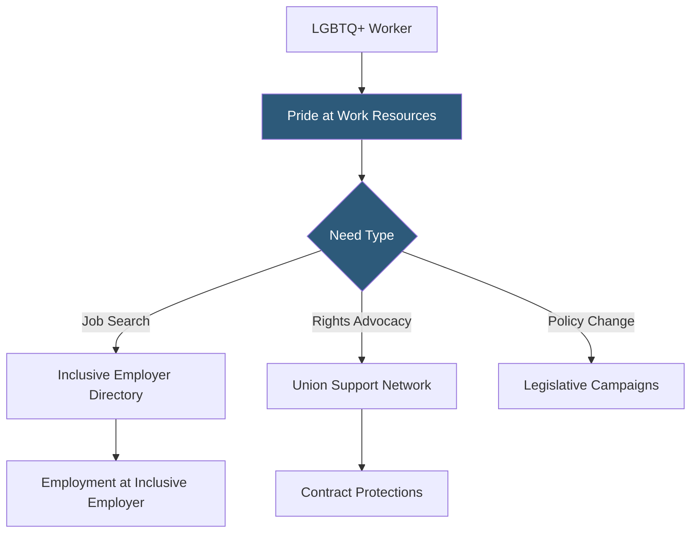

**Category:** Diversity & Inclusion Recruiting
**Difficulty:** Beginner
**Reading time:** 5 min read

---

Pride at Work is an AFL-CIO constituency group and advocacy organization connecting LGBTQ+ workers with labor unions, worker rights resources, and employers committed to LGBTQ+ workplace equality. It bridges organized labor and LGBTQ+ inclusion in the workplace.

- **Collective bargaining for LGBTQ+ rights** — negotiating employment contracts that explicitly protect LGBTQ+ workers from discrimination
- **AFL-CIO affiliation** — connection to America's largest labor federation, providing resources and political advocacy
- **Non-discrimination policy** — employer policy explicitly prohibiting discrimination based on sexual orientation and gender identity
- **Domestic partner benefits** — health and retirement benefits extended to same-sex partners and their dependents
- **Trans-inclusive healthcare** — employer health plans covering gender-affirming care for transgender employees
- **LGBTQ+ ERG** — Employee Resource Group for LGBTQ+ employees serving as internal advocates and community builders

Pride at Work differs from standard job boards by combining employment resources with labor rights advocacy. The organization maintains a network of union affiliates across industries and helps LGBTQ+ workers access union protections — particularly important in industries where union contracts provide explicit LGBTQ+ non-discrimination clauses that may exceed those in local employment law.

For job seekers, Pride at Work provides guidance on identifying LGBTQ+-inclusive employers through metrics like the Human Rights Campaign's Corporate Equality Index score, presence of LGBTQ+ ERGs, trans-inclusive healthcare benefits, and explicit non-discrimination policies covering sexual orientation and gender identity.

The organization advocates at the federal and state legislative levels for LGBTQ+ workplace protections, making it an active participant in expanding the legal floor for LGBTQ+ employment rights rather than just navigating the existing landscape.

Pride at Work also provides workplace training and consultation helping union locals and employers understand their obligations and best practices for LGBTQ+ inclusion — covering topics from bathroom access for transgender workers to inclusive language in employee handbooks.

- An LGBTQ+ worker seeking a union job with explicit contract protections against discrimination
- A transgender employee navigating healthcare benefits coverage for gender-affirming care
- A union steward learning how to advocate for LGBTQ+ members in contract negotiations
- An employer seeking a labor-aligned partnership to strengthen LGBTQ+ worker credibility
- An HR team reviewing its non-discrimination policy against Pride at Work guidelines

| Advantage | Disadvantage |
|-----------|--------------|
| Union affiliation provides legal contract protections beyond HR policies | Primarily relevant to unionized industries |
| Legislative advocacy expands legal floor for all LGBTQ+ workers | Slower advocacy outcomes than direct employment programs |
| Trans-inclusive healthcare guidance is highly specific and actionable | Organization primarily US-based |
| Labor-employer bridge builds credibility with skeptical LGBTQ+ workers | Limited job posting volume compared to dedicated boards |

- [Out & Equal LGBTQ+ Workplace](out-equal-lgbtq-workplace.md)
- [myGwork LGBTQ+ Professionals](mygwork-lgbtq-professionals.md)
- [Disability:IN Inclusion](disabilityin-inclusion.md)

---
*Part of the [Diversity & Inclusion Recruiting](index.md) category · [Back to Master Index](../../index.md)*
