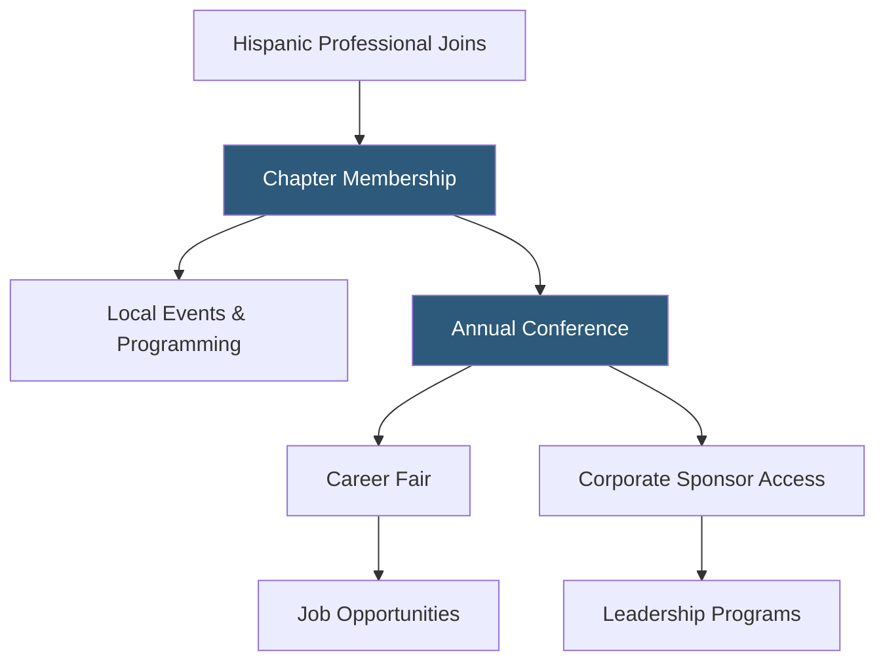

**Category:** Diversity & Inclusion Recruiting
**Difficulty:** Beginner
**Reading time:** 5 min read

---

Prospanica (formerly the National Society of Hispanic MBAs) is a nonprofit professional organization advancing Hispanic business leaders through a national network, annual conference, scholarship programs, and corporate partnerships connecting Hispanic talent with career opportunities.

- **Hispanic business professionals network** — community of Hispanic executives, managers, and MBA graduates advancing in corporate America
- **Annual conference** — flagship event combining career fair, workshops, and networking connecting candidates with corporate sponsors
- **Scholarship program** — financial awards for Hispanic graduate business students pursuing MBAs and professional degrees
- **Corporate sponsor** — company paying to access Prospanica's network through conference participation, job listings, and talent pipeline programs
- **Chapter network** — local Prospanica chapters in major US cities providing ongoing programming between national conferences
- **Leadership pipeline** — structured programs developing Hispanic professionals toward executive-level roles

Prospanica connects Hispanic business professionals with corporate employers through a combination of local chapter programming and a high-impact national annual conference. The conference — one of the largest Hispanic professional development events in the US — attracts thousands of candidates and hundreds of corporate recruiters to a multi-day event combining a large career fair, professional development workshops, and executive networking sessions.

Corporate sponsors pay substantial fees to participate in the conference and access the Prospanica talent network. The sponsorship model funds Prospanica's scholarship programs and operational costs while giving companies direct engagement with high-potential Hispanic MBA graduates and experienced professionals.

Chapter networks in cities including Chicago, Houston, Dallas, Miami, and New York run year-round programming — networking events, mentorship circles, and professional development workshops — maintaining engagement between annual conferences. This consistent touchpoint helps Prospanica retain professionals who are early in their careers and build loyalty that translates to conference attendance as they advance.

The scholarship program distributes significant awards to Hispanic graduate students in business programs, creating awareness of Prospanica among emerging professionals and building long-term alumni relationships.

- A Hispanic MBA graduate seeking interviews with corporate sponsors at the annual conference career fair
- A Fortune 500 company meeting Hispanic senior leadership hiring targets through Prospanica sponsorship
- A chapter leader mentoring early-career Hispanic professionals in the Dallas business community
- A graduate student applying for a Prospanica scholarship to fund an MBA program
- A talent acquisition team building a pipeline of Hispanic candidates for management rotation programs

| Advantage | Disadvantage |
|-----------|--------------|
| Annual conference concentrates high-quality talent and employer access in one event | Conference-dependent model provides inconsistent year-round touchpoints |
| Scholarship programs build early loyalty among emerging Hispanic professionals | Focused on professional and graduate-level talent; limited for entry-level hiring |
| Chapter network provides local ongoing engagement | Chapter quality and activity levels vary by city |
| Strong brand recognition in Hispanic corporate professional community | Geographic concentration in major US metros |

- [NSHMBA Hispanic MBAs](nshmba-hispanic-mbas.md)
- [Hispanic Alliance for Career Enhancement](hispanic-alliance-for-career-enhancement.md)
- [ALPFA Latino Professionals](alpfa-latino-professionals.md)

---
*Part of the [Diversity & Inclusion Recruiting](index.md) category · [Back to Master Index](../../index.md)*
