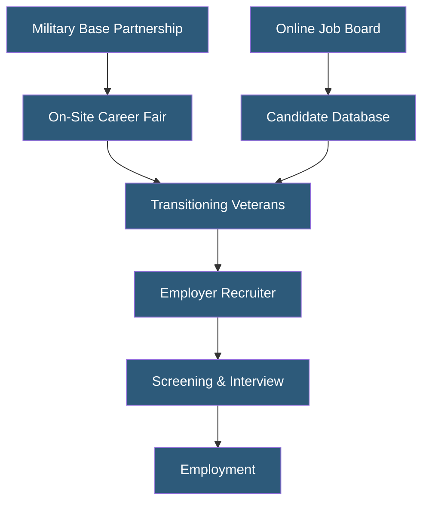

**Category:** Diversity & Inclusion Recruiting
**Difficulty:** Beginner
**Reading time:** 5 min read

---

RecruitMilitary is a veteran-focused recruiting company that connects transitioning service members and veterans with civilian employers through career fairs, a job board, and the Search & Employ magazine. It is one of the largest veteran recruiting platforms in the United States, hosting hundreds of career fairs annually at military installations nationwide.

- **Veteran Career Fair** — In-person recruiting events held on or near military bases connecting transitioning service members with employers
- **Military Installation Partnerships** — Formal relationships with bases enabling on-site career fair access to transitioning personnel
- **Search & Employ** — RecruitMilitary's publication providing career content to the veteran community
- **Clearance Recruiting** — Specialized services for placing cleared candidates into government and defense contractor roles
- **Veteran Affinity** — The organizational identity and mission alignment with military community values
- **Post-9/11 GI Bill** — Education benefits for post-2001 veterans, creating a talent pool of veterans with advanced degrees entering the workforce

RecruitMilitary's primary differentiator is its network of on-installation career fairs held in partnership with Transition Assistance Programs at military bases. These events give employers face-to-face access to service members within weeks of separation, capturing talent before they enter the general civilian job market. Attendance at these events is often built into the official transition process, ensuring high participation rates.

The company's job board at recruitmilitary.com allows employers to post open positions searchable by veterans across the country. Employers can search the candidate database by MOS code, clearance level, branch of service, and geographic preference. The platform's MOS translator converts military job codes to civilian equivalents, making veteran profiles findable through standard skills-based searches.

RecruitMilitary also offers employer branding services — creating veteran-focused content for company career pages, producing veteran employee spotlights, and publishing editorial content in Search & Employ that positions companies as military-friendly employers. This brand building improves organic candidate attraction beyond active recruiter outreach.

For government contractors with OFCCP veteran affirmative action reporting requirements, RecruitMilitary provides job posting syndication and documentation services that demonstrate good-faith outreach efforts, a necessary component of compliance.

- Nationwide employers seeking large-volume veteran recruiting at scale
- Defense contractors recruiting cleared candidates for government work
- Logistics and operations companies hiring veterans for management roles
- Technology firms recruiting IT-certified veterans for infrastructure positions
- Employers building OFCCP-compliant veteran affirmative action programs

| Advantage | Disadvantage |
|-----------|--------------|
| On-base career fairs access pre-market transitioning talent | Event-based model concentrates recruiting at specific dates/locations |
| Large national network provides geographic coverage | Less candidate preparation compared to nonprofit models like Hire Heroes |
| MOS translation improves searchability of veteran profiles | Clearance verification requires employer-side due diligence |
| OFCCP documentation services streamline compliance reporting | Premium services can be costly for smaller employers |

- [Hire Heroes USA Veterans](hire-heroes-usa-veterans.md)
- [Veteran Job Platforms](veteran-job-platforms.md)
- [Getting Hired Disability Jobs](getting-hired-disability-jobs.md)

---
*Part of the [Diversity & Inclusion Recruiting](index.md) category · [Back to Master Index](../../index.md)*
